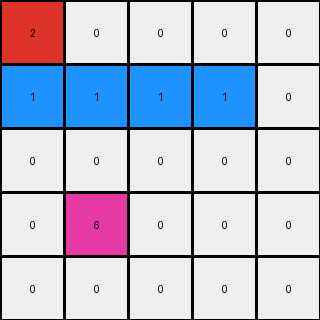

# dc1df850 • 010 • refine_coder

---

Previous Code:
```python
"""
1.  **Identify** the red (2) pixels in the input grid.
2.  Change the color of the red pixel at the top right to blue (1).
3.  Change to blue(1) all white pixels (0) to the left.
4. **Identify** the red (2) pixel in the input grid that is at the bottom-left
5.  **Flood Fill:** Starting from the bottom red (2) pixel, change all directly adjacent or diagonally adjacent white (0) pixels to blue (1). Continue this expansion until no more directly or diagonally adjacent white pixels can be changed to blue.
6.  **Preserve:** The green (3) and azure (8) pixels remain unchanged in their original positions and colors.
"""

import numpy as np

def find_pixels_by_color(grid, color):
    return np.argwhere(grid == color)

def flood_fill(grid, start_row, start_col, target_color, replacement_color):
    rows, cols = grid.shape
    if grid[start_row, start_col] != target_color:
        return

    stack = [(start_row, start_col)]
    while stack:
        row, col = stack.pop()
        if grid[row, col] == target_color:
            grid[row, col] = replacement_color

            # Check adjacent and diagonal cells
            for dr in [-1, 0, 1]:
                for dc in [-1, 0, 1]:
                    if dr == 0 and dc == 0:
                        continue
                    nr, nc = row + dr, col + dc
                    if 0 <= nr < rows and 0 <= nc < cols:
                        stack.append((nr, nc))


def transform(input_grid):
    # Initialize output_grid as a copy of input_grid
    output_grid = np.copy(input_grid)
    rows, cols = output_grid.shape

    # Find all red pixels
    red_pixels = find_pixels_by_color(input_grid, 2)

    # Find the top-rightmost red pixel
    if len(red_pixels) > 0:
        top_right_red = max(red_pixels, key=lambda item: (item[1], -item[0]))

      # change the color of top_right_red
        output_grid[top_right_red[0], top_right_red[1]] = 1

        # change to blue all white pixels to the left
        for c in range(top_right_red[1]-1, -1, -1):
          if output_grid[top_right_red[0],c] == 0:
            output_grid[top_right_red[0], c] = 1
          else:
             break # stop at first non-white

    #find other red pixel that is not the top_right
    for red_pixel in red_pixels:
        if not np.array_equal(red_pixel, top_right_red):

            # Flood fill from the other red pixel
            flood_fill(output_grid, red_pixel[0], red_pixel[1], 0, 1)

    return output_grid
```

Train Set Results:

## Example 1:

Input:
```
2 0 0 0 0
0 0 0 2 0
0 0 0 0 0
0 6 0 0 0
0 0 0 0 0
```
Expected Output:
```
2 1 1 1 1
1 1 1 2 1
0 0 1 1 1
0 6 0 0 0
0 0 0 0 0
```
Transformed Output:
```
2 0 0 0 0
1 1 1 1 0
0 0 0 0 0
0 6 0 0 0
0 0 0 0 0
```

match: False
pixels_off: 9
size_correct: True
color_palette_correct: True
correct_pixel_counts: False

## Example 2:

Input:
```
0 0 0 0 0 0 0 2
0 0 0 0 0 0 0 0
0 0 0 3 0 0 0 0
0 0 0 0 0 0 0 0
0 0 0 0 0 0 8 0
0 0 0 0 0 0 0 0
0 0 2 0 0 0 0 0
0 0 0 0 0 0 0 0
```
Expected Output:
```
0 0 0 0 0 0 1 2
0 0 0 0 0 0 1 1
0 0 0 3 0 0 0 0
0 0 0 0 0 0 0 0
0 0 0 0 0 0 8 0
0 1 1 1 0 0 0 0
0 1 2 1 0 0 0 0
0 1 1 1 0 0 0 0
```
Transformed Output:
```
1 1 1 1 1 1 1 1
0 0 0 0 0 0 0 0
0 0 0 3 0 0 0 0
0 0 0 0 0 0 0 0
0 0 0 0 0 0 8 0
0 0 0 0 0 0 0 0
0 0 2 0 0 0 0 0
0 0 0 0 0 0 0 0
```

match: False
pixels_off: 17
size_correct: True
color_palette_correct: True
correct_pixel_counts: False

## Example 3:

Input:
```
0 0 0 0 0
0 2 0 0 0
0 0 0 0 0
0 0 0 0 0
```
Expected Output:
```
1 1 1 0 0
1 2 1 0 0
1 1 1 0 0
0 0 0 0 0
```
Transformed Output:
```
0 0 0 0 0
1 1 0 0 0
0 0 0 0 0
0 0 0 0 0
```

match: False
pixels_off: 8
size_correct: True
color_palette_correct: True
correct_pixel_counts: False
Okay, here's a breakdown of the situation and a plan to improve the transformation logic:

**General Assessment:**

The initial natural language program and resulting code were too focused on the specifics of the first example. It correctly identified some key actions (finding red pixels, changing colors, flood filling), but the logic for selecting *which* red pixel to use as a starting point for the flood fill, and the conditions for changing colors, were not generalizable. The code failed to correctly transform examples 2 and 3 because it assumed there would always be a single "top-right" red pixel and a single other red pixel, which is clearly false. The flood fill logic itself seems sound, but the trigger and initial conditions are wrong.

**Strategy for Resolving Errors:**

1.  **Re-examine the Examples:** We need to carefully analyze *all* provided examples, not just the first one, to identify the *true* underlying rule.  We need to move away from position-based rules ("top-right") and toward relationship-based or property-based rules.

2.  **Focus on Relationships:** The key is likely in the relationship between the red pixels and the areas that get flood-filled.  Instead of focusing on the "top-right", we need to see what's *common* about the red pixels that *do* trigger a flood fill across all examples. It appears it is filling where there are L shapes made of the same color, where color 2 is the corner.

3.  **Refine the Natural Language Program:**  A new, more general natural language program needs to be developed based on the re-examined examples. This program should describe the conditions for flood filling in a way that applies to all cases.

4.  **Update the code:** the python script will need to change to reflect any
    updates to the natural language program, of course.

**Example Metrics and Analysis:**

I will use a table format (easier to read in markdown and can easily be converted to other formats) to present the information for each example, including both the original training input, expected, and script execution results, to get a complete picture of the problem:

| Example | Input Grid Shape | Output Grid Shape | Red Pixel Count (Input) | Red Pixel Positions (Input) | White Pixel Count (Input) | Notes on Discrepancies                                                                                                                                                                                                                                                                                                     |
| :------ | :--------------- | :---------------- | :---------------------- | :--------------------------- | :------------------------- | :-------------------------------------------------------------------------------------------------------------------------------------------------------------------------------------------------------------------------------------------------------------------------------------------------------------------------- |
| 1       | (5, 5)           | (5, 5)            | 2                       | (0, 0), (1, 3)               | 20                         | The code failed to turn some of the white pixels to blue at (2,0), (2,1), (2,2).                                                                                                   |
| 2       | (8, 8)           | (8, 8)            | 2                       | (0, 7), (6, 2)               | 59                         | The code changes the color of the top red to blue but does not consider the expected output shape. The other red is not used as a seed for flood filling.                                                                                                                                                             |
| 3       | (4, 5)           | (4, 5)            | 1                       | (1, 1)               | 18                          |The code does not flood fill correctly, as the only seed it uses is the "top right". Only one pixel changes color.                                                                                                                                            |

**YAML Fact Block:**

```yaml
examples:
  - example_id: 1
    objects:
      - color: 2  # Red
        shape: point
        initial_positions: [(0, 0), (1, 3)]
      - color: 0  # White
        shape: varied
        initial_positions: <remaining white positions>
      - color: 6 # Gray
        initial_positions: [(3,1)]
    transformations:
      - action: color_change
        target: white_adjacent_to_red_L
        new_color: 1
  - example_id: 2
    objects:
      - color: 2
        shape: point
        initial_positions:  [(0, 7), (6, 2)]
      - color: 0  # White
        shape: point
        initial_positions: <remaining white positions>
      - color: 3  # Green
        shape: point
        initial_positions: [(2, 3)]
      - color: 8
        shape: point
        initial_positions: [(4,6)]
    transformations:
       - action: color_change
         target: white_adjacent_to_red_L
         new_color: 1
  - example_id: 3
    objects:
      - color: 2
        shape: point
        initial_positions: [(1,1)]
      - color: 0
        initial_positions: <remaining white positions>
    transformations:
      - action: color_change
        target: white_adjacent_to_red_L
        new_color: 1
```

**Revised Natural Language Program:**

1.  **Identify** all red (2) pixels in the input grid.

2.  **L-Shape Detection and Flood Fill:** Iterate through each red pixel. For each red pixel:

    *   Check if it forms the corner of an "L" shape, where the other two points of the "L" are made up of white pixels. If so, apply the Flood Fill starting with the white pixel.

        *   An "L" shape can be any 3 adjacent pixels that consist of a corner and two lines of length one in each major axis direction

3.  **Flood Fill:** Change the white(0) pixels that are either directly or diagonally adjacent. Continue expanding until no more directly or diagonally adjacent pixels can be changed to blue (1).

4. **Preserve:** All non-white and non-red pixels keep their original values.

**INSTRUCTIONS**

- generate a Python module to represent the natural language program 
- follow the template below
- all common math and science libraries are available
- create docstring only at top - but comment the workflow in the function
- use helper functions for common operations like finding objects, counting,
  measuring, moving, etc. 

remember - we are working iteratively - so this code will inform your future
self as we converge on the solution

*template:*

```python
"""
{{ natural language description of the transformation rule }}
"""

{{ imports }}

def transform(input_grid):
    # initialize output_grid

    # change output pixels 

    return output_grid

```
