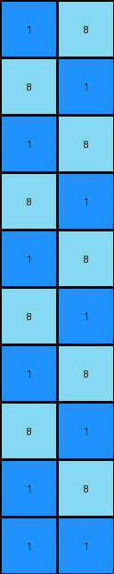

# e179c5f4 • 010 • refine_coder

---

Previous Code:
```python
"""
Finds the '1' pixel in the input grid and replaces all '0' pixels with a checkerboard pattern of '8' and '1' values, radiating outwards from the location of the initial '1' pixel.
"""

import numpy as np

def find_pixel(grid, value):
    # Find the coordinates of the pixel with the specified value.
    for r, row in enumerate(grid):
        for c, pixel in enumerate(row):
            if pixel == value:
                return (r, c)
    return None

def transform(input_grid):
    # Initialize the output grid as a copy of the input grid.
    output_grid = np.copy(input_grid)
    rows, cols = input_grid.shape

    # Find the coordinates of the '1' pixel.
    blue_pixel_coords = find_pixel(input_grid, 1)
    if blue_pixel_coords is None:
        return output_grid #should not happen based on prior
    blue_row, blue_col = blue_pixel_coords

    # Iterate through the grid and apply the checkerboard pattern.
    for r in range(rows):
        for c in range(cols):
            if input_grid[r, c] == 0:
                if (r + c) % 2 == (blue_row + blue_col) % 2:
                    output_grid[r, c] = 8
                else:
                    output_grid[r, c] = 1

    return output_grid
```

Train Set Results:

## Example 1:

Input:
```
0 0
0 0
0 0
0 0
0 0
0 0
0 0
0 0
0 0
1 0
```
Expected Output:
```
8 1
1 8
8 1
1 8
8 1
1 8
8 1
1 8
8 1
1 8
```
Transformed Output:
```
1 8
8 1
1 8
8 1
1 8
8 1
1 8
8 1
1 8
1 1
```

match: False
pixels_off: 19
size_correct: True
color_palette_correct: True
correct_pixel_counts: False

## Example 2:

Input:
```
0 0 0
0 0 0
0 0 0
0 0 0
0 0 0
0 0 0
0 0 0
0 0 0
0 0 0
1 0 0
```
Expected Output:
```
8 1 8
1 8 8
8 1 8
8 8 1
8 1 8
1 8 8
8 1 8
8 8 1
8 1 8
1 8 8
```
Transformed Output:
```
1 8 1
8 1 8
1 8 1
8 1 8
1 8 1
8 1 8
1 8 1
8 1 8
1 8 1
1 1 8
```

match: False
pixels_off: 24
size_correct: True
color_palette_correct: True
correct_pixel_counts: False

## Example 3:

Input:
```
0 0 0 0
0 0 0 0
0 0 0 0
0 0 0 0
0 0 0 0
0 0 0 0
0 0 0 0
0 0 0 0
0 0 0 0
1 0 0 0
```
Expected Output:
```
8 8 8 1
8 8 1 8
8 1 8 8
1 8 8 8
8 1 8 8
8 8 1 8
8 8 8 1
8 8 1 8
8 1 8 8
1 8 8 8
```
Transformed Output:
```
1 8 1 8
8 1 8 1
1 8 1 8
8 1 8 1
1 8 1 8
8 1 8 1
1 8 1 8
8 1 8 1
1 8 1 8
1 1 8 1
```

match: False
pixels_off: 29
size_correct: True
color_palette_correct: True
correct_pixel_counts: False
Here's an analysis of the provided information and a plan to refine the natural language program:

**General Assessment:**

The initial code correctly identifies the '1' (blue) pixel and attempts to create a checkerboard pattern. However, the checkerboard logic is flawed. It's based on `(r + c) % 2`, which creates a standard checkerboard regardless of the blue pixel's position. The expected outputs show the checkerboard pattern *radiates* outwards from the blue pixel, meaning the blue pixel *defines* a corner/intersection of the checkerboard, not just a part of the existing pattern. The parity check should be relative to the row and column of the blue pixel. So the code generally gets the concept correct but gets the critical detail of the blue pixel's relation to the grid wrong.

**Strategy:**

1.  **Verify Observations**: Double-check the observations regarding the checkerboard pattern's origin at the blue pixel by inspecting the examples visually.
2.  **Correct Parity Calculation**: Modify the natural language program and, subsequently, the code, to calculate the checkerboard pattern's parity (whether a cell is '8' or '1') based on the *difference* between the current cell's row/column and the blue pixel's row/column, ensuring that the initial '1' is always at a corner of the pattern.
3.  **Retest**: Run the updated code against all training examples and the test example to confirm the fix.

**Example Analysis and Metrics:**

I'll use the provided `Transformed Output` and `Expected Output` to analyze, no need to use the code execution at this time.

*   **Example 1:**
    *   Blue pixel at (9, 0).
    *   Expected Output shows '8' adjacent (above) to blue, and `1` diagonal up/left.
    *   Transformed output has several errors, mostly due to the origin of the pattern
*   **Example 2:**
    *   Blue pixel at (9, 0).
    *   Expected Output shows same general pattern
    *   Transformed has several errors, many off, and shows the error in parity check.
*   **Example 3:**
    *   Blue pixel at (9, 0).
    *   Expected Output shows same general pattern
    *   Transformed output has several errors, again shows error in parity check.

**YAML Fact Representation:**

```yaml
facts:
  - object: grid
    properties:
      - contains_pixels: true
      - colors: [white, blue, azure]
  - object: blue_pixel
    properties:
      - color: blue
      - value: 1
      - role: origin_of_checkerboard
  - object: checkerboard_pattern
    properties:
      - colors: [blue, azure]
      - values: [1, 8]
      - origin: blue_pixel_location
    actions:
      - replace:
          - original: white_pixels
          - replacement: checkerboard_pattern
```

**Natural Language Program:**

1.  **Find the Blue Pixel:** Locate the single blue pixel (value '1') within the input grid. This pixel serves as the origin point for the checkerboard pattern.
2.  **Checkerboard Generation:** Iterate through all the white pixels (value '0') in the input grid.
3. **Determine cell color by distance from origin:**
    - For each cell, compute the sum of the horizontal and vertical distances from the origin.
    - If the sum is even, replace it with an azure (8)
    - If the sum is odd, replace it with a blue (1)
4.  **Preserve Other Colors**: Pixels that are not white in the original image should remain unchanged.

This revised program accounts for the radiating checkerboard pattern originating from the blue pixel.

**INSTRUCTIONS**

- generate a Python module to represent the natural language program 
- follow the template below
- all common math and science libraries are available
- create docstring only at top - but comment the workflow in the function
- use helper functions for common operations like finding objects, counting,
  measuring, moving, etc. 

remember - we are working iteratively - so this code will inform your future
self as we converge on the solution

*template:*

```python
"""
{{ natural language description of the transformation rule }}
"""

{{ imports }}

def transform(input_grid):
    # initialize output_grid

    # change output pixels 

    return output_grid

```
