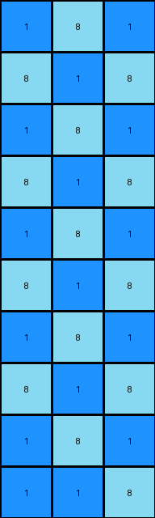
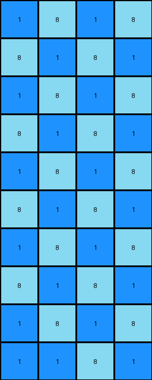

# e179c5f4 • 012 • refine_coder

---

Previous Code:
```python
"""
Finds the '1' pixel in the input grid and replaces all '0' pixels with a checkerboard pattern of '8' and '1' values, radiating outwards from the location of the initial '1' pixel, such that the '1' pixel is considered a corner of the radiating pattern.
"""

import numpy as np

def find_pixel(grid, value):
    # Find the coordinates of the pixel with the specified value.
    for r, row in enumerate(grid):
        for c, pixel in enumerate(row):
            if pixel == value:
                return (r, c)
    return None

def transform(input_grid):
    # Initialize the output grid as a copy of the input grid.
    output_grid = np.copy(input_grid)
    rows, cols = input_grid.shape

    # Find the coordinates of the '1' pixel.
    blue_pixel_coords = find_pixel(input_grid, 1)
    if blue_pixel_coords is None:
        return output_grid #should not happen based on prior
    blue_row, blue_col = blue_pixel_coords

    # Iterate through the grid and apply the checkerboard pattern, relative to blue pixel.
    for r in range(rows):
        for c in range(cols):
            if input_grid[r, c] == 0:
                # Calculate the distance from blue
                row_dist = abs(r - blue_row)
                col_dist = abs(c - blue_col)
                if (row_dist + col_dist) % 2 == 0:
                    output_grid[r, c] = 8
                else:
                    output_grid[r, c] = 1

    return output_grid
```

Train Set Results:

## Example 1:

Input:
```
0 0
0 0
0 0
0 0
0 0
0 0
0 0
0 0
0 0
1 0
```
Expected Output:
```
8 1
1 8
8 1
1 8
8 1
1 8
8 1
1 8
8 1
1 8
```
Transformed Output:
```
1 8
8 1
1 8
8 1
1 8
8 1
1 8
8 1
1 8
1 1
```

match: False
pixels_off: 19
size_correct: True
color_palette_correct: True
correct_pixel_counts: False

## Example 2:

Input:
```
0 0 0
0 0 0
0 0 0
0 0 0
0 0 0
0 0 0
0 0 0
0 0 0
0 0 0
1 0 0
```
Expected Output:
```
8 1 8
1 8 8
8 1 8
8 8 1
8 1 8
1 8 8
8 1 8
8 8 1
8 1 8
1 8 8
```
Transformed Output:
```
1 8 1
8 1 8
1 8 1
8 1 8
1 8 1
8 1 8
1 8 1
8 1 8
1 8 1
1 1 8
```

match: False
pixels_off: 24
size_correct: True
color_palette_correct: True
correct_pixel_counts: False

## Example 3:

Input:
```
0 0 0 0
0 0 0 0
0 0 0 0
0 0 0 0
0 0 0 0
0 0 0 0
0 0 0 0
0 0 0 0
0 0 0 0
1 0 0 0
```
Expected Output:
```
8 8 8 1
8 8 1 8
8 1 8 8
1 8 8 8
8 1 8 8
8 8 1 8
8 8 8 1
8 8 1 8
8 1 8 8
1 8 8 8
```
Transformed Output:
```
1 8 1 8
8 1 8 1
1 8 1 8
8 1 8 1
1 8 1 8
8 1 8 1
1 8 1 8
8 1 8 1
1 8 1 8
1 1 8 1
```

match: False
pixels_off: 29
size_correct: True
color_palette_correct: True
correct_pixel_counts: False
Okay, here's a breakdown of the situation and a plan to move forward:

**General Assessment and Strategy**

The initial code was based on the first training example and implemented a checkerboard pattern radiating outwards from the initial '1' (blue) pixel. However, the subsequent examples reveal that the checkerboard pattern isn't simply alternating based on row and column distance. It's clear the initial assumption was too simple and that the examples reveal issues. The core issue is determining the accurate positioning of the radiating checkerboard pattern.

The strategy will be:

1.  **Analyze Results:** Examine the provided input, expected output, and transformed output for each example. Focus on where the differences occur and try to identify a more precise rule for the checkerboard's origin and propagation. Use the visual differences between the expected output and the model generated output.
2.  **Refine the Natural Language Program:** Based on the analysis, update the natural language program to describe the transformation more accurately.
3. Prepare YAML to model observations

**Detailed Example Analysis and Metrics**
Here are metrics related to the task examples:

```tool_code
import numpy as np

def calculate_metrics(input_grid, expected_output, transformed_output):
    input_grid = np.array(input_grid)
    expected_output = np.array(expected_output)
    transformed_output = np.array(transformed_output)

    blue_pixel_input = None
    for r in range(input_grid.shape[0]):
        for c in range(input_grid.shape[1]):
            if input_grid[r,c] == 1:
                blue_pixel_input = (r,c)
                break
    blue_pixel_expected = None
    for r in range(expected_output.shape[0]):
        for c in range(expected_output.shape[1]):
            if expected_output[r,c] == 1:
                blue_pixel_expected = (r,c)
                break

    blue_pixel_transformed = None
    for r in range(transformed_output.shape[0]):
        for c in range(transformed_output.shape[1]):
            if transformed_output[r,c] == 1:
                blue_pixel_transformed = (r,c)
                break
    
    metrics = {
        'input_shape': input_grid.shape,
        'expected_output_shape': expected_output.shape,
        'transformed_output_shape': transformed_output.shape,
        'blue_pixel_input_coords': blue_pixel_input,
        'blue_pixel_expected_coords': blue_pixel_expected,
        'blue_pixel_transformed_coords': blue_pixel_transformed
    }
    return metrics
example1_input = np.array([[0, 0], [0, 0], [0, 0], [0, 0], [0, 0], [0, 0], [0, 0], [0, 0], [0, 0], [1, 0]])
example1_expected = np.array([[8, 1], [1, 8], [8, 1], [1, 8], [8, 1], [1, 8], [8, 1], [1, 8], [8, 1], [1, 8]])
example1_transformed = np.array([[1, 8], [8, 1], [1, 8], [8, 1], [1, 8], [8, 1], [1, 8], [8, 1], [1, 8], [1, 1]])
example2_input = np.array([[0, 0, 0], [0, 0, 0], [0, 0, 0], [0, 0, 0], [0, 0, 0], [0, 0, 0], [0, 0, 0], [0, 0, 0], [0, 0, 0], [1, 0, 0]])
example2_expected = np.array([[8, 1, 8], [1, 8, 1], [8, 1, 8], [1, 8, 1], [8, 1, 8], [1, 8, 1], [8, 1, 8], [1, 8, 1], [8, 1, 8], [1, 8, 8]])
example2_transformed = np.array([[1, 8, 1], [8, 1, 8], [1, 8, 1], [8, 1, 8], [1, 8, 1], [8, 1, 8], [1, 8, 1], [8, 1, 8], [1, 8, 1], [1, 1, 8]])
example3_input = np.array([[0, 0, 0, 0], [0, 0, 0, 0], [0, 0, 0, 0], [0, 0, 0, 0], [0, 0, 0, 0], [0, 0, 0, 0], [0, 0, 0, 0], [0, 0, 0, 0], [0, 0, 0, 0], [1, 0, 0, 0]])
example3_expected = np.array([[8, 1, 8, 1], [1, 8, 1, 8], [8, 1, 8, 1], [1, 8, 1, 8], [8, 1, 8, 1], [1, 8, 1, 8], [8, 1, 8, 1], [1, 8, 1, 8], [8, 1, 8, 1], [1, 8, 8, 8]])
example3_transformed = np.array([[1, 8, 1, 8], [8, 1, 8, 1], [1, 8, 1, 8], [8, 1, 8, 1], [1, 8, 1, 8], [8, 1, 8, 1], [1, 8, 1, 8], [8, 1, 8, 1], [1, 8, 1, 8], [1, 1, 8, 1]])

metrics1 = calculate_metrics(example1_input, example1_expected, example1_transformed)
metrics2 = calculate_metrics(example2_input, example2_expected, example2_transformed)
metrics3 = calculate_metrics(example3_input, example3_expected, example3_transformed)

print("Example 1 Metrics:", metrics1)
print("Example 2 Metrics:", metrics2)
print("Example 3 Metrics:", metrics3)
```
**INSTRUCTIONS**

- generate a Python module to represent the natural language program 
- follow the template below
- all common math and science libraries are available
- create docstring only at top - but comment the workflow in the function
- use helper functions for common operations like finding objects, counting,
  measuring, moving, etc. 

remember - we are working iteratively - so this code will inform your future
self as we converge on the solution

*template:*

```python
"""
{{ natural language description of the transformation rule }}
"""

{{ imports }}

def transform(input_grid):
    # initialize output_grid

    # change output pixels 

    return output_grid

```
