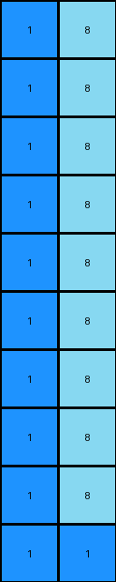
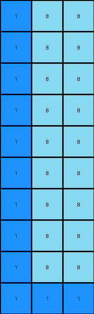
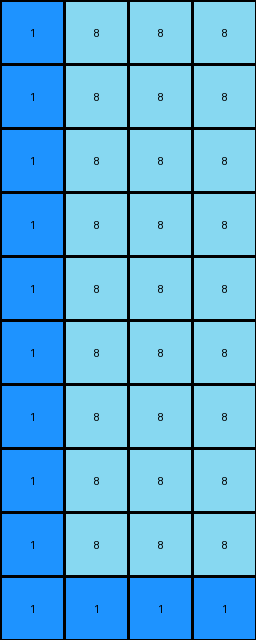

# e179c5f4 • 015 • refine_dreamer

---

Previous Code:
```python
"""
1.  **Background Fill:** Replace all 0s in the input grid with 8s.

2.  **Cross Construction:**
    *   Locate the single cell with the value of 1 in the input grid
    *   In the output grid, set this original location to 1.
    *   From this position extend the value 1 outwards along the row and column to form the four points of the cross.
"""

import numpy as np

def find_object(grid, value):
    # finds all instances of value and returns coordinates
    coords = np.where(grid == value)
    return list(zip(coords[0], coords[1]))

def transform(input_grid):
    # initialize output_grid
    output_grid = np.full(input_grid.shape, 8)

    # find the location of the 1
    one_locations = find_object(input_grid, 1)
    if not one_locations:  # Handle edge case with no 1 present.
       return output_grid
       
    one_row, one_col = one_locations[0]

    # construct cross
    output_grid[one_row, :] = 1    # horizontal
    output_grid[:, one_col] = 1    # vertical

    return output_grid
```

Train Set Results:

## Example 1:

Input:
```
0 0
0 0
0 0
0 0
0 0
0 0
0 0
0 0
0 0
1 0
```
Expected Output:
```
8 1
1 8
8 1
1 8
8 1
1 8
8 1
1 8
8 1
1 8
```
Transformed Output:
```
1 8
1 8
1 8
1 8
1 8
1 8
1 8
1 8
1 8
1 1
```

match: False
pixels_off: 11
size_correct: True
color_palette_correct: True
correct_pixel_counts: False

## Example 2:

Input:
```
0 0 0
0 0 0
0 0 0
0 0 0
0 0 0
0 0 0
0 0 0
0 0 0
0 0 0
1 0 0
```
Expected Output:
```
8 1 8
1 8 8
8 1 8
8 8 1
8 1 8
1 8 8
8 1 8
8 8 1
8 1 8
1 8 8
```
Transformed Output:
```
1 8 8
1 8 8
1 8 8
1 8 8
1 8 8
1 8 8
1 8 8
1 8 8
1 8 8
1 1 1
```

match: False
pixels_off: 16
size_correct: True
color_palette_correct: True
correct_pixel_counts: False

## Example 3:

Input:
```
0 0 0 0
0 0 0 0
0 0 0 0
0 0 0 0
0 0 0 0
0 0 0 0
0 0 0 0
0 0 0 0
0 0 0 0
1 0 0 0
```
Expected Output:
```
8 8 8 1
8 8 1 8
8 1 8 8
1 8 8 8
8 1 8 8
8 8 1 8
8 8 8 1
8 8 1 8
8 1 8 8
1 8 8 8
```
Transformed Output:
```
1 8 8 8
1 8 8 8
1 8 8 8
1 8 8 8
1 8 8 8
1 8 8 8
1 8 8 8
1 8 8 8
1 8 8 8
1 1 1 1
```

match: False
pixels_off: 19
size_correct: True
color_palette_correct: True
correct_pixel_counts: False
**INSTRUCTIONS**

The code above was generated based on observations from the first training
example

we have tested the transform function on each of the task example inputs and
compared with the expected output

review each of the examples provided and the results and consider how the
natural language program should be updated to accommodate this new knowledge

respond with the following deliverables:

- general assessment of the information provided and strategy for resolving the
  errors
- gather metrics about each of the examples and results - use code_execution to
  develop accurate reports on your assumptions
- a YAML block documenting facts - Focus on identifying objects, their properties, and the actions performed on them.
- a natural language program - Be as clear and concise as possible, providing a complete description of the transformation rule.


your responses should be considered as information in a report - not a
conversation
