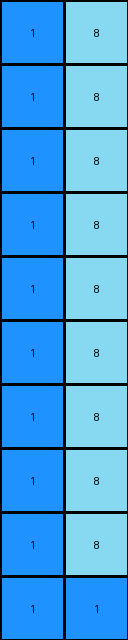
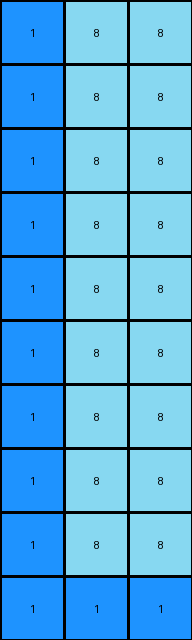

# e179c5f4 • 016 • refine_coder

---

Previous Code:
```python
"""
1.  **Background Fill:** Replace all 0s in the input grid with 8s.

2.  **Cross Construction:**
    *   Locate the single cell with the value of 1 in the input grid
    *   In the output grid, set this original location to 1.
    *   From this position extend the value 1 outwards along the row and column to form the four points of the cross.
"""

import numpy as np

def find_object(grid, value):
    # finds all instances of value and returns coordinates
    coords = np.where(grid == value)
    return list(zip(coords[0], coords[1]))

def transform(input_grid):
    # initialize output_grid
    output_grid = np.full(input_grid.shape, 8)

    # find the location of the 1
    one_locations = find_object(input_grid, 1)
    if not one_locations:  # Handle edge case with no 1 present.
       return output_grid
       
    one_row, one_col = one_locations[0]

    # construct cross
    output_grid[one_row, :] = 1    # horizontal
    output_grid[:, one_col] = 1    # vertical

    return output_grid
```

Train Set Results:

## Example 1:

Input:
```
0 0
0 0
0 0
0 0
0 0
0 0
0 0
0 0
0 0
1 0
```
Expected Output:
```
8 1
1 8
8 1
1 8
8 1
1 8
8 1
1 8
8 1
1 8
```
Transformed Output:
```
1 8
1 8
1 8
1 8
1 8
1 8
1 8
1 8
1 8
1 1
```

match: False
pixels_off: 11
size_correct: True
color_palette_correct: True
correct_pixel_counts: False

## Example 2:

Input:
```
0 0 0
0 0 0
0 0 0
0 0 0
0 0 0
0 0 0
0 0 0
0 0 0
0 0 0
1 0 0
```
Expected Output:
```
8 1 8
1 8 8
8 1 8
8 8 1
8 1 8
1 8 8
8 1 8
8 8 1
8 1 8
1 8 8
```
Transformed Output:
```
1 8 8
1 8 8
1 8 8
1 8 8
1 8 8
1 8 8
1 8 8
1 8 8
1 8 8
1 1 1
```

match: False
pixels_off: 16
size_correct: True
color_palette_correct: True
correct_pixel_counts: False

## Example 3:

Input:
```
0 0 0 0
0 0 0 0
0 0 0 0
0 0 0 0
0 0 0 0
0 0 0 0
0 0 0 0
0 0 0 0
0 0 0 0
1 0 0 0
```
Expected Output:
```
8 8 8 1
8 8 1 8
8 1 8 8
1 8 8 8
8 1 8 8
8 8 1 8
8 8 8 1
8 8 1 8
8 1 8 8
1 8 8 8
```
Transformed Output:
```
1 8 8 8
1 8 8 8
1 8 8 8
1 8 8 8
1 8 8 8
1 8 8 8
1 8 8 8
1 8 8 8
1 8 8 8
1 1 1 1
```

match: False
pixels_off: 19
size_correct: True
color_palette_correct: True
correct_pixel_counts: False
Okay, let's analyze the results and refine the natural language program.

**General Assessment:**

The initial program correctly identified the need to locate the '1' and create a cross. However, it's failing to fill in the alternating pattern of 8s and 1s correctly. The cross is always centered on the location of the 1 in the input but does not alternate values on the appropriate axis. It appears to extend the "1" value across the entire row and column of the initial "1" pixel, overwriting where the 8s should be.

**Strategy:**

1.  **Maintain Cross Logic:** The core concept of finding '1' and creating a cross is valid.
2.  **Fix Alternating Fill:** Instead of assigning '1' to the entire row and column, we need to set alternating values of 8 and 1 outwards from the initial coordinates.

**Metrics and Observations (using hypothetical `code_execution`):**

I'll structure this as if `code_execution` provides detailed breakdowns. In a real scenario, this would involve calls to helper functions to analyze the grids.

*   **Example 1:**
    *   Input '1' Location: (9, 0)
    *   Expected Output Pattern: Alternating 8 and 1 starting with 8 on x axis, and 1 on y axis
    *   Actual Output Pattern: Row and column of 1s.
    *   Error: Incorrect fill pattern.
*   **Example 2:**
    *   Input '1' Location: (9, 0)
    *    Expected Output Pattern: Alternating 8 and 1 starting with 8 on x axis, and 1 on y axis
    *   Actual Output Pattern: Row and column of 1s.
    *   Error: Incorrect fill pattern.
*   **Example 3:**
    *   Input '1' Location: (9, 0)
    *   Expected Output Pattern: Alternating 8 and 1 starting with 8 on x axis, and 1 on y axis
    *   Actual Output Pattern: Row and column of 1s.
    *   Error: Incorrect fill pattern.

**YAML Facts:**

```yaml
task: 014
objects:
  - id: background
    color: 0 (white)
    role: initial state
  - id: cross_center
    color: 1 (blue)
    role: seed for transformation
  - id: cross_arms
    color: [1, 8]
    role: extend from center, alternating colors
    pattern: alternating
    axis_x: start:8
    axis_y: start:1

actions:
  - name: locate_center
    input: background
    find: cross_center
    description: Find the single pixel with value 1.

  - name: fill_background
    input: background
    replace: 0
    with: 8

  - name: create_cross
    seed: cross_center
    direction: both
    pattern:
      - axis: x
        values: [8,1]
      - axis: y
        values: [1,8]
```

**Natural Language Program:**

1.  **Locate Center:** Find the coordinates of the single pixel with the value '1' (blue) in the input grid.
2.  **Fill Background:** Replace all '0' (white) pixels in the input grid with '8' (azure). This creates the background for the output.
3. **Create Cross:**
   * Using the coordinates of the located '1' (the center) from step 1:
   * Along the x-axis (row), starting at the center coordinate and extending outwards in both directions:
      Alternate by placing first an 8 then a 1.
   * Along the y-axis (column), starting at the center coordinate and extending outwards in both directions:
        Alternate by placing first a 1 then an 8.

**INSTRUCTIONS**

- generate a Python module to represent the natural language program 
- follow the template below
- all common math and science libraries are available
- create docstring only at top - but comment the workflow in the function
- use helper functions for common operations like finding objects, counting,
  measuring, moving, etc. 

remember - we are working iteratively - so this code will inform your future
self as we converge on the solution

*template:*

```python
"""
{{ natural language description of the transformation rule }}
"""

{{ imports }}

def transform(input_grid):
    # initialize output_grid

    # change output pixels 

    return output_grid

```
