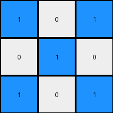

# ea786f4a • 005 • refine_dreamer

---


Previous Code:
```python
"""
Invert colors of the input grid and create a cross shape with the inverted colors.
"""

import numpy as np

def transform(input_grid):
    """
    Transforms the input grid by inverting colors and forming a cross shape.
    
    Args:
        input_grid (numpy.ndarray): A 2D numpy array representing the input grid.
        
    Returns:
        numpy.ndarray: A 2D numpy array representing the output grid.
    """
    # Initialize the output grid as a copy of the input grid.
    output_grid = input_grid.copy()
    
    # Get the dimensions of the grid.
    rows, cols = output_grid.shape
    
    # Find the non-zero color in the input grid.
    non_zero_colors = np.unique(input_grid[input_grid != 0])
    # Use the first element of non_zero_color, and default color is set to 0 in case of empty non_zero_colors.
    other_color = non_zero_colors[0] if non_zero_colors.size > 0 else 0

    # Find the center row and column indices.
    center_row = rows // 2
    center_col = cols // 2

    # Iterate through each pixel in the grid.
    for i in range(rows):
        for j in range(cols):
            # Check if the pixel is on the center row or center column.
            if i == center_row or j == center_col:
                # Invert the pixel value. 0 becomes other_color, and other_color becomes 0.
                if output_grid[i, j] == 0:
                    output_grid[i, j] = other_color
                elif output_grid[i,j] == other_color:
                    output_grid[i, j] = 0
                
    return output_grid
```

Train Set Results:

## Example 1:

Input:
```
1 1 1
1 0 1
1 1 1
```
Expected Output:
```
0 1 0
1 0 1
0 1 0
```
Transformed Output:
```
1 0 1
0 1 0
1 0 1
```

match: False
pixels_off: 9
size_correct: True
color_palette_correct: True
correct_pixel_counts: False

## Example 2:

Input:
```
2 2 2 2 2
2 2 2 2 2
2 2 0 2 2
2 2 2 2 2
2 2 2 2 2
```
Expected Output:
```
0 2 2 2 0
2 0 2 0 2
2 2 0 2 2
2 0 2 0 2
0 2 2 2 0
```
Transformed Output:
```
2 2 0 2 2
2 2 0 2 2
0 0 2 0 0
2 2 0 2 2
2 2 0 2 2
```

match: False
pixels_off: 17
size_correct: True
color_palette_correct: True
correct_pixel_counts: False

## Example 3:

Input:
```
3 3 3 3 3 3 3
3 3 3 3 3 3 3
3 3 3 3 3 3 3
3 3 3 0 3 3 3
3 3 3 3 3 3 3
3 3 3 3 3 3 3
3 3 3 3 3 3 3
```
Expected Output:
```
0 3 3 3 3 3 0
3 0 3 3 3 0 3
3 3 0 3 0 3 3
3 3 3 0 3 3 3
3 3 0 3 0 3 3
3 0 3 3 3 0 3
0 3 3 3 3 3 0
```
Transformed Output:
```
3 3 3 0 3 3 3
3 3 3 0 3 3 3
3 3 3 0 3 3 3
0 0 0 3 0 0 0
3 3 3 0 3 3 3
3 3 3 0 3 3 3
3 3 3 0 3 3 3
```

match: False
pixels_off: 25
size_correct: True
color_palette_correct: True
correct_pixel_counts: False

**INSTRUCTIONS**

The code above was generated based on observations from the first training
example

we have tested the transform function on each of the task example inputs and
compared with the expected output

review each of the examples provided and the results and consider how the
natural language program should be updated to accommodate this new knowledge

respond with the following deliverables:

- general assessment of the information provided and strategy for resolving the
  errors
- gather metrics about each of the examples and results - use code_execution to
  develop accurate reports on your assumptions
- a YAML block documenting facts - Focus on identifying objects, their properties, and the actions performed on them.
- a natural language program - Be as clear and concise as possible, providing a complete description of the transformation rule.


your responses should be considered as information in a report - not a
conversation
