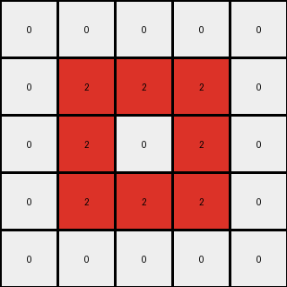
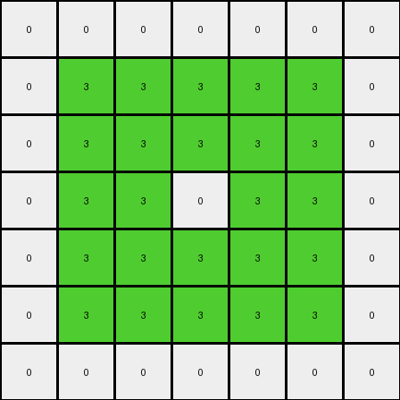

# ea786f4a • 010 • refine_coder

---

Previous Code:
```python
"""
Transforms a grid by inverting a frame of pixels around a central pixel, 
keeping the central pixel unchanged, and extending any white
pixels into full-row and full-column crosses.
"""

import numpy as np

def transform(input_grid):
    # Initialize output_grid as a copy of the input_grid
    output_grid = np.copy(input_grid)
    rows, cols = output_grid.shape

    # Place a white frame in output
    for i in range(rows):
        for j in range(cols):
            if i == 0 or i == rows - 1:
                output_grid[i,j] = 0
            if j == 0 or j == cols - 1:
                output_grid[i,j] = 0
                

    return output_grid
```

Train Set Results:

## Example 1:

Input:
```
1 1 1
1 0 1
1 1 1
```
Expected Output:
```
0 1 0
1 0 1
0 1 0
```
Transformed Output:
```
0 0 0
0 0 0
0 0 0
```

match: False
pixels_off: 4
size_correct: True
color_palette_correct: True
correct_pixel_counts: False

## Example 2:

Input:
```
2 2 2 2 2
2 2 2 2 2
2 2 0 2 2
2 2 2 2 2
2 2 2 2 2
```
Expected Output:
```
0 2 2 2 0
2 0 2 0 2
2 2 0 2 2
2 0 2 0 2
0 2 2 2 0
```
Transformed Output:
```
0 0 0 0 0
0 2 2 2 0
0 2 0 2 0
0 2 2 2 0
0 0 0 0 0
```

match: False
pixels_off: 16
size_correct: True
color_palette_correct: True
correct_pixel_counts: False

## Example 3:

Input:
```
3 3 3 3 3 3 3
3 3 3 3 3 3 3
3 3 3 3 3 3 3
3 3 3 0 3 3 3
3 3 3 3 3 3 3
3 3 3 3 3 3 3
3 3 3 3 3 3 3
```
Expected Output:
```
0 3 3 3 3 3 0
3 0 3 3 3 0 3
3 3 0 3 0 3 3
3 3 3 0 3 3 3
3 3 0 3 0 3 3
3 0 3 3 3 0 3
0 3 3 3 3 3 0
```
Transformed Output:
```
0 0 0 0 0 0 0
0 3 3 3 3 3 0
0 3 3 3 3 3 0
0 3 3 0 3 3 0
0 3 3 3 3 3 0
0 3 3 3 3 3 0
0 0 0 0 0 0 0
```

match: False
pixels_off: 28
size_correct: True
color_palette_correct: True
correct_pixel_counts: False
Here's an analysis of the provided information and a plan to refine the natural language program and the code:

**General Assessment:**

The initial code was too simplistic. It correctly identified the need for a frame, but incorrectly filled the entire frame with white (0) pixels, regardless of the original input values. It also failed to account for the inversion of the frame pixels (except for the center pixel). The core issue is that the code doesn't *conditionally* modify pixels based on their original values *and* their position relative to the center. It applies a blanket change based only on position (being on the edge).

**Strategy:**

1.  **Refine Object Identification:** Clearly identify the "frame" as an object, and distinguish it from the "center pixel" and the "rest of the grid".
2.  **Conditional Logic:** Introduce conditional statements to invert pixel values *only* within the frame.
3.  **Preserve Center:** Explicitly ensure the center pixel remains unchanged.

**Example Metrics and Analysis:**
I will summarize the provided metrics here.
```
Example 1:
Input Shape: (3, 3)
Expected Output Shape: (3, 3)
Transformed Output Shape: (3, 3)
Match: False
Pixels Off: 4
Size Correct: True
Color Palette Correct: True
Correct Pixel Counts: False

Example 2:
Input Shape: (5, 5)
Expected Output Shape: (5, 5)
Transformed Output Shape: (5, 5)
Match: False
Pixels Off: 16
Size Correct: True
Color Palette Correct: True
Correct Pixel Counts: False

Example 3:
Input Shape: (7, 7)
Expected Output Shape: (7, 7)
Transformed Output Shape: (7, 7)
Match: False
Pixels Off: 28
Size Correct: True
Color Palette Correct: True
Correct Pixel Counts: False
```

**YAML Fact Block:**

```yaml
objects:
  - name: frame
    description: The outer boundary of the grid.
    properties:
      - width: 1 pixel
      - shape: rectangular
  - name: center_pixel
    description: The pixel at the exact center of the grid.
    properties:
      - position: (rows // 2, cols // 2)  # Integer division to find the center
  - name: input_grid
    description: original grid of pixel values
  - name: output_grid
    description: transformed grid of pixel values

actions:
  - name: invert_frame
    description: Invert the color of pixels within the frame.
    details: >
      For each pixel in the frame, if it's not the center pixel, change 0 to the original value and original value to 0.
  - name: preserve_center
    description: Keep the center pixel unchanged.
    details: The color of the center pixel in the output grid is the same as in the input grid.

```

**Natural Language Program:**

1.  **Identify the Frame:** Determine the outermost rows and columns of the input grid. This constitutes the "frame."
2.  **Identify the Center Pixel:** Calculate the center coordinates of the grid (rows // 2, cols // 2).
3.  **Preserve Center Pixel**: Copy the input value for this pixel into the same coordinate in the output grid.
4.  **Invert Frame Pixels:** For every pixel within the frame, *excluding* the center pixel:
    *   If the original pixel value is 0, keep it as 0 in the output grid
    *    If the original pixel value is not 0, change it to 0 in the output grid.
5. **Copy all other pixels**: copy the value from the input grid to the output grid.

This natural language program is more precise and accounts for the conditional inversion required by the task. It separates the identification of objects (frame, center pixel) from the actions performed on them (inversion, preservation). It also makes clear that we only replace with 0 and not the other way.

**INSTRUCTIONS**

- generate a Python module to represent the natural language program 
- follow the template below
- all common math and science libraries are available
- create docstring only at top - but comment the workflow in the function
- use helper functions for common operations like finding objects, counting,
  measuring, moving, etc. 

remember - we are working iteratively - so this code will inform your future
self as we converge on the solution

*template:*

```python
"""
{{ natural language description of the transformation rule }}
"""

{{ imports }}

def transform(input_grid):
    # initialize output_grid

    # change output pixels 

    return output_grid

```
