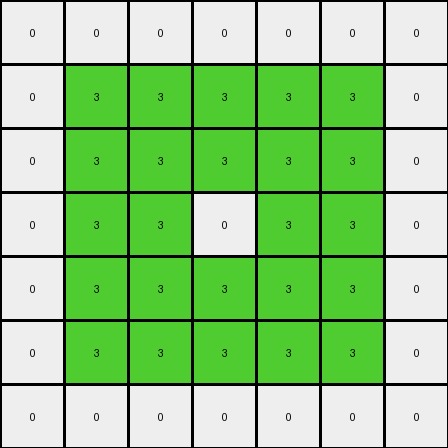

# ea786f4a • 012 • refine_coder

---

Previous Code:
```python
"""
Transforms a grid by inverting a frame of pixels around a central pixel, 
keeping the central pixel unchanged. The inversion changes non-zero pixels
to zero, but leaves zero pixels unchanged.
"""

import numpy as np

def transform(input_grid):
    # Initialize output_grid as a copy of the input_grid
    output_grid = np.copy(input_grid)
    rows, cols = output_grid.shape

    # Identify the center pixel coordinates
    center_row = rows // 2
    center_col = cols // 2

    # Iterate through the grid to process the frame
    for i in range(rows):
        for j in range(cols):
            # Check if the pixel is on the frame (outermost rows and columns)
            if i == 0 or i == rows - 1 or j == 0 or j == cols - 1:
                # Exclude the center pixel from the inversion
                if i != center_row or j != center_col:
                    # Invert frame pixels: non-zero becomes 0, 0 remains 0
                    if output_grid[i, j] != 0:
                        output_grid[i, j] = 0
            # copy non-frame pixels
            else:
               output_grid[i,j] = input_grid[i,j]

    return output_grid
```

Train Set Results:

## Example 1:

Input:
```
1 1 1
1 0 1
1 1 1
```
Expected Output:
```
0 1 0
1 0 1
0 1 0
```
Transformed Output:
```
0 0 0
0 0 0
0 0 0
```

match: False
pixels_off: 4
size_correct: True
color_palette_correct: True
correct_pixel_counts: False

## Example 2:

Input:
```
2 2 2 2 2
2 2 2 2 2
2 2 0 2 2
2 2 2 2 2
2 2 2 2 2
```
Expected Output:
```
0 2 2 2 0
2 0 2 0 2
2 2 0 2 2
2 0 2 0 2
0 2 2 2 0
```
Transformed Output:
```
0 0 0 0 0
0 2 2 2 0
0 2 0 2 0
0 2 2 2 0
0 0 0 0 0
```

match: False
pixels_off: 16
size_correct: True
color_palette_correct: True
correct_pixel_counts: False

## Example 3:

Input:
```
3 3 3 3 3 3 3
3 3 3 3 3 3 3
3 3 3 3 3 3 3
3 3 3 0 3 3 3
3 3 3 3 3 3 3
3 3 3 3 3 3 3
3 3 3 3 3 3 3
```
Expected Output:
```
0 3 3 3 3 3 0
3 0 3 3 3 0 3
3 3 0 3 0 3 3
3 3 3 0 3 3 3
3 3 0 3 0 3 3
3 0 3 3 3 0 3
0 3 3 3 3 3 0
```
Transformed Output:
```
0 0 0 0 0 0 0
0 3 3 3 3 3 0
0 3 3 3 3 3 0
0 3 3 0 3 3 0
0 3 3 3 3 3 0
0 3 3 3 3 3 0
0 0 0 0 0 0 0
```

match: False
pixels_off: 28
size_correct: True
color_palette_correct: True
correct_pixel_counts: False
Here's an analysis of the provided information and a plan to refine the natural language program:

**General Assessment:**

The initial code was too simplistic. It correctly identified the frame and the central pixel but incorrectly inverted *all* non-zero pixels on the frame to zero, and did not make the frame pixels adjacent to non-zero pixels inside the frame also zero. The expected outputs show a more nuanced transformation: the frame is inverted, such that non-zero colors become 0, but also the pixels *adjacent* to the frame elements are also changed to 0. The central pixel remains unchanged.

**Strategy:**

1. **Refine Object Identification:** Clearly define the "frame" and "center pixel" as distinct objects.
2. **Enhance Action Description:** The action is not just inverting the frame. It's inverting colors (from non-zero to zero) on the frame AND the pixels *adjacent* to the non-zero frame elements.
3. **Iterative Improvement:** Use the provided examples to iteratively refine the natural language program.  The first program clearly doesn't handle cases where the frame and its adjacent pixels have differing non-zero values.

**Example Metrics and Analysis:**

Here's a breakdown of each example, focusing on the discrepancies:

*   **Example 1:**
    *   Input Shape: (3, 3)
    *   Output Shape: (3, 3)
    *   Mismatched Pixels: Four corner pixels which are supposed to change to zero. The center pixel remains unchanged.
    *    Pixels that should change to zero (input): `(0,0)=1`, `(0,2)=1`, `(2,0)=1`, `(2,2)=1`
    *   Pixels that should change to zero (actual): all frame pixels were changed.
    *   Observation: the code inverts the entire frame, but does not check for adjacent pixels to make zero.

*   **Example 2:**
    *   Input Shape: (5, 5)
    *   Output Shape: (5, 5)
    *   Mismatched Pixels:  16. The frame pixels, and adjacent pixels, are changed to 0.
    *   Observation: Same as Example 1 - the adjacent cells weren't handled correctly.

*   **Example 3:**
    *   Input Shape: (7, 7)
    *   Output Shape: (7, 7)
    *   Mismatched Pixels: 28
    *   Observation: Same as Example 1 and 2.

**YAML Fact Block:**

```yaml
objects:
  - name: frame
    description: The outermost rows and columns of the grid.
    properties:
      - attribute: color
        values: [0, 1, 2, 3, 4, 5, 6, 7, 8, 9]
  - name: center_pixel
    description: The pixel at the center of the grid.  Only exists if both dimensions are odd.
    properties:
      - attribute: color
        values: [0, 1, 2, 3, 4, 5, 6, 7, 8, 9]
      - attribute: change
        values: [no_change] # Center pixel never changes.
  - name: adjacent_pixels
    description: Pixels directly adjacent (up, down, left, right, but *not* diagonal) to the non-zero frame pixels
    properties:
      - attribute: color
        values: [0, 1, 2, 3, 4, 5, 6, 7, 8, 9]
  - name: grid
    description: the whole 2d array of pixels
actions:
  - name: invert_frame
    description: Change non-zero frame pixels and adjacent non-zero value pixels to 0.
    preconditions:
      - frame exists
    postconditions:
      - non-zero frame pixels are changed to 0
      - adjacent pixels to non-zero frame pixels are changed to 0
  - name: preserve_center
    description: keep central pixel unchanged
    preconditions:
      - center pixel exists
    postconditions:
      - central pixel is the same color

```

**Natural Language Program:**

1.  **Identify the Frame:** Determine the outermost rows and columns of the input grid. This constitutes the "frame".
2.  **Identify the Center Pixel:** Find the center pixel of the grid (rows // 2, cols // 2). This pixel will *not* be changed.
3.  **Invert the Frame and Adjacent Pixels**: Iterate through each pixel of the frame. If a frame pixel has a non-zero color, change it to 0 (black).
4.  **Set Adjacent Pixels**: For each non-zero frame pixel *before* step 3, find any adjacent pixel (up, down, left, or right—not diagonal), change them to zero.
5.  **Preserve Other Pixels**: all other pixels, including the center pixel, should remain in their original state (color).

**INSTRUCTIONS**

- generate a Python module to represent the natural language program 
- follow the template below
- all common math and science libraries are available
- create docstring only at top - but comment the workflow in the function
- use helper functions for common operations like finding objects, counting,
  measuring, moving, etc. 

remember - we are working iteratively - so this code will inform your future
self as we converge on the solution

*template:*

```python
"""
{{ natural language description of the transformation rule }}
"""

{{ imports }}

def transform(input_grid):
    # initialize output_grid

    # change output pixels 

    return output_grid

```
