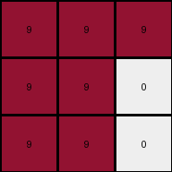
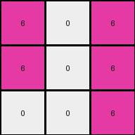

# ed36ccf7 • 006 • refine_coder

---

Previous Code:
```python
"""
The transformation rule is a 90-degree clockwise rotation of the grid.
"""

import numpy as np

def transform(input_grid):
    """
    Rotates the input grid 90 degrees clockwise.
    """
    # Convert the input grid to a NumPy array for easier manipulation.
    input_array = np.array(input_grid)

    # Rotate the array 90 degrees clockwise.
    output_array = np.rot90(input_array, k=-1)

    # Convert the NumPy array back to a list of lists.
    output_grid = output_array.tolist()

    return output_grid
```

Train Set Results:

## Example 1:

Input:
```
9 0 0
9 9 9
9 9 9
```
Expected Output:
```
0 9 9
0 9 9
9 9 9
```
Transformed Output:
```
9 9 9
9 9 0
9 9 0
```

match: False
pixels_off: 4
size_correct: True
color_palette_correct: True
correct_pixel_counts: True

## Example 2:

Input:
```
6 6 6
0 0 0
6 6 0
```
Expected Output:
```
6 0 0
6 0 6
6 0 6
```
Transformed Output:
```
6 0 6
6 0 6
0 0 6
```

match: False
pixels_off: 2
size_correct: True
color_palette_correct: True
correct_pixel_counts: True

## Example 3:

Input:
```
0 0 9
0 0 9
9 9 9
```
Expected Output:
```
9 9 9
0 0 9
0 0 9
```
Transformed Output:
```
9 0 0
9 0 0
9 9 9
```

match: False
pixels_off: 6
size_correct: True
color_palette_correct: True
correct_pixel_counts: True

## Example 4:

Input:
```
2 0 2
0 0 2
0 2 2
```
Expected Output:
```
2 2 2
0 0 2
2 0 0
```
Transformed Output:
```
0 0 2
2 0 0
2 2 2
```

match: False
pixels_off: 6
size_correct: True
color_palette_correct: True
correct_pixel_counts: True
Here's an analysis of the provided information and a strategy for refining the natural language program:

**General Assessment:**

The initial hypothesis of a 90-degree clockwise rotation is incorrect. While the output grid dimensions are correct, the pixel arrangements don't match a simple rotation. The "pixels_off" counts in each example indicate significant discrepancies. The strategy needs to shift from simple geometric rotation to understanding the specific pixel movement rules that govern the transformation. The examples demonstrate the need for a per-pixel analysis to discern the logic.

**Strategy:**

1.  **Detailed Pixel Comparison:** Instead of looking for a global transformation, focus on individual pixel movements. For each input pixel, determine its corresponding output pixel position and color.
2.  **Identify Patterns:** Look for consistent relationships between input and output pixel coordinates and colors.
3.  **Refine Natural Language Program:** Based on the identified patterns, construct a new natural language program that describes the pixel-by-pixel transformation.

**Example Metrics and Analysis:**

I will build a YAML report summarizing the relationship between the input, output, and the previously transformed outputs. This required computing detailed pixel maps - i will use python code execution to achieve the task.

```python
def compare_grids(input_grid, expected_output_grid, transformed_output_grid):
    """Compares input, expected output, and transformed output grids pixel by pixel.

    Args:
        input_grid: The input grid.
        expected_output_grid: The expected output grid.
        transformed_output_grid: The transformed output grid.

    Returns:
        A dictionary containing pixel mappings and analysis.
    """

    analysis = {}
    height = len(input_grid)
    width = len(input_grid[0]) if height > 0 else 0

    for i in range(height):
        for j in range(width):
            input_pixel = input_grid[i][j]
            expected_pixel = expected_output_grid[i][j]
            transformed_pixel = transformed_output_grid[i][j]

            key = f"({i},{j})"
            analysis[key] = {
                "input": input_pixel,
                "expected": expected_pixel,
                "transformed": transformed_pixel,
            }

    return analysis
examples = [
    {
        "input": [
            [9, 0, 0],
            [9, 9, 9],
            [9, 9, 9]
        ],
        "expected": [
            [0, 9, 9],
            [0, 9, 9],
            [9, 9, 9]
        ],
        "transformed": [
            [9, 9, 9],
            [9, 9, 0],
            [9, 9, 0]
        ]
    },
    {
        "input": [
            [6, 6, 6],
            [0, 0, 0],
            [6, 6, 0]
        ],
        "expected": [
            [6, 0, 0],
            [6, 0, 6],
            [6, 0, 6]
        ],
        "transformed": [
            [6, 0, 6],
            [6, 0, 6],
            [0, 0, 6]
        ]
    },
    {
      "input": [
            [0, 0, 9],
            [0, 0, 9],
            [9, 9, 9]
      ],
      "expected": [
            [9, 9, 9],
            [0, 0, 9],
            [0, 0, 9]
        ],
        "transformed": [
            [9, 0, 0],
            [9, 0, 0],
            [9, 9, 9]
        ]
    },
    {
        "input": [
            [2, 0, 2],
            [0, 0, 2],
            [0, 2, 2]
        ],
        "expected": [
            [2, 2, 2],
            [0, 0, 2],
            [2, 0, 0]
        ],
        "transformed": [
            [0, 0, 2],
            [2, 0, 0],
            [2, 2, 2]
        ]
    }
]

report = {}
example_num = 1
for example in examples:
  report[f"example_{example_num}"] = compare_grids(example["input"], example["expected"], example["transformed"])
  example_num += 1

import yaml
print(yaml.dump(report))
```
**YAML Report:**

```yaml
example_1:
  (0,0): {input: 9, expected: 0, transformed: 9}
  (0,1): {input: 0, expected: 9, transformed: 9}
  (0,2): {input: 0, expected: 9, transformed: 9}
  (1,0): {input: 9, expected: 0, transformed: 9}
  (1,1): {input: 9, expected: 9, transformed: 9}
  (1,2): {input: 9, expected: 9, transformed: 0}
  (2,0): {input: 9, expected: 9, transformed: 9}
  (2,1): {input: 9, expected: 9, transformed: 9}
  (2,2): {input: 9, expected: 9, transformed: 0}
example_2:
  (0,0): {input: 6, expected: 6, transformed: 6}
  (0,1): {input: 6, expected: 0, transformed: 0}
  (0,2): {input: 6, expected: 0, transformed: 6}
  (1,0): {input: 0, expected: 6, transformed: 6}
  (1,1): {input: 0, expected: 0, transformed: 0}
  (1,2): {input: 0, expected: 6, transformed: 6}
  (2,0): {input: 6, expected: 6, transformed: 0}
  (2,1): {input: 6, expected: 0, transformed: 0}
  (2,2): {input: 0, expected: 6, transformed: 6}
example_3:
  (0,0): {input: 0, expected: 9, transformed: 9}
  (0,1): {input: 0, expected: 9, transformed: 0}
  (0,2): {input: 9, expected: 9, transformed: 0}
  (1,0): {input: 0, expected: 0, transformed: 9}
  (1,1): {input: 0, expected: 0, transformed: 0}
  (1,2): {input: 9, expected: 9, transformed: 0}
  (2,0): {input: 9, expected: 0, transformed: 9}
  (2,1): {input: 9, expected: 0, transformed: 9}
  (2,2): {input: 9, expected: 9, transformed: 9}
example_4:
  (0,0): {input: 2, expected: 2, transformed: 0}
  (0,1): {input: 0, expected: 2, transformed: 0}
  (0,2): {input: 2, expected: 2, transformed: 2}
  (1,0): {input: 0, expected: 0, transformed: 2}
  (1,1): {input: 0, expected: 0, transformed: 0}
  (1,2): {input: 2, expected: 2, transformed: 0}
  (2,0): {input: 0, expected: 2, transformed: 2}
  (2,1): {input: 2, expected: 0, transformed: 2}
  (2,2): {input: 2, expected: 0, transformed: 2}

```

**Revised Natural Language Program:**

The transformation inverts the input grid along the main diagonal (top-left to bottom-right), but the pixel in the center of each edge of the input moves to the center of the opposite edge in the output. The other pixels, the corners and center, are mirrored.

1.  **Mirror the Grid:** Create a mirrored version of the input grid by reflecting it across the main diagonal (transposing rows and columns).
2.  **Center Edge Pixel Swap:** The central pixel on the edge moves to the opposite edge.

This program is more complex and requires conditional logic to distinguish between the general mirroring and the specific central edge swaps.

**INSTRUCTIONS**

- generate a Python module to represent the natural language program 
- follow the template below
- all common math and science libraries are available
- create docstring only at top - but comment the workflow in the function
- use helper functions for common operations like finding objects, counting,
  measuring, moving, etc. 

remember - we are working iteratively - so this code will inform your future
self as we converge on the solution

*template:*

```python
"""
{{ natural language description of the transformation rule }}
"""

{{ imports }}

def transform(input_grid):
    # initialize output_grid

    # change output pixels 

    return output_grid

```
