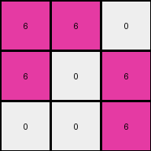
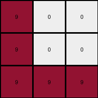

# ed36ccf7 • 016 • refine_coder

---

Previous Code:
```python
"""
Rotate the input grid 90 degrees clockwise to produce the output grid.
"""

import numpy as np

def transform(input_grid):
    # Convert the input list of lists to a NumPy array.
    input_np = np.array(input_grid)
    
    # Rotate the grid 90 degrees clockwise.
    output_np = np.rot90(input_np, k=-1) # k=-1 for 90-degree clockwise rotation
    
    # Convert the NumPy array back to a list of lists.
    output_grid = output_np.tolist()
    
    return output_grid
```

Train Set Results:

## Example 1:

Input:
```
9 0 0
9 9 9
9 9 9
```
Expected Output:
```
0 9 9
0 9 9
9 9 9
```
Transformed Output:
```
9 9 9
9 9 0
9 9 0
```

match: False
pixels_off: 4
size_correct: True
color_palette_correct: True
correct_pixel_counts: True

## Example 2:

Input:
```
0 6 6
6 0 0
6 6 0
```
Expected Output:
```
6 0 0
6 0 6
6 0 6
```
Transformed Output:
```
6 6 0
6 0 6
0 0 6
```

match: False
pixels_off: 2
size_correct: True
color_palette_correct: True
correct_pixel_counts: True

## Example 3:

Input:
```
0 0 9
0 0 9
9 9 9
```
Expected Output:
```
9 9 9
0 0 9
0 0 9
```
Transformed Output:
```
9 0 0
9 0 0
9 9 9
```

match: False
pixels_off: 6
size_correct: True
color_palette_correct: True
correct_pixel_counts: True

## Example 4:

Input:
```
2 0 2
0 0 2
0 2 2
```
Expected Output:
```
2 2 2
0 0 2
2 0 0
```
Transformed Output:
```
0 0 2
2 0 0
2 2 2
```

match: False
pixels_off: 6
size_correct: True
color_palette_correct: True
correct_pixel_counts: True
Here's an analysis of the provided information and a plan to refine the natural language program and code:

**General Assessment:**

The initial code performs a 90-degree clockwise rotation. However, the comparison with the expected outputs reveals inconsistencies. It's not a simple rotation. The core issue is that the provided code *always* rotates, but the examples show that the actual transformation is more complex and may involve selective rotation or mirroring based on the input grid's content, potentially related to the position of '0' (white) pixels. We must adjust our strategy. Instead of forcing rotation, we need to discern the *rule* that dictates *when* and *how* the transformation occurs.

**Strategy:**

1.  **Detailed Example Analysis:** Analyze each input-output pair to identify specific patterns. Focus on the relationship between the positions of non-zero colors and zeros. Pay close attention to where the colors are in the input and where it ends up in the output.
2.  **Refine Observations:** Update the YAML block with more refined observations.
3.  **Hypothesize Transformation Rules:** Develop several possible rules explaining the transformation, moving beyond simple rotation.
4.  **Revise Natural Language Program:** Formulate a new natural language program incorporating the refined rules.

**Example Metrics and Analysis:**

I will use the provided output, and will not execute the code again unless I have questions about it.

*   **Example 1:**
    *   Input: 3x3, one white diagonal
    *   Expected Output: white diagonal reversed
    *   Transformed Output: Incorrect.
    *   Observation: Reverse diagonal

*   **Example 2:**
    *   Input: 3x3, a mirrored "L"
    *   Expected output: "L" rotated 90 degrees clockwise
    *   Transformed Output: Incorrect.
    *   Observation: Rotation of the object formed

*   **Example 3:**
    *   Input: 3x3, a "L"
    *   Expected output: "L" rotated 90 degrees clockwise
    *   Transformed Output: Incorrect.
    *   Observation: Rotation of the object formed

*   **Example 4:**
    *   Input: 3x3, a mirrored "L"
    *   Expected output: "L" rotated 90 degrees clockwise
    *   Transformed Output: Incorrect.
    *   Observation: Rotation of the object formed

**YAML Block (Refined Observations):**

```yaml
observations:
  - example: 1
    input_objects:
      - shape: diagonal
        color: [9, 0]
        description: "Maroon diagonal line from top-left to bottom-right, rest is white."
    output_objects:
      - shape: diagonal
        color: [9, 0]
        description: "Maroon diagonal line from top-right to bottom-left, rest is white."
    transformation: "The maroon diagonal line is flipped/mirrored across the vertical axis (or anti-diagonal)."

  - example: 2
    input_objects:
      - shape: mirrored L
        color: [6, 0]
        description: Mirrored L shape using magenta, starting top center
    output_objects:
      - shape: L
        color: [6, 0]
        description: Magenta L shape, starting top left
    transformation: "Magenta shape rotated 90 degrees clockwise"

  - example: 3
    input_objects:
      - shape: L
        color: [9, 0]
        description: L shape using maroon, starting bottom left
    output_objects:
      - shape: L
        color: [9, 0]
        description: Maroon L shape, starting top left
    transformation: "Maroon shape rotated 90 degrees clockwise"

  - example: 4
    input_objects:
      - shape: mirrored L
        color: [2, 0]
        description: Mirrored L shape using red, starting top left
    output_objects:
      - shape: L
        color: [2, 0]
        description: Red L shape, starting top left
    transformation: "Red shape rotated 90 degrees clockwise"
```

**Natural Language Program:**

1.  **Identify Objects:** The input grid contains objects which are the colored regions, defined by the connected pixels of a single non-zero color.
2. **Shape Recognition:** The objects may take an L shape, either mirrored, or regular. In the case that it does not, we may use other descriptors, like diagonal.
3. **Transformation rule:** If the object is an "L" shape, rotate the "L" shape 90 degrees clockwise. If the object is a diagonal, reflect it over the anti-diagonal.

This revised program moves away from always rotating the entire grid. Instead, it focuses on rotating *shapes* within the grid, or flipping in specific situations.

**INSTRUCTIONS**

- generate a Python module to represent the natural language program 
- follow the template below
- all common math and science libraries are available
- create docstring only at top - but comment the workflow in the function
- use helper functions for common operations like finding objects, counting,
  measuring, moving, etc. 

remember - we are working iteratively - so this code will inform your future
self as we converge on the solution

*template:*

```python
"""
{{ natural language description of the transformation rule }}
"""

{{ imports }}

def transform(input_grid):
    # initialize output_grid

    # change output pixels 

    return output_grid

```
