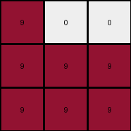
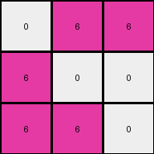

# ed36ccf7 • 017 • refine_dreamer

---

Previous Code:
```python
"""
Identify objects in the grid. If the object is an "L" shape, rotate the "L" shape 90 degrees clockwise. If the object is a diagonal, reflect it over the anti-diagonal.
"""

import numpy as np

def get_object(grid):
    """
    Extracts the non-zero object from the grid.  Assumes a single object.
    Returns coordinates and color.
    """
    coords = []
    color = 0
    for r, row in enumerate(grid):
        for c, val in enumerate(row):
            if val != 0:
                coords.append((r, c))
                color = val
    return coords, color

def rotate_point(point, rows, cols):
    """Rotates a point 90 degrees clockwise around the center of the grid."""
    r, c = point
    center_r = (rows - 1) / 2
    center_c = (cols - 1) / 2
    new_r = c - center_c + center_r
    new_c = -(r - center_r) + center_c
    return int(new_r), int(new_c)
    
def is_L_shape(coords, rows, cols):
    """Checks if the coordinates form an L shape (regular or mirrored)."""

    if len(coords) != 3:
        return False

    # Convert coords to numpy array for easier manipulation
    coords_np = np.array(coords)

    # Calculate differences between coordinates
    diffs = np.diff(coords_np, axis=0)
    
    if len(diffs) < 2:
        return False

    # Check if the differences indicate an L shape
    # An L-shape will have two segments. The segments should be orthogonal.
    
    # Check for orthogonality by verifying one of the differences is zero
    if (diffs[0][0] == 0 or diffs[0][1] == 0) and (diffs[1][0] == 0 or diffs[1][1] == 0) :
        if (diffs[0][0] == 0 and diffs[1][1] == 0) or (diffs[0][1] == 0 and diffs[1][0] == 0):
           return True

    return False

def is_diagonal(coords, rows, cols):
    if len(coords) != rows:
      return False
    
    coords_set = set(coords)
    
    # Check for main diagonal
    is_main_diagonal = all((i, i) in coords_set for i in range(rows))
    if is_main_diagonal:
        return "main"
    
    # check for anti diagonal
    is_anti_diagonal = all((i, cols - 1 - i) in coords_set for i in range(rows))
    if is_anti_diagonal:
        return "anti"
    
    return False
    

def reflect_anti_diagonal(point, rows, cols):
    r, c = point
    return c, r

def transform(input_grid):
    # Convert the input list of lists to a NumPy array.
    input_np = np.array(input_grid)
    rows, cols = input_np.shape
    
    # Get object coordinates and color
    coords, color = get_object(input_grid)

    # initialize output grid
    output_np = np.zeros_like(input_np)
    
    if len(coords) == 0:
        return output_np.tolist()

    if is_L_shape(coords, rows, cols):
        # Rotate L shape
        new_coords = [rotate_point(p, rows, cols) for p in coords]
        for r, c in new_coords:
            if 0 <= r < rows and 0 <= c < cols:
                output_np[r, c] = color
    elif is_diagonal(coords, rows, cols) == "anti":
        # flip across anti-diagonal:
        new_coords = [reflect_anti_diagonal(p, rows, cols) for p in coords]
        for r,c in new_coords:
            output_np[r,c] = color
    elif is_diagonal(coords, rows, cols) == "main":
        new_coords = [reflect_anti_diagonal(p, rows, cols) for p in coords]
        for r, c in new_coords:
          output_np[r,c] = color
    else:
        # default - no change
        for r, c in coords:
          output_np[r,c] = color
            
    # Convert the NumPy array back to a list of lists.
    output_grid = output_np.tolist()
    
    return output_grid
```

Train Set Results:

## Example 1:

Input:
```
9 0 0
9 9 9
9 9 9
```
Expected Output:
```
0 9 9
0 9 9
9 9 9
```
Transformed Output:
```
9 0 0
9 9 9
9 9 9
```

match: False
pixels_off: 4
size_correct: True
color_palette_correct: True
correct_pixel_counts: True

## Example 2:

Input:
```
0 6 6
6 0 0
6 6 0
```
Expected Output:
```
6 0 0
6 0 6
6 0 6
```
Transformed Output:
```
0 6 6
6 0 0
6 6 0
```

match: False
pixels_off: 6
size_correct: True
color_palette_correct: True
correct_pixel_counts: True

## Example 3:

Input:
```
0 0 9
0 0 9
9 9 9
```
Expected Output:
```
9 9 9
0 0 9
0 0 9
```
Transformed Output:
```
0 0 9
0 0 9
9 9 9
```

match: False
pixels_off: 4
size_correct: True
color_palette_correct: True
correct_pixel_counts: True

## Example 4:

Input:
```
2 0 2
0 0 2
0 2 2
```
Expected Output:
```
2 2 2
0 0 2
2 0 0
```
Transformed Output:
```
2 0 2
0 0 2
0 2 2
```

match: False
pixels_off: 4
size_correct: True
color_palette_correct: True
correct_pixel_counts: True
**INSTRUCTIONS**

The code above was generated based on observations from the first training
example

we have tested the transform function on each of the task example inputs and
compared with the expected output

review each of the examples provided and the results and consider how the
natural language program should be updated to accommodate this new knowledge

respond with the following deliverables:

- general assessment of the information provided and strategy for resolving the
  errors
- gather metrics about each of the examples and results - use code_execution to
  develop accurate reports on your assumptions
- a YAML block documenting facts - Focus on identifying objects, their properties, and the actions performed on them.
- a natural language program - Be as clear and concise as possible, providing a complete description of the transformation rule.


your responses should be considered as information in a report - not a
conversation
