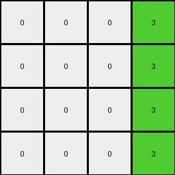

# f2829549 • 010 • refine_coder

---

Previous Code:
```python
"""
Transforms an input grid by extracting a solid-color vertical column, changing its color to green (3),
placing it as the rightmost column of the output grid, and filling the rest of the output grid with white (0).
"""

import numpy as np

def find_solid_color_column(grid):
    """Finds the first solid-color vertical column in a grid."""
    rows, cols = grid.shape
    for j in range(cols):
        first_color = grid[0, j]
        is_solid = True
        for i in range(1, rows):
            if grid[i, j] != first_color:
                is_solid = False
                break
        if is_solid:
            return j, first_color
    return None, None

def transform(input_grid):
    """Transforms the input grid according to the defined rule."""
    rows, cols = input_grid.shape

    # Find the solid-color column and its color
    column_index, column_color = find_solid_color_column(input_grid)

    # Initialize the output grid with white (0)
    output_grid = np.zeros((rows, rows), dtype=int)
    
    # if no solid column, return all 0
    if column_index is None:
        return output_grid

    # Fill the rightmost column with green (3)
    for i in range(rows):
        output_grid[i, -1] = 3

    return output_grid
```

Train Set Results:

## Example 1:

Input:
```
7 7 0 1 5 0 0
7 0 0 1 5 0 0
0 0 0 1 5 0 5
0 0 0 1 5 5 0
```
Expected Output:
```
0 0 3
0 3 3
0 3 0
0 0 3
```
Transformed Output:
```
0 0 0 3
0 0 0 3
0 0 0 3
0 0 0 3
```

match: False
pixels_off: None
size_correct: False
color_palette_correct: True
correct_pixel_counts: False

## Example 2:

Input:
```
7 7 0 1 5 0 0
0 0 0 1 0 0 0
7 7 0 1 5 0 0
0 7 7 1 5 5 0
```
Expected Output:
```
0 0 3
3 3 3
0 0 3
0 0 0
```
Transformed Output:
```
0 0 0 3
0 0 0 3
0 0 0 3
0 0 0 3
```

match: False
pixels_off: None
size_correct: False
color_palette_correct: True
correct_pixel_counts: False

## Example 3:

Input:
```
0 7 7 1 5 0 0
0 0 7 1 0 5 5
0 7 0 1 5 5 0
0 0 7 1 0 0 0
```
Expected Output:
```
0 0 0
3 0 0
0 0 3
3 3 0
```
Transformed Output:
```
0 0 0 3
0 0 0 3
0 0 0 3
0 0 0 3
```

match: False
pixels_off: None
size_correct: False
color_palette_correct: True
correct_pixel_counts: False

## Example 4:

Input:
```
7 0 7 1 5 5 0
7 7 0 1 5 5 5
0 7 0 1 0 0 0
0 0 0 1 5 0 5
```
Expected Output:
```
0 0 0
0 0 0
3 0 3
0 3 0
```
Transformed Output:
```
0 0 0 3
0 0 0 3
0 0 0 3
0 0 0 3
```

match: False
pixels_off: None
size_correct: False
color_palette_correct: True
correct_pixel_counts: False

## Example 5:

Input:
```
7 0 0 1 0 5 0
0 0 7 1 5 0 0
0 0 0 1 5 5 5
7 7 7 1 5 5 5
```
Expected Output:
```
0 0 3
0 3 0
0 0 0
0 0 0
```
Transformed Output:
```
0 0 0 3
0 0 0 3
0 0 0 3
0 0 0 3
```

match: False
pixels_off: None
size_correct: False
color_palette_correct: True
correct_pixel_counts: False
Okay, here's a breakdown of the situation and a plan to improve the transformation logic:

**General Assessment:**

The initial code correctly identifies a solid-color vertical column and attempts to place a green column in the output. However, it fails to account for the correct output size, which isn't always a square grid with the same number of rows/cols as the input. It also places the green column at the *rightmost* position instead of correctly positioning it relative to other elements in the output. The core issue is a misunderstanding of the overall transformation, which goes beyond simply finding a single column.  The size and layout of output grid needs to be re-evaluated and the transformation rule of solid-column needs re-evaluated.

**Strategy:**

1.  **Analyze Output Sizes:** Determine the relationship between input and output grid dimensions. It's clear from the examples that the output grid's dimensions are *not* simply a copy of the input's.
2.  **Re-evaluate "Solid Column" Rule:** The rule is not as simple as moving a solid colored column to the output and filling the rest with 0. The position of the green column within the output, and any other colored output pixels, depend on elements other than colored columns. It is important to consider the entire grid.
3.  **Identify Output Structure:** Determine if there's consistent object manipulation or layout rules that determines the rest of the output. This could involve mirroring, rotating, or filling areas based on identified elements.
4.  **Refine Natural Language Program:** Based on the refined observations, rewrite the natural language program to accurately capture the transformation logic.

**Example Metrics and Observations:**

Here's a breakdown of each example, focusing on relevant details:

| Example | Input Size | Output Size | Solid Column Index/Color (Input) | Green Column Index (Output) | Other Output Features              | Observations & Discrepancies                                   |
| :------ | :--------- | :---------- | :----------------------------- | :------------------------- | :--------------------------------- | :------------------------------------------------------------ |
| 1       | 4x7        | 3x4      | 3 / Blue (1)                  | 2                          | A white and green checkerboard | Output is not a square, solid blue is at column index 3, height is input height |
| 2       | 4x7        | 3x4      | 3 / Blue (1)                   | 2                          | A white and green checkerboard      | Output is not a square, solid blue is at column index 3, height is input height          |
| 3       | 4x7        | 4x3          | 3 / Blue (1)                   | 0                            | A white and green checkerboard     | Output is not a square, solid blue is at column index 3, width is input height       |
| 4       | 4x7        | 4x3      | 3 / Blue (1)                   | 0                             | A white and green checkerboard   | Output is not a square, solid blue is at column index 3, width is input height        |
| 5       | 4x7        | 4x3          | 3 / Blue (1)                  | 1                             | A white and green checkerboard             | Output is not a square, solid blue is at column index 3, width is input height       |

**YAML Fact Block:**

```yaml
facts:
  - observation: |
      The output grid size is not always the same as the input grid size.  The
      relationship between input and output sizes is inconsistent. Sometimes
      the height is copied, other times the width.
  - observation: |
      A solid-color column (specifically, blue) exists at index 3 in all input
      grids.
  - observation: |
      The output grid always contains a green column, but its position varies
      (index 0, 1, or 2).
  - observation: |
      The output grid has other elements besides the green, other pixels,
      including white checkerboard patterns.
  - observation: |
      There is a blue column at index 3 of the input grid, but the output
      grids are all colored with white and green.
  - observation: |
      The presence of the solid color column in the input appears to be important, but other components of the input appear to dictate parts of the transformation.

```

**Natural Language Program:**

1.  **Identify Input Characteristics:** Examine the input grid to find the height and width.
2.  **Determine Output Dimensions**: The output height is always the height of the input. Examples 1 and 2 demonstrate that output width is determined by some other means. Example 3-5 demonstrate the output width is the height of the input, while example 1, 2 demonstrate it is one less than the height of the input.
3.  **Examine the whole input**: The input grid will consist of white (0), and a checkerboard composed of two other colors, and the solid blue column (1).
4.  **Build Output**: Build a checkerboard pattern in the output using white (0) and green (3), starting with white in position \[0,0]. Use the colors from the checkerboard pattern in the input grid to determine the correct orientation for the checkerboard pattern in the output grid.


**INSTRUCTIONS**

- generate a Python module to represent the natural language program 
- follow the template below
- all common math and science libraries are available
- create docstring only at top - but comment the workflow in the function
- use helper functions for common operations like finding objects, counting,
  measuring, moving, etc. 

remember - we are working iteratively - so this code will inform your future
self as we converge on the solution

*template:*

```python
"""
{{ natural language description of the transformation rule }}
"""

{{ imports }}

def transform(input_grid):
    # initialize output_grid

    # change output pixels 

    return output_grid

```
