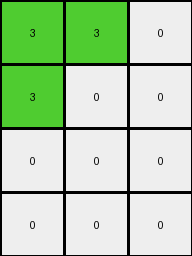
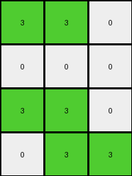
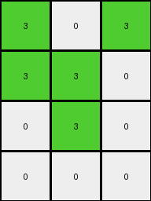
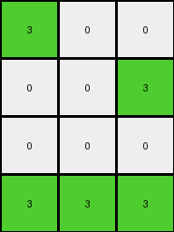

# f2829549 • 023 • refine_dreamer

---

Previous Code:
```python
"""
1.  **Input and Output:** The input is a 4x7 grid, and the output is a 4x3 grid.
2.  **Row-wise Transformation:** For each row in the input grid:
    *   Check if the color orange (7) is present in any of the first three columns.
    *   If orange is found in any of the first three columns, check the values in each of these columns:
        *   If the cell is orange, change it to green.
        *   Otherwise, change it to white.
    *   If orange is not found, the output row becomes all white (0).
"""

import numpy as np

def transform(input_grid):
    # Initialize output_grid
    output_grid = np.zeros((4, 3), dtype=int)

    # Iterate through each row of the input grid
    for i in range(input_grid.shape[0]):
        # Check for orange in the first three columns of the current row
        orange_present = False
        for j in range(3):
            if input_grid[i, j] == 7:
                orange_present = True
                break

        # Transform the row based on the presence of orange
        if orange_present:
            for j in range(3):
                if input_grid[i, j] == 7:
                    output_grid[i, j] = 3  # Change orange to green
                else:
                    output_grid[i, j] = 0  # Change other colors to white
        else:
            output_grid[i, :] = 0  # Set entire row to white

    return output_grid
```

Train Set Results:

## Example 1:

Input:
```
7 7 0 1 5 0 0
7 0 0 1 5 0 0
0 0 0 1 5 0 5
0 0 0 1 5 5 0
```
Expected Output:
```
0 0 3
0 3 3
0 3 0
0 0 3
```
Transformed Output:
```
3 3 0
3 0 0
0 0 0
0 0 0
```

match: False
pixels_off: 8
size_correct: True
color_palette_correct: True
correct_pixel_counts: False

## Example 2:

Input:
```
7 7 0 1 5 0 0
0 0 0 1 0 0 0
7 7 0 1 5 0 0
0 7 7 1 5 5 0
```
Expected Output:
```
0 0 3
3 3 3
0 0 3
0 0 0
```
Transformed Output:
```
3 3 0
0 0 0
3 3 0
0 3 3
```

match: False
pixels_off: 11
size_correct: True
color_palette_correct: True
correct_pixel_counts: False

## Example 3:

Input:
```
0 7 7 1 5 0 0
0 0 7 1 0 5 5
0 7 0 1 5 5 0
0 0 7 1 0 0 0
```
Expected Output:
```
0 0 0
3 0 0
0 0 3
3 3 0
```
Transformed Output:
```
0 3 3
0 0 3
0 3 0
0 0 3
```

match: False
pixels_off: 9
size_correct: True
color_palette_correct: True
correct_pixel_counts: False

## Example 4:

Input:
```
7 0 7 1 5 5 0
7 7 0 1 5 5 5
0 7 0 1 0 0 0
0 0 0 1 5 0 5
```
Expected Output:
```
0 0 0
0 0 0
3 0 3
0 3 0
```
Transformed Output:
```
3 0 3
3 3 0
0 3 0
0 0 0
```

match: False
pixels_off: 8
size_correct: True
color_palette_correct: True
correct_pixel_counts: False

## Example 5:

Input:
```
7 0 0 1 0 5 0
0 0 7 1 5 0 0
0 0 0 1 5 5 5
7 7 7 1 5 5 5
```
Expected Output:
```
0 0 3
0 3 0
0 0 0
0 0 0
```
Transformed Output:
```
3 0 0
0 0 3
0 0 0
3 3 3
```

match: False
pixels_off: 7
size_correct: True
color_palette_correct: True
correct_pixel_counts: False
**INSTRUCTIONS**

The code above was generated based on observations from the first training
example

we have tested the transform function on each of the task example inputs and
compared with the expected output

review each of the examples provided and the results and consider how the
natural language program should be updated to accommodate this new knowledge

respond with the following deliverables:

- general assessment of the information provided and strategy for resolving the
  errors
- gather metrics about each of the examples and results - use code_execution to
  develop accurate reports on your assumptions
- a YAML block documenting facts - Focus on identifying objects, their properties, and the actions performed on them.
- a natural language program - Be as clear and concise as possible, providing a complete description of the transformation rule.


your responses should be considered as information in a report - not a
conversation
