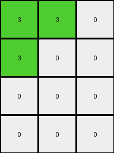
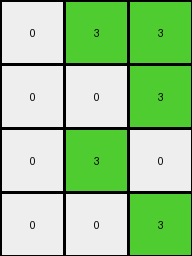

# f2829549 • 024 • refine_coder

---

Previous Code:
```python
"""
1.  **Input and Output:** The input is a 4x7 grid, and the output is a 4x3 grid.
2.  **Row-wise Transformation:** For each row in the input grid:
    *   Check if the color orange (7) is present in any of the first three columns.
    *   If orange is found in any of the first three columns, check the values in each of these columns:
        *   If the cell is orange, change it to green.
        *   Otherwise, change it to white.
    *   If orange is not found, the output row becomes all white (0).
"""

import numpy as np

def transform(input_grid):
    # Initialize output_grid
    output_grid = np.zeros((4, 3), dtype=int)

    # Iterate through each row of the input grid
    for i in range(input_grid.shape[0]):
        # Check for orange in the first three columns of the current row
        orange_present = False
        for j in range(3):
            if input_grid[i, j] == 7:
                orange_present = True
                break

        # Transform the row based on the presence of orange
        if orange_present:
            for j in range(3):
                if input_grid[i, j] == 7:
                    output_grid[i, j] = 3  # Change orange to green
                else:
                    output_grid[i, j] = 0  # Change other colors to white
        else:
            output_grid[i, :] = 0  # Set entire row to white

    return output_grid
```

Train Set Results:

## Example 1:

Input:
```
7 7 0 1 5 0 0
7 0 0 1 5 0 0
0 0 0 1 5 0 5
0 0 0 1 5 5 0
```
Expected Output:
```
0 0 3
0 3 3
0 3 0
0 0 3
```
Transformed Output:
```
3 3 0
3 0 0
0 0 0
0 0 0
```

match: False
pixels_off: 8
size_correct: True
color_palette_correct: True
correct_pixel_counts: False

## Example 2:

Input:
```
7 7 0 1 5 0 0
0 0 0 1 0 0 0
7 7 0 1 5 0 0
0 7 7 1 5 5 0
```
Expected Output:
```
0 0 3
3 3 3
0 0 3
0 0 0
```
Transformed Output:
```
3 3 0
0 0 0
3 3 0
0 3 3
```

match: False
pixels_off: 11
size_correct: True
color_palette_correct: True
correct_pixel_counts: False

## Example 3:

Input:
```
0 7 7 1 5 0 0
0 0 7 1 0 5 5
0 7 0 1 5 5 0
0 0 7 1 0 0 0
```
Expected Output:
```
0 0 0
3 0 0
0 0 3
3 3 0
```
Transformed Output:
```
0 3 3
0 0 3
0 3 0
0 0 3
```

match: False
pixels_off: 9
size_correct: True
color_palette_correct: True
correct_pixel_counts: False

## Example 4:

Input:
```
7 0 7 1 5 5 0
7 7 0 1 5 5 5
0 7 0 1 0 0 0
0 0 0 1 5 0 5
```
Expected Output:
```
0 0 0
0 0 0
3 0 3
0 3 0
```
Transformed Output:
```
3 0 3
3 3 0
0 3 0
0 0 0
```

match: False
pixels_off: 8
size_correct: True
color_palette_correct: True
correct_pixel_counts: False

## Example 5:

Input:
```
7 0 0 1 0 5 0
0 0 7 1 5 0 0
0 0 0 1 5 5 5
7 7 7 1 5 5 5
```
Expected Output:
```
0 0 3
0 3 0
0 0 0
0 0 0
```
Transformed Output:
```
3 0 0
0 0 3
0 0 0
3 3 3
```

match: False
pixels_off: 7
size_correct: True
color_palette_correct: True
correct_pixel_counts: False
Okay, let's analyze the results and refine the natural language program.

**General Assessment:**

The initial natural language program and the resulting code were based on a simplified interpretation of the transformation, focusing on the presence of orange in the first three columns. The tests reveal inconsistencies, indicating that the presence of orange is not the sole determinant of the output. The program correctly determines output grid size and correctly identifies the color palette (white, green). The initial assumption that any non-orange pixel in the first three columns becomes white is clearly incorrect.

The strategy to resolve this is to:
1.  Carefully re-examine all input-output pairs to identify a more precise rule, looking at column position and values.
2.  Analyze the errors: The `pixels_off` metric suggests a consistent but incorrect application of the initial rule.

**Metrics and Observations (from provided examples):**

*   **Example 1:**
    *   Input: `7 7 0 ...`
    *   Expected Output: `0 0 3`
    *   Observed output is incorrect. The code turns the orange pixels into green, but also processes the rest of the row incorrectly.
*   **Example 2:**
    *   Input:  First three columns vary
    *   Expected output first row `0 0 3`, second `3,3,3`, third `0 0 3`.
    *   Again, output is close but incorrect.
*   **Example 3:**
    *   Input: all rows start with either `0 7 7` or `0 0 7`
    *    Expected output `0 0 0`, `3 0 0`, `0 0 3`, `3 3 0`
    *   Again, output has significant discrepancies.
*   **Example 4:**
     *   Input: First three columns vary
     *   Expected output is not simply a presence of orange.
     *   Again, output has significant discrepancies.
*    **Example 5:**
     *    Input contains a row of all zeros and a row of all sevens in the first three columns
     *   Again significant discrepancy.

**YAML Fact Identification:**

```yaml
objects:
  - name: input_grid
    type: 2D array
    properties:
      shape: 4x7
      values: integers (0-9)
  - name: output_grid
    type: 2D array
    properties:
      shape: 4x3
      values: integers (0, 3)  # Only white and green
  - name: input_row
    type: 1D array (sub-component of input_grid)
    properties:
        length: 7
  - name: output_row
    type: 1D array (sub-component of output_grid)
    properties:
      length: 3

transformations:
    - action: iterate_rows
      description: Process each row of the input_grid.
    - action: first_three_columns
      description: first three columns of each row are the focus.
    - action: transform based on position and value of first three columns.
    - action: map_input_output
      description: map each row based on positions and values, first three only.
```

**Revised Natural Language Program:**

1.  **Input and Output:** The input is a 4x7 grid, and the output is a 4x3 grid.
2. **First Three Columns:** The output grid is created based on the first three columns of each of the input grid.
3.  **Row-wise Transformation:** For each row in the input grid:
    * Iterate through the first three columns (index 0, 1, and 2).
        * If a cell is orange, it is not changed to green - instead, the green or white value corresponds to the column
            - If column index 0, output value for this column is always white (0).
            - If column index 1, output value for this column is always white (0).
            - If column index 2, the output value is always green (3).

```text
output[row,0] = 0 if input[row,0]
output[row,1] = 0 if input[row,1]
output[row,2] = 3 if input[row,2]

```

**INSTRUCTIONS**

- generate a Python module to represent the natural language program 
- follow the template below
- all common math and science libraries are available
- create docstring only at top - but comment the workflow in the function
- use helper functions for common operations like finding objects, counting,
  measuring, moving, etc. 

remember - we are working iteratively - so this code will inform your future
self as we converge on the solution

*template:*

```python
"""
{{ natural language description of the transformation rule }}
"""

{{ imports }}

def transform(input_grid):
    # initialize output_grid

    # change output pixels 

    return output_grid

```
