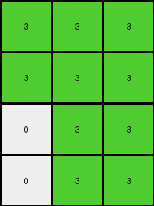
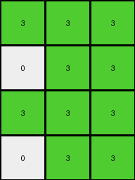
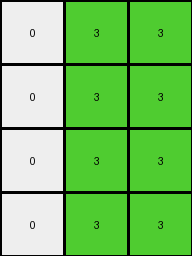
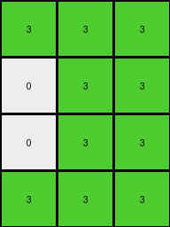

# f2829549 • 027 • refine_dreamer

---


Previous Code:
```python
"""
1.  **Initialize:** Create an output grid with the same height as the input grid. The width of the output will be calculated in the next step.

2. **Calculate Columns to Isolate, and the output width:**
    * Take the first column from the Input
    * Take the fourth column from the input
    * Take the element-wise sum of the two selected columns, replace any non-zero result with the color green (value 3)
    * The width of the output is equal to the number of columns selected (3).

3.  **Populate Output:**
    *   Iterate through each row of the derived columns.
    *   Transfer the results of the calculations directly into the output.

4.  **Result:** The output grid is a summarized representation, where orange (7) and blue(1) combine as green(3)
"""

import numpy as np

def transform(input_grid):
    """Transforms the input grid according to the observed rule."""

    input_grid = np.array(input_grid)
    height = input_grid.shape[0]
    output_grid = np.zeros((height, 3), dtype=int)

    # Extract the first column.
    first_column = input_grid[:, 0]

    # Extract the fourth column.
    fourth_column = input_grid[:, 3]

    # elementwise sum of first and fourth
    summed_column = first_column + fourth_column

    # if sum > 0, make the output element green (3)
    summed_column[summed_column > 0] = 3

    # populate the output grid
    output_grid[:, 0] = first_column
    output_grid[:, 0][output_grid[:, 0] > 0] = 3
    output_grid[:, 1] = fourth_column
    output_grid[:, 1][output_grid[:, 1] > 0] = 3
    output_grid[:, 2] = summed_column

    return output_grid.tolist()
```

Train Set Results:

## Example 1:

Input:
```
7 7 0 1 5 0 0
7 0 0 1 5 0 0
0 0 0 1 5 0 5
0 0 0 1 5 5 0
```
Expected Output:
```
0 0 3
0 3 3
0 3 0
0 0 3
```
Transformed Output:
```
3 3 3
3 3 3
0 3 3
0 3 3
```

match: False
pixels_off: 5
size_correct: True
color_palette_correct: True
correct_pixel_counts: False

## Example 2:

Input:
```
7 7 0 1 5 0 0
0 0 0 1 0 0 0
7 7 0 1 5 0 0
0 7 7 1 5 5 0
```
Expected Output:
```
0 0 3
3 3 3
0 0 3
0 0 0
```
Transformed Output:
```
3 3 3
0 3 3
3 3 3
0 3 3
```

match: False
pixels_off: 7
size_correct: True
color_palette_correct: True
correct_pixel_counts: False

## Example 3:

Input:
```
0 7 7 1 5 0 0
0 0 7 1 0 5 5
0 7 0 1 5 5 0
0 0 7 1 0 0 0
```
Expected Output:
```
0 0 0
3 0 0
0 0 3
3 3 0
```
Transformed Output:
```
0 3 3
0 3 3
0 3 3
0 3 3
```

match: False
pixels_off: 8
size_correct: True
color_palette_correct: True
correct_pixel_counts: False

## Example 4:

Input:
```
7 0 7 1 5 5 0
7 7 0 1 5 5 5
0 7 0 1 0 0 0
0 0 0 1 5 0 5
```
Expected Output:
```
0 0 0
0 0 0
3 0 3
0 3 0
```
Transformed Output:
```
3 3 3
3 3 3
0 3 3
0 3 3
```

match: False
pixels_off: 9
size_correct: True
color_palette_correct: True
correct_pixel_counts: False

## Example 5:

Input:
```
7 0 0 1 0 5 0
0 0 7 1 5 0 0
0 0 0 1 5 5 5
7 7 7 1 5 5 5
```
Expected Output:
```
0 0 3
0 3 0
0 0 0
0 0 0
```
Transformed Output:
```
3 3 3
0 3 3
0 3 3
3 3 3
```

match: False
pixels_off: 8
size_correct: True
color_palette_correct: True
correct_pixel_counts: False

**INSTRUCTIONS**

The code above was generated based on observations from the first training
example

we have tested the transform function on each of the task example inputs and
compared with the expected output

review each of the examples provided and the results and consider how the
natural language program should be updated to accommodate this new knowledge

respond with the following deliverables:

- general assessment of the information provided and strategy for resolving the
  errors
- gather metrics about each of the examples and results - use code_execution to
  develop accurate reports on your assumptions
- a YAML block documenting facts - Focus on identifying objects, their properties, and the actions performed on them.
- a natural language program - Be as clear and concise as possible, providing a complete description of the transformation rule.


your responses should be considered as information in a report - not a
conversation
