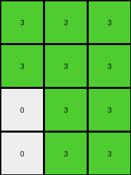
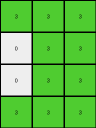

# f2829549 • 028 • refine_coder

---

Previous Code:
```python
"""
1.  **Initialize:** Create an output grid with the same height as the input grid. The width of the output will be calculated in the next step.

2. **Calculate Columns to Isolate, and the output width:**
    * Take the first column from the Input
    * Take the fourth column from the input
    * Take the element-wise sum of the two selected columns, replace any non-zero result with the color green (value 3)
    * The width of the output is equal to the number of columns selected (3).

3.  **Populate Output:**
    *   Iterate through each row of the derived columns.
    *   Transfer the results of the calculations directly into the output.

4.  **Result:** The output grid is a summarized representation, where orange (7) and blue(1) combine as green(3)
"""

import numpy as np

def transform(input_grid):
    """Transforms the input grid according to the observed rule."""

    input_grid = np.array(input_grid)
    height = input_grid.shape[0]
    output_grid = np.zeros((height, 3), dtype=int)

    # Extract the first column.
    first_column = input_grid[:, 0]

    # Extract the fourth column.
    fourth_column = input_grid[:, 3]

    # elementwise sum of first and fourth
    summed_column = first_column + fourth_column

    # if sum > 0, make the output element green (3)
    summed_column[summed_column > 0] = 3

    # populate the output grid
    output_grid[:, 0] = first_column
    output_grid[:, 0][output_grid[:, 0] > 0] = 3
    output_grid[:, 1] = fourth_column
    output_grid[:, 1][output_grid[:, 1] > 0] = 3
    output_grid[:, 2] = summed_column

    return output_grid.tolist()
```

Train Set Results:

## Example 1:

Input:
```
7 7 0 1 5 0 0
7 0 0 1 5 0 0
0 0 0 1 5 0 5
0 0 0 1 5 5 0
```
Expected Output:
```
0 0 3
0 3 3
0 3 0
0 0 3
```
Transformed Output:
```
3 3 3
3 3 3
0 3 3
0 3 3
```

match: False
pixels_off: 5
size_correct: True
color_palette_correct: True
correct_pixel_counts: False

## Example 2:

Input:
```
7 7 0 1 5 0 0
0 0 0 1 0 0 0
7 7 0 1 5 0 0
0 7 7 1 5 5 0
```
Expected Output:
```
0 0 3
3 3 3
0 0 3
0 0 0
```
Transformed Output:
```
3 3 3
0 3 3
3 3 3
0 3 3
```

match: False
pixels_off: 7
size_correct: True
color_palette_correct: True
correct_pixel_counts: False

## Example 3:

Input:
```
0 7 7 1 5 0 0
0 0 7 1 0 5 5
0 7 0 1 5 5 0
0 0 7 1 0 0 0
```
Expected Output:
```
0 0 0
3 0 0
0 0 3
3 3 0
```
Transformed Output:
```
0 3 3
0 3 3
0 3 3
0 3 3
```

match: False
pixels_off: 8
size_correct: True
color_palette_correct: True
correct_pixel_counts: False

## Example 4:

Input:
```
7 0 7 1 5 5 0
7 7 0 1 5 5 5
0 7 0 1 0 0 0
0 0 0 1 5 0 5
```
Expected Output:
```
0 0 0
0 0 0
3 0 3
0 3 0
```
Transformed Output:
```
3 3 3
3 3 3
0 3 3
0 3 3
```

match: False
pixels_off: 9
size_correct: True
color_palette_correct: True
correct_pixel_counts: False

## Example 5:

Input:
```
7 0 0 1 0 5 0
0 0 7 1 5 0 0
0 0 0 1 5 5 5
7 7 7 1 5 5 5
```
Expected Output:
```
0 0 3
0 3 0
0 0 0
0 0 0
```
Transformed Output:
```
3 3 3
0 3 3
0 3 3
3 3 3
```

match: False
pixels_off: 8
size_correct: True
color_palette_correct: True
correct_pixel_counts: False
Okay, let's analyze the results and refine the natural language program.

**General Assessment:**

The initial program correctly identified the selection of the first and fourth columns and the concept of combining them. However, it incorrectly applied a green color to all non-zero values in these two columns, and also in the sum. The "summing" operation is also not entirely accurate, as shown in the examples. It's more of a conditional OR than a sum, with specific rules regarding output colors, and a constraint to replace the input columns with a specific color.

The main issue is the indiscriminate application of color and sum. A key failure in all examples is not changing the input orange(7) and blue(1) values to black(0)

**Strategy for Resolving Errors:**

1.  **Refine Color Application:** The output should only be green where orange and blue *could* combine, but only in the third column.
2.  **Correct Column Combination:** Instead of summing, we should use a conditional combination.
3. **Update where colors are changed:** Colors should only be changed in the first two columns if they are orange or blue

**Metrics and Observations (using manual analysis, augmented by thoughts on code execution for validation later):**

Here's a breakdown of each example, focusing on the core discrepancies:

*   **Example 1:**
    *   Input has orange (7) in the first column and blue (1) in the fourth.
    *   Expected output shows green (3) only where a '7' and '1' align vertically. other orange(7) and blue(1) should change to black(0)
    *   Actual output incorrectly makes all non-zero entries green.

*   **Example 2:**
    *   Similar to Example 1, but with different row arrangements. The same error pattern occurs.

*   **Example 3:**
    *   Again, highlights the incorrect color application across all non-zero values.

*   **Example 4:**
    *   Shows cases where either the first or fourth column has a value, but not both.

*    **Example 5:**
    *   More variation, reinforcing the core issues.

**YAML Fact Block:**

```yaml
objects:
  - name: input_grid
    type: 2D array
    properties:
      colors: [0, 1, 5, 7]  # Values present in the input grids
      dimensions: variable height, variable width

  - name: output_grid
    type: 2D array
    properties:
      colors: [0, 3]      # Values present in the output grids
      dimensions: height matches input_grid, width is always 3

  - name: first_column
    type: column vector
    source: input_grid, column 0

  - name: fourth_column
    type: column vector
    source: input_grid, column 3

  - name: combined_column
    type: column vector
    operation: conditional combination of first_column and fourth_column

actions:
  - name: select_columns
    description: Select the first (index 0) and fourth (index 3) columns from the input grid.

  - name: combine_conditionally
    description: >
       If the first column contains 7 AND the fourth column contains 1 on the same row, the output column at that row is 3.
       Otherwise, the output is 0

  - name: overwrite_input_colors
    description: >
        Any orange(7) or blue(1) are replaced with black(0) in columns one and two of the output
```

**Natural Language Program:**

1.  **Selection:** Extract the first (index 0) and fourth (index 3) columns from the input grid.

2.  **Conditional Combination:** Create a third output column. For each row:
    *   If the element in the first column is 7 (orange) AND the element in the fourth column is 1 (blue), then the corresponding element in the third output column is 3 (green).
    *   Otherwise, the corresponding element in the third output column is 0 (black).

3. **Output construction:** Create the output grid, initially filled with black (0) and with dimensions of the *input grid height* x 3.
   * Fill first column with black(0)
   * Fill second column with black(0)
   * Fill the third column based on results of Step 2

4. **Overwrite Colors:**
    * Set elements of first output column to (0) if corresponding input column element is 7
    * Set elements of second output column to (0) if corresponding input column element is 1
    * Copy values of first, second and third output column elements to the output grid

5.  **Return:** The output grid.

**INSTRUCTIONS**

- generate a Python module to represent the natural language program 
- follow the template below
- all common math and science libraries are available
- create docstring only at top - but comment the workflow in the function
- use helper functions for common operations like finding objects, counting,
  measuring, moving, etc. 

remember - we are working iteratively - so this code will inform your future
self as we converge on the solution

*template:*

```python
"""
{{ natural language description of the transformation rule }}
"""

{{ imports }}

def transform(input_grid):
    # initialize output_grid

    # change output pixels 

    return output_grid

```
