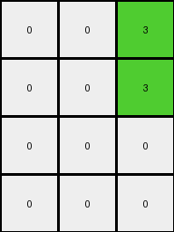
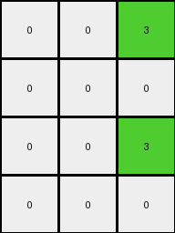

# f2829549 • 029 • refine_dreamer

---


Previous Code:
```python
"""
1.  **Selection:** Extract the first (index 0) and fourth (index 3) columns from the input grid.

2.  **Conditional Combination:** Create a third output column. For each row:
    *   If the element in the first column is 7 (orange) AND the element in the fourth column is 1 (blue), then the corresponding element in the third output column is 3 (green).
    *   Otherwise, the corresponding element in the third output column is 0 (black).

3. **Output construction:** Create the output grid, initially filled with black (0) and with dimensions of the *input grid height* x 3.
   * Fill first column with black(0)
   * Fill second column with black(0)
   * Fill the third column based on results of Step 2

4. **Overwrite Colors:**
    * Set elements of first output column to (0) if corresponding input column element is 7
    * Set elements of second output column to (0) if corresponding input column element is 1
    * Copy values of first, second and third output column elements to the output grid

5.  **Return:** The output grid.
"""

import numpy as np

def transform(input_grid):
    input_grid = np.array(input_grid)
    height = input_grid.shape[0]
    output_grid = np.zeros((height, 3), dtype=int)

    # Extract the first and fourth columns.
    first_column = input_grid[:, 0]
    fourth_column = input_grid[:, 3]

    # Create the combined column based on the conditional logic.
    combined_column = np.zeros(height, dtype=int)
    for i in range(height):
        if first_column[i] == 7 and fourth_column[i] == 1:
            combined_column[i] = 3

    # Create temporary columns for overwriting
    temp_first_column = np.zeros(height, dtype=int)
    temp_second_column = np.zeros(height, dtype=int)

    # Overwrite colors in temporary columns
    for i in range(height):
        if first_column[i] == 7:
            temp_first_column[i] = 0
        if fourth_column[i] == 1:
            temp_second_column[i] = 0

    # populate output
    output_grid[:,0] = temp_first_column
    output_grid[:,1] = temp_second_column
    output_grid[:,2] = combined_column

    return output_grid.tolist()
```

Train Set Results:

## Example 1:

Input:
```
7 7 0 1 5 0 0
7 0 0 1 5 0 0
0 0 0 1 5 0 5
0 0 0 1 5 5 0
```
Expected Output:
```
0 0 3
0 3 3
0 3 0
0 0 3
```
Transformed Output:
```
0 0 3
0 0 3
0 0 0
0 0 0
```

match: False
pixels_off: 3
size_correct: True
color_palette_correct: True
correct_pixel_counts: False

## Example 2:

Input:
```
7 7 0 1 5 0 0
0 0 0 1 0 0 0
7 7 0 1 5 0 0
0 7 7 1 5 5 0
```
Expected Output:
```
0 0 3
3 3 3
0 0 3
0 0 0
```
Transformed Output:
```
0 0 3
0 0 0
0 0 3
0 0 0
```

match: False
pixels_off: 3
size_correct: True
color_palette_correct: True
correct_pixel_counts: False

## Example 3:

Input:
```
0 7 7 1 5 0 0
0 0 7 1 0 5 5
0 7 0 1 5 5 0
0 0 7 1 0 0 0
```
Expected Output:
```
0 0 0
3 0 0
0 0 3
3 3 0
```
Transformed Output:
```
0 0 0
0 0 0
0 0 0
0 0 0
```

match: False
pixels_off: 4
size_correct: True
color_palette_correct: True
correct_pixel_counts: False

## Example 4:

Input:
```
7 0 7 1 5 5 0
7 7 0 1 5 5 5
0 7 0 1 0 0 0
0 0 0 1 5 0 5
```
Expected Output:
```
0 0 0
0 0 0
3 0 3
0 3 0
```
Transformed Output:
```
0 0 3
0 0 3
0 0 0
0 0 0
```

match: False
pixels_off: 5
size_correct: True
color_palette_correct: True
correct_pixel_counts: False

## Example 5:

Input:
```
7 0 0 1 0 5 0
0 0 7 1 5 0 0
0 0 0 1 5 5 5
7 7 7 1 5 5 5
```
Expected Output:
```
0 0 3
0 3 0
0 0 0
0 0 0
```
Transformed Output:
```
0 0 3
0 0 0
0 0 0
0 0 3
```

match: False
pixels_off: 2
size_correct: True
color_palette_correct: True
correct_pixel_counts: True

**INSTRUCTIONS**

The code above was generated based on observations from the first training
example

we have tested the transform function on each of the task example inputs and
compared with the expected output

review each of the examples provided and the results and consider how the
natural language program should be updated to accommodate this new knowledge

respond with the following deliverables:

- general assessment of the information provided and strategy for resolving the
  errors
- gather metrics about each of the examples and results - use code_execution to
  develop accurate reports on your assumptions
- a YAML block documenting facts - Focus on identifying objects, their properties, and the actions performed on them.
- a natural language program - Be as clear and concise as possible, providing a complete description of the transformation rule.


your responses should be considered as information in a report - not a
conversation
