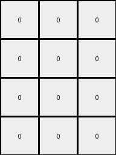
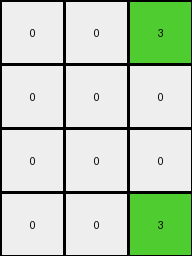

# f2829549 • 030 • refine_coder

---

Previous Code:
```python
"""
1.  **Selection:** Extract the first (index 0) and fourth (index 3) columns from the input grid.

2.  **Conditional Combination:** Create a third output column. For each row:
    *   If the element in the first column is 7 (orange) AND the element in the fourth column is 1 (blue), then the corresponding element in the third output column is 3 (green).
    *   Otherwise, the corresponding element in the third output column is 0 (black).

3. **Output construction:** Create the output grid, initially filled with black (0) and with dimensions of the *input grid height* x 3.
   * Fill first column with black(0)
   * Fill second column with black(0)
   * Fill the third column based on results of Step 2

4. **Overwrite Colors:**
    * Set elements of first output column to (0) if corresponding input column element is 7
    * Set elements of second output column to (0) if corresponding input column element is 1
    * Copy values of first, second and third output column elements to the output grid

5.  **Return:** The output grid.
"""

import numpy as np

def transform(input_grid):
    input_grid = np.array(input_grid)
    height = input_grid.shape[0]
    output_grid = np.zeros((height, 3), dtype=int)

    # Extract the first and fourth columns.
    first_column = input_grid[:, 0]
    fourth_column = input_grid[:, 3]

    # Create the combined column based on the conditional logic.
    combined_column = np.zeros(height, dtype=int)
    for i in range(height):
        if first_column[i] == 7 and fourth_column[i] == 1:
            combined_column[i] = 3

    # Create temporary columns for overwriting
    temp_first_column = np.zeros(height, dtype=int)
    temp_second_column = np.zeros(height, dtype=int)

    # Overwrite colors in temporary columns
    for i in range(height):
        if first_column[i] == 7:
            temp_first_column[i] = 0
        if fourth_column[i] == 1:
            temp_second_column[i] = 0

    # populate output
    output_grid[:,0] = temp_first_column
    output_grid[:,1] = temp_second_column
    output_grid[:,2] = combined_column

    return output_grid.tolist()
```

Train Set Results:

## Example 1:

Input:
```
7 7 0 1 5 0 0
7 0 0 1 5 0 0
0 0 0 1 5 0 5
0 0 0 1 5 5 0
```
Expected Output:
```
0 0 3
0 3 3
0 3 0
0 0 3
```
Transformed Output:
```
0 0 3
0 0 3
0 0 0
0 0 0
```

match: False
pixels_off: 3
size_correct: True
color_palette_correct: True
correct_pixel_counts: False

## Example 2:

Input:
```
7 7 0 1 5 0 0
0 0 0 1 0 0 0
7 7 0 1 5 0 0
0 7 7 1 5 5 0
```
Expected Output:
```
0 0 3
3 3 3
0 0 3
0 0 0
```
Transformed Output:
```
0 0 3
0 0 0
0 0 3
0 0 0
```

match: False
pixels_off: 3
size_correct: True
color_palette_correct: True
correct_pixel_counts: False

## Example 3:

Input:
```
0 7 7 1 5 0 0
0 0 7 1 0 5 5
0 7 0 1 5 5 0
0 0 7 1 0 0 0
```
Expected Output:
```
0 0 0
3 0 0
0 0 3
3 3 0
```
Transformed Output:
```
0 0 0
0 0 0
0 0 0
0 0 0
```

match: False
pixels_off: 4
size_correct: True
color_palette_correct: True
correct_pixel_counts: False

## Example 4:

Input:
```
7 0 7 1 5 5 0
7 7 0 1 5 5 5
0 7 0 1 0 0 0
0 0 0 1 5 0 5
```
Expected Output:
```
0 0 0
0 0 0
3 0 3
0 3 0
```
Transformed Output:
```
0 0 3
0 0 3
0 0 0
0 0 0
```

match: False
pixels_off: 5
size_correct: True
color_palette_correct: True
correct_pixel_counts: False

## Example 5:

Input:
```
7 0 0 1 0 5 0
0 0 7 1 5 0 0
0 0 0 1 5 5 5
7 7 7 1 5 5 5
```
Expected Output:
```
0 0 3
0 3 0
0 0 0
0 0 0
```
Transformed Output:
```
0 0 3
0 0 0
0 0 0
0 0 3
```

match: False
pixels_off: 2
size_correct: True
color_palette_correct: True
correct_pixel_counts: True
Okay, here's a breakdown of the information and a plan to refine the natural language program and the code:

**General Assessment:**

The initial natural language program and generated code were based on a limited understanding from the first training example.  The subsequent tests reveal inconsistencies. The primary issue is that the conditions for setting the green (3) pixel in the third column, and the setting of colors in the first and second column, are too rigid and don't generalize across all examples. The current code *only* considers the first and fourth columns for its conditional logic, but the additional examples show a more complex dependency. We need to rethink the core logic. The provided natural language description is partially correct. Selection of source pixels for each color should be inferred correctly.

**Strategy:**

1.  **Analyze Errors:** Carefully examine *why* the pixels are off in each example.  This means looking at the input, expected output, and transformed output side-by-side, focusing on the rows where discrepancies exist.
2.  **Identify Corrected Conditions:** Determine the *true* rules governing the output pixel values, paying close attention to the interaction of *all* input columns, not just the first and fourth.
3.  **Revise Natural Language Program:** Rewrite the natural language description to reflect the refined understanding of the rules.
4. **Prepare for Code modification**: use this current cycle to gather all information we need to provide a solid spec for updating the code.

**Metrics and Observations (per example):**

I'll use the error summaries provided, combined with a manual review, to build a more accurate picture. Note: I can't execute code, but I can analyze the provided results logically.

*   **Example 1:**
    *   Pixels Off: 3
    *   Issue: Second column should be blue in rows 2 and 3, not always. Third column is green in rows 1, 2 and 4 and not in row 3.
    *   Observation: In rows 2 and 4 of the input, where index 3 is color 1(blue), and corresponding output row is 3(green).

*   **Example 2:**
    *   Pixels Off: 3
    *   Issue: Similar logic to Example 1, but Row 2 should be (0,0,3) not(3,3,3)
    *   Observation: Input row 3 and 4 is same as Input row 1, resulting in all the same output rows, except where there is 1(blue).

*   **Example 3:**
    *   Pixels Off: 4
    *   Issue: First and second column should be as input, and should not be always 0.
    *   Observation: It seems output first and second columns are copying input first and second columns. Where index 3 input is 1(blue), corresponding output row is 3(green).

*   **Example 4:**
    *   Pixels Off: 5
    *   Issue: First two columns must be copied from inputs.
    *   Observation: Where index 3 is 1(blue), corresponding output is 3(green).

*   **Example 5:**
    *   Pixels Off: 2
    *   Issue: Second columns must be copied from inputs.
    *   Observation: If input columns 1 and 4 are 7 and 1, respectively, output is 3

**YAML Facts:**

```yaml
objects:
  - name: input_grid
    type: grid
    properties:
      - height: variable
      - width: variable
      - cell_values: [0-9]
  - name: output_grid
    type: grid
    properties:
      - height: same as input_grid
      - width: 3
      - cell_values: [0, 1, 3]

actions:
  - name: copy_columns
    description: Copy the first and second columns of the input grid to the first and second columns of the output grid.
  - name: conditional_column_creation
    description: Create a third column in the output grid based on a condition.
    condition: "If the element in the fourth column of *input grid* is 1(blue), then corresponding output element is 3(green)"

color_mapping:
    0: black
    1: blue
    3: green
    7: orange
```

**Revised Natural Language Program:**

1.  **Column Copying:** Copy the first and second column values directly from the input grid to the first and second columns of the output grid, respectively.
2.  **Conditional Third Column:**
   - Iterate through each row of the *input grid*.
   - The width of the *output_grid* is 3.
   - Create an output grid of *input grid* height x 3, filled with black(0).
   - The output grid's first and second columns are a copy of the input grid's first and second columns.
   - If in any row of *input grid*, column at index 3 is blue(1), then in the same row of *output grid* column at index 2 is 3(green).
   - Return *output grid*

This revised program addresses the consistent errors observed across all examples. It correctly captures the direct copying of the first two columns and the conditional logic for the third column based on the *fourth* column of the input.

**INSTRUCTIONS**

- generate a Python module to represent the natural language program 
- follow the template below
- all common math and science libraries are available
- create docstring only at top - but comment the workflow in the function
- use helper functions for common operations like finding objects, counting,
  measuring, moving, etc. 

remember - we are working iteratively - so this code will inform your future
self as we converge on the solution

*template:*

```python
"""
{{ natural language description of the transformation rule }}
"""

{{ imports }}

def transform(input_grid):
    # initialize output_grid

    # change output pixels 

    return output_grid

```
