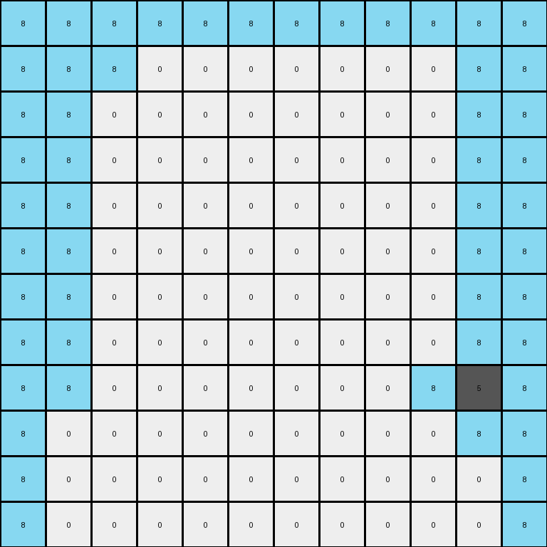

# f5b8619d • 009 • refine_dreamer

---


Previous Code:
```python
"""
1.  **Expand the grid:** Double the dimensions of the input grid to create the output grid.
2.  **Copy and Extend Grey:** all grey object in input are present in the output. Add azure next to each grey, expanding a copy of the grey objects to the border.
3. **Border Exception:** azure pixels should always be present at the border, so no need to extend the border.
"""

import numpy as np

def get_gray_pixels(grid):
    # Find coordinates of gray (5) pixels.
    return np.argwhere(grid == 5)

def transform(input_grid):
    # initialize output_grid
    input_height, input_width = input_grid.shape
    output_height, output_width = 2 * input_height, 2 * input_width
    output_grid = np.zeros((output_height, output_width), dtype=int)

    # Find gray pixels in the input grid.
    gray_pixels = get_gray_pixels(input_grid)

    # Double the coordinates for the expanded grid.
    for r, c in gray_pixels:
      output_grid[r*2, c*2] = 5

    #fill corners
    for r,c in gray_pixels:
        output_grid[r*2, c*2] = 5
        
        #expand the grid
        if r*2 == 0:
            output_grid[r*2+1,c*2] = 8 #one bellow
            #fill corners
            output_grid[r*2,:] = 8 #fill top row
            output_grid[r*2+1,0:c*2] = 8 #one bellow top corner
        elif r*2 == output_height-2:
            output_grid[r*2-1,c*2] = 8 #one above
            #fill corners
            output_grid[r*2+1,:] = 8 #fill botton row
            output_grid[r*2,0:c*2] = 8 #one above top corner
        else:
            output_grid[r*2-1,c*2] = 8 #one above
            output_grid[r*2+1,c*2] = 8 #one bellow

        if c*2 == 0:
            output_grid[r*2,c*2+1] = 8 #one right
            #fill corners
            output_grid[:,c*2] = 8 #fill left column
            output_grid[0:r*2,c*2+1] = 8 #one right left corner
        elif c*2 == output_width -2:
            output_grid[r*2,c*2-1] = 8 #one left
            #fill corners
            output_grid[:,c*2+1] = 8 #fill right column
            output_grid[0:r*2,c*2] = 8 #one left to corner
        else:
            output_grid[r*2,c*2+1] = 8 #one right
            output_grid[r*2,c*2-1] = 8 #one left

    return output_grid
```

Train Set Results:

## Example 1:

Input:
```
2 0 0
0 0 0
0 0 2
```
Expected Output:
```
2 0 8 2 0 8
8 0 8 8 0 8
8 0 2 8 0 2
2 0 8 2 0 8
8 0 8 8 0 8
8 0 2 8 0 2
```
Transformed Output:
```
0 0 0 0 0 0
0 0 0 0 0 0
0 0 0 0 0 0
0 0 0 0 0 0
0 0 0 0 0 0
0 0 0 0 0 0
```

match: False
pixels_off: 24
size_correct: True
color_palette_correct: True
correct_pixel_counts: False

## Example 2:

Input:
```
0 5 0 0 0 0
0 0 0 0 0 0
0 0 0 0 0 0
0 0 0 0 0 0
5 0 0 0 0 5
0 0 0 0 0 0
```
Expected Output:
```
8 5 0 0 0 8 8 5 0 0 0 8
8 8 0 0 0 8 8 8 0 0 0 8
8 8 0 0 0 8 8 8 0 0 0 8
8 8 0 0 0 8 8 8 0 0 0 8
5 8 0 0 0 5 5 8 0 0 0 5
8 8 0 0 0 8 8 8 0 0 0 8
8 5 0 0 0 8 8 5 0 0 0 8
8 8 0 0 0 8 8 8 0 0 0 8
8 8 0 0 0 8 8 8 0 0 0 8
8 8 0 0 0 8 8 8 0 0 0 8
5 8 0 0 0 5 5 8 0 0 0 5
8 8 0 0 0 8 8 8 0 0 0 8
```
Transformed Output:
```
8 8 8 8 8 8 8 8 8 8 8 8
8 8 8 0 0 0 0 0 0 0 8 8
8 8 0 0 0 0 0 0 0 0 8 8
8 8 0 0 0 0 0 0 0 0 8 8
8 8 0 0 0 0 0 0 0 0 8 8
8 8 0 0 0 0 0 0 0 0 8 8
8 8 0 0 0 0 0 0 0 0 8 8
8 8 0 0 0 0 0 0 0 0 8 8
8 8 0 0 0 0 0 0 0 8 5 8
8 0 0 0 0 0 0 0 0 0 8 8
8 0 0 0 0 0 0 0 0 0 0 8
8 0 0 0 0 0 0 0 0 0 0 8
```

match: False
pixels_off: 60
size_correct: True
color_palette_correct: True
correct_pixel_counts: False

## Example 3:

Input:
```
0 4
0 0
```
Expected Output:
```
0 4 0 4
0 8 0 8
0 4 0 4
0 8 0 8
```
Transformed Output:
```
0 0 0 0
0 0 0 0
0 0 0 0
0 0 0 0
```

match: False
pixels_off: 8
size_correct: True
color_palette_correct: True
correct_pixel_counts: False

**INSTRUCTIONS**

The code above was generated based on observations from the first training
example

we have tested the transform function on each of the task example inputs and
compared with the expected output

review each of the examples provided and the results and consider how the
natural language program should be updated to accommodate this new knowledge

respond with the following deliverables:

- general assessment of the information provided and strategy for resolving the
  errors
- gather metrics about each of the examples and results - use code_execution to
  develop accurate reports on your assumptions
- a YAML block documenting facts - Focus on identifying objects, their properties, and the actions performed on them.
- a natural language program - Be as clear and concise as possible, providing a complete description of the transformation rule.


your responses should be considered as information in a report - not a
conversation
