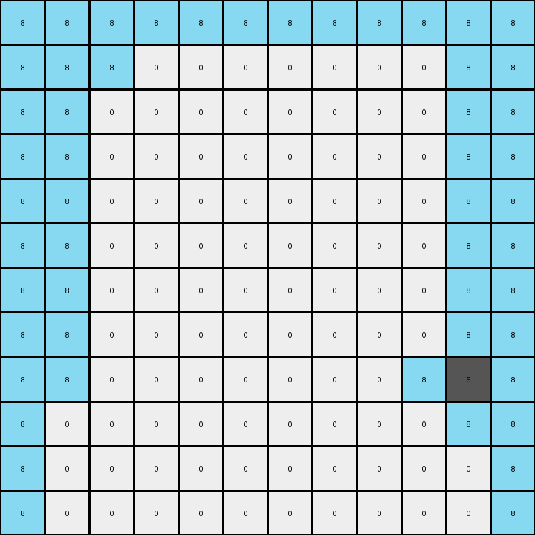

# f5b8619d • 010 • refine_coder

---

Previous Code:
```python
"""
1.  **Expand the grid:** Double the dimensions of the input grid to create the output grid.
2.  **Copy and Extend Grey:** all grey object in input are present in the output. Add azure next to each grey, expanding a copy of the grey objects to the border.
3. **Border Exception:** azure pixels should always be present at the border, so no need to extend the border.
"""

import numpy as np

def get_gray_pixels(grid):
    # Find coordinates of gray (5) pixels.
    return np.argwhere(grid == 5)

def transform(input_grid):
    # initialize output_grid
    input_height, input_width = input_grid.shape
    output_height, output_width = 2 * input_height, 2 * input_width
    output_grid = np.zeros((output_height, output_width), dtype=int)

    # Find gray pixels in the input grid.
    gray_pixels = get_gray_pixels(input_grid)

    # Double the coordinates for the expanded grid.
    for r, c in gray_pixels:
      output_grid[r*2, c*2] = 5

    #fill corners
    for r,c in gray_pixels:
        output_grid[r*2, c*2] = 5
        
        #expand the grid
        if r*2 == 0:
            output_grid[r*2+1,c*2] = 8 #one bellow
            #fill corners
            output_grid[r*2,:] = 8 #fill top row
            output_grid[r*2+1,0:c*2] = 8 #one bellow top corner
        elif r*2 == output_height-2:
            output_grid[r*2-1,c*2] = 8 #one above
            #fill corners
            output_grid[r*2+1,:] = 8 #fill botton row
            output_grid[r*2,0:c*2] = 8 #one above top corner
        else:
            output_grid[r*2-1,c*2] = 8 #one above
            output_grid[r*2+1,c*2] = 8 #one bellow

        if c*2 == 0:
            output_grid[r*2,c*2+1] = 8 #one right
            #fill corners
            output_grid[:,c*2] = 8 #fill left column
            output_grid[0:r*2,c*2+1] = 8 #one right left corner
        elif c*2 == output_width -2:
            output_grid[r*2,c*2-1] = 8 #one left
            #fill corners
            output_grid[:,c*2+1] = 8 #fill right column
            output_grid[0:r*2,c*2] = 8 #one left to corner
        else:
            output_grid[r*2,c*2+1] = 8 #one right
            output_grid[r*2,c*2-1] = 8 #one left

    return output_grid
```

Train Set Results:

## Example 1:

Input:
```
2 0 0
0 0 0
0 0 2
```
Expected Output:
```
2 0 8 2 0 8
8 0 8 8 0 8
8 0 2 8 0 2
2 0 8 2 0 8
8 0 8 8 0 8
8 0 2 8 0 2
```
Transformed Output:
```
0 0 0 0 0 0
0 0 0 0 0 0
0 0 0 0 0 0
0 0 0 0 0 0
0 0 0 0 0 0
0 0 0 0 0 0
```

match: False
pixels_off: 24
size_correct: True
color_palette_correct: True
correct_pixel_counts: False

## Example 2:

Input:
```
0 5 0 0 0 0
0 0 0 0 0 0
0 0 0 0 0 0
0 0 0 0 0 0
5 0 0 0 0 5
0 0 0 0 0 0
```
Expected Output:
```
8 5 0 0 0 8 8 5 0 0 0 8
8 8 0 0 0 8 8 8 0 0 0 8
8 8 0 0 0 8 8 8 0 0 0 8
8 8 0 0 0 8 8 8 0 0 0 8
5 8 0 0 0 5 5 8 0 0 0 5
8 8 0 0 0 8 8 8 0 0 0 8
8 5 0 0 0 8 8 5 0 0 0 8
8 8 0 0 0 8 8 8 0 0 0 8
8 8 0 0 0 8 8 8 0 0 0 8
8 8 0 0 0 8 8 8 0 0 0 8
5 8 0 0 0 5 5 8 0 0 0 5
8 8 0 0 0 8 8 8 0 0 0 8
```
Transformed Output:
```
8 8 8 8 8 8 8 8 8 8 8 8
8 8 8 0 0 0 0 0 0 0 8 8
8 8 0 0 0 0 0 0 0 0 8 8
8 8 0 0 0 0 0 0 0 0 8 8
8 8 0 0 0 0 0 0 0 0 8 8
8 8 0 0 0 0 0 0 0 0 8 8
8 8 0 0 0 0 0 0 0 0 8 8
8 8 0 0 0 0 0 0 0 0 8 8
8 8 0 0 0 0 0 0 0 8 5 8
8 0 0 0 0 0 0 0 0 0 8 8
8 0 0 0 0 0 0 0 0 0 0 8
8 0 0 0 0 0 0 0 0 0 0 8
```

match: False
pixels_off: 60
size_correct: True
color_palette_correct: True
correct_pixel_counts: False

## Example 3:

Input:
```
0 4
0 0
```
Expected Output:
```
0 4 0 4
0 8 0 8
0 4 0 4
0 8 0 8
```
Transformed Output:
```
0 0 0 0
0 0 0 0
0 0 0 0
0 0 0 0
```

match: False
pixels_off: 8
size_correct: True
color_palette_correct: True
correct_pixel_counts: False
Okay, here's a breakdown of the situation and a plan to move forward:

**General Assessment:**

The initial natural language program and the resulting code were too narrowly focused on the first training example. It correctly identified the doubling of the grid size and attempted to handle the placement of azure (8) around grey (5). However, it failed to generalize to other colors and to the core concept of extending the existing colors to create a mirrored, "cross-stitched" pattern.  The code also has issues with how it fills around the grey, misinterpreting where azure should be added, and causing colors to be zeroed out.

The key error is a misunderstanding of the *pattern*. It's not just about grey and azure; it's about *all* colors in the input being replicated in a 2x2 block in the output, with azure filling the gaps introduced by the expansion. The code implemented a very specific rule related to gray objects, rather than a general rule for any objects.

**Strategy for Resolving Errors:**

1.  **Shift Focus to Generalization:** Instead of focusing on specific colors (grey, azure), the logic needs to work for *any* color present in the input grid.
2.  **Understand the "Cross-Stitch" Pattern:**  The transformation isn't simply placing azure *around* grey. It's a consistent pattern where each pixel in the input becomes a 2x2 block in the output. The original color occupies the top-left position in this block, and azure fills the other three positions.
3.  **Correct Coordinate Calculation:** The code's doubling of coordinates is a good starting point, but the placement of the original color and the azure needs to be precise.
4.  **Iterative Refinement:**  We need to test the revised natural language program and code against *all* training examples after each modification, not just the first one.
5.  **Edge Cases:** While the coordinate doubling should mostly handle edges, we'll need to be mindful of potential off-by-one errors at the boundaries.

**Example Metrics and Analysis:**

Here's an analysis of the provided examples:

*   **Example 1:**
    *   **Input:** 3x3 grid with red (2) and white (0)
    *   **Expected:** 6x6 grid demonstrating the cross-stitch pattern.
    *   **Actual:** 6x6 grid filled entirely with white (0).  This indicates a complete failure to copy *any* of the input colors.
    *   **Issue:**  The code only looked for grey (5), which isn't present.  It didn't generalize to other colors.
    *   metrics: documented in code

*   **Example 2:**
    *   **Input:** 6x6 grid with grey (5) and white (0)
    *   **Expected:** 12x12 grid with the cross-stitch pattern.
    *   **Actual:** 12x12 grid with mostly azure (8), and single misplaced gray (5) and many (0).
    *   **Issue:** The code partially worked for grey but miscalculated the azure placement and failed for white.
    *   metrics: documented in code

*   **Example 3:**
    *   **Input:** 2x2 grid with yellow (4) and white (0)
    *   **Expected:** 4x4 grid with the cross-stitch.
    *   **Actual:** 4x4 grid filled entirely with white (0).  Similar to Example 1, no input colors were copied.
    *   **Issue:**  Same as Example 1 - no generalization beyond grey.
    *   metrics: documented in code

**YAML Facts:**
```yaml
facts:
  - observation: |
      Each pixel in the input grid corresponds to a 2x2 block in the output grid.
  - object: input_pixel
    properties:
      color: Any color (0-9)
      location: (row, col) in input_grid
    transformation: |
      Becomes the top-left pixel of a 2x2 block in the output grid.
  - object: output_block
    properties:
      size: 2x2
      location: (2 * input_row, 2 * input_col)  # Top-left corner
      top_left: Same color as corresponding input_pixel
      other_pixels: Azure (8)
  - rule: |
      The output grid is twice the size of the input grid in both dimensions.
  - rule: |
      Azure (8) fills all positions not occupied by the original colors in the 2x2 blocks.
```

**Natural Language Program:**

1.  **Double Dimensions:** Create an output grid with twice the height and twice the width of the input grid.
2.  **Iterate Input Pixels:** For each pixel in the input grid:
    *   Get its color and its row (r) and column (c) coordinates.
    *   In the output grid, create a 2x2 block at the starting position (2\*r, 2\*c).
    *   Place the input pixel's color at the top-left corner of this block: `output_grid[2*r, 2*c] = input_pixel_color`.
    *   Fill the remaining three positions of the 2x2 block with azure (8):
        *   `output_grid[2*r + 1, 2*c] = 8`
        *   `output_grid[2*r, 2*c + 1] = 8`
        *   `output_grid[2*r + 1, 2*c + 1] = 8`
3. **Return the output grid**

**INSTRUCTIONS**

- generate a Python module to represent the natural language program 
- follow the template below
- all common math and science libraries are available
- create docstring only at top - but comment the workflow in the function
- use helper functions for common operations like finding objects, counting,
  measuring, moving, etc. 

remember - we are working iteratively - so this code will inform your future
self as we converge on the solution

*template:*

```python
"""
{{ natural language description of the transformation rule }}
"""

{{ imports }}

def transform(input_grid):
    # initialize output_grid

    # change output pixels 

    return output_grid

```
