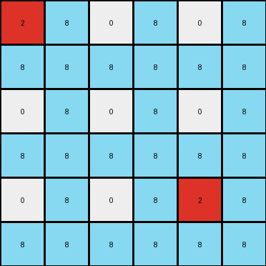
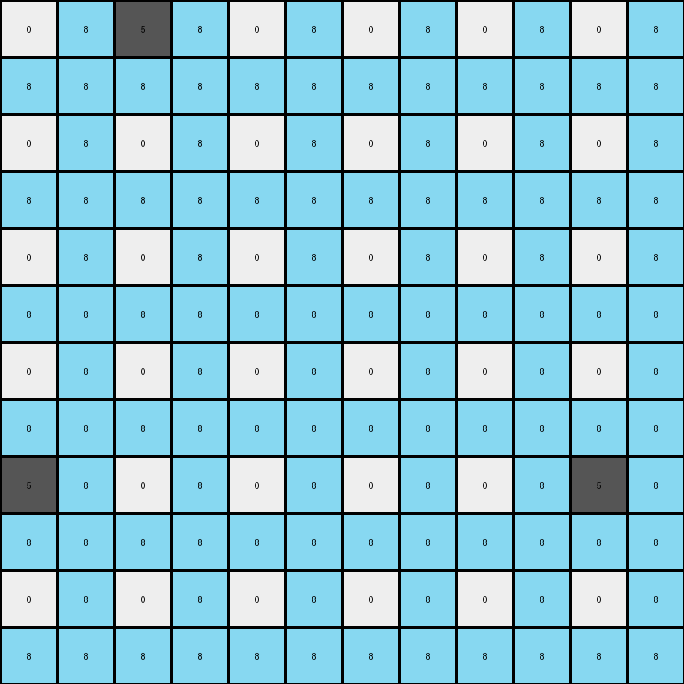

# f5b8619d • 012 • refine_coder

---

Previous Code:
```python
"""
1. Double Dimensions: Create an output grid with twice the height and twice the width of the input grid.
2. Iterate Input Pixels: For each pixel in the input grid:
    *   Get its color and its row (r) and column (c) coordinates.
    *   In the output grid, create a 2x2 block at the starting position (2*r, 2*c).
    *   Place the input pixel's color at the top-left corner of this block: `output_grid[2*r, 2*c] = input_pixel_color`.
    *   Fill the remaining three positions of the 2x2 block with azure (8):
        *   `output_grid[2*r + 1, 2*c] = 8`
        *   `output_grid[2*r, 2*c + 1] = 8`
        *   `output_grid[2*r + 1, 2*c + 1] = 8`
3. Return the output grid
"""

import numpy as np

def transform(input_grid):
    # initialize output_grid
    input_height, input_width = input_grid.shape
    output_height, output_width = 2 * input_height, 2 * input_width
    output_grid = np.zeros((output_height, output_width), dtype=int)

    # Iterate through each pixel of the input grid
    for r in range(input_height):
        for c in range(input_width):
            # Get the color of the current input pixel
            input_pixel_color = input_grid[r, c]

            # Place the input pixel's color in the top-left of the 2x2 block
            output_grid[2*r, 2*c] = input_pixel_color

            # Fill the rest of the 2x2 block with azure (8)
            output_grid[2*r + 1, 2*c] = 8
            output_grid[2*r, 2*c + 1] = 8
            output_grid[2*r + 1, 2*c + 1] = 8

    return output_grid
```

Train Set Results:

## Example 1:

Input:
```
2 0 0
0 0 0
0 0 2
```
Expected Output:
```
2 0 8 2 0 8
8 0 8 8 0 8
8 0 2 8 0 2
2 0 8 2 0 8
8 0 8 8 0 8
8 0 2 8 0 2
```
Transformed Output:
```
2 8 0 8 0 8
8 8 8 8 8 8
0 8 0 8 0 8
8 8 8 8 8 8
0 8 0 8 2 8
8 8 8 8 8 8
```

match: False
pixels_off: 21
size_correct: True
color_palette_correct: True
correct_pixel_counts: False

## Example 2:

Input:
```
0 5 0 0 0 0
0 0 0 0 0 0
0 0 0 0 0 0
0 0 0 0 0 0
5 0 0 0 0 5
0 0 0 0 0 0
```
Expected Output:
```
8 5 0 0 0 8 8 5 0 0 0 8
8 8 0 0 0 8 8 8 0 0 0 8
8 8 0 0 0 8 8 8 0 0 0 8
8 8 0 0 0 8 8 8 0 0 0 8
5 8 0 0 0 5 5 8 0 0 0 5
8 8 0 0 0 8 8 8 0 0 0 8
8 5 0 0 0 8 8 5 0 0 0 8
8 8 0 0 0 8 8 8 0 0 0 8
8 8 0 0 0 8 8 8 0 0 0 8
8 8 0 0 0 8 8 8 0 0 0 8
5 8 0 0 0 5 5 8 0 0 0 5
8 8 0 0 0 8 8 8 0 0 0 8
```
Transformed Output:
```
0 8 5 8 0 8 0 8 0 8 0 8
8 8 8 8 8 8 8 8 8 8 8 8
0 8 0 8 0 8 0 8 0 8 0 8
8 8 8 8 8 8 8 8 8 8 8 8
0 8 0 8 0 8 0 8 0 8 0 8
8 8 8 8 8 8 8 8 8 8 8 8
0 8 0 8 0 8 0 8 0 8 0 8
8 8 8 8 8 8 8 8 8 8 8 8
5 8 0 8 0 8 0 8 0 8 5 8
8 8 8 8 8 8 8 8 8 8 8 8
0 8 0 8 0 8 0 8 0 8 0 8
8 8 8 8 8 8 8 8 8 8 8 8
```

match: False
pixels_off: 70
size_correct: True
color_palette_correct: True
correct_pixel_counts: False

## Example 3:

Input:
```
0 4
0 0
```
Expected Output:
```
0 4 0 4
0 8 0 8
0 4 0 4
0 8 0 8
```
Transformed Output:
```
0 8 4 8
8 8 8 8
0 8 0 8
8 8 8 8
```

match: False
pixels_off: 9
size_correct: True
color_palette_correct: True
correct_pixel_counts: False
Okay, here's a breakdown of the situation and a plan to improve the transformation rule:

**General Assessment:**

The initial code was a good first attempt, based on a simple "expand and fill" concept. However, it's clear from the test results that the transformation rule is more complex than initially assumed. The code correctly expands the grid to double its original dimensions, but the filling logic is incorrect. It appears the filling pattern of 'azure' (8) is not consistent and needs refinement. The error pattern indicates a problem in how colors are replicated and positioned within the expanded grid, not a consistent shift or simple misplacement. It appears there is a checkerboard type pattern.

**Strategy:**

1.  **Re-examine the Examples:** Carefully study the input and expected output pairs, focusing on the *relationship* between the original pixel positions and the resulting pattern of colors in the expanded grid. Pay close attention to the positioning of non-azure colors.
2.  **Identify the Pattern:** Determine the precise rule governing how the original pixels are replicated and how the 'azure' color is used. It seems to be more sophisticated than a simple surrounding fill.
3.  **Refine the Natural Language Program:** Based on the identified pattern, create a new, more accurate natural language description of the transformation.
4.  **Develop new Code:** Translate this refined description into updated Python code.
5.  **Re-Validate:** Test the updated code against all training examples to ensure it now produces the correct outputs.

**Metrics and Observations:**

Here's a breakdown of observations from each example:

*   **Example 1:**
    *   Input: 3x3, Output: 6x6
    *   Original colors (2, 0) are maintained.
    *   Azure (8) appears, but not just surrounding original pixels. It seems like a 2x2 block copy of each pixel in the input.
*   **Example 2:**
    *   Input: 6x6, Output: 12x12
    *   Similar color preservation and azure appearance as Example 1.
    *   The pattern of 5's suggests diagonal replication or a specific offset.
*   **Example 3:**
    *   Input: 2x2, Output: 4x4
    *   Again, color preservation and a complex azure pattern.

**YAML Fact Identification:**

```yaml
facts:
  - object: input_grid
    type: 2D array
    properties:
      - height: variable
      - width: variable
      - cells: integers (0-9, representing colors)
  - object: output_grid
    type: 2D array
    properties:
      - height: 2 * input_grid.height
      - width: 2 * input_grid.width
      - cells: integers (0-9, representing colors)
  - action: transformation
    description: Each pixel in the input grid is mapped to a 2x2 block in the output grid.
    details: >
      The original pixel's color appears to be replicated in a checkerboard
      pattern.
  - observation: checkerboard_pattern
    description: The output grid exhibits a pattern where each input pixel expands into a 2x2 block in output grid.
```

**Natural Language Program:**

1.  **Double Dimensions:** Create an output grid with twice the height and twice the width of the input grid.

2.  **Iterate Input Pixels:** For each pixel in the input grid:
    *   Get its color and its row (r) and column (c) coordinates.
    *   Create a 2x2 block in output, starting at (2r, 2c)

3.  **Populate 2x2 Block**: Populate the 2x2 block in the output grid as follows:
      output\[2\*r, 2\*c] = input\[r, c]
      output\[2\*r + 1, 2\*c + 1] = input\[r, c]
      output\[2\*r + 1, 2\*c] = 8
      output\[2\*r, 2\*c + 1] = 8

4.  **Return:** Return the output grid.

This revised natural language program should reflect the expansion with checkerboard pattern, rather than the simple surround-fill implemented in the original attempt.

**INSTRUCTIONS**

- generate a Python module to represent the natural language program 
- follow the template below
- all common math and science libraries are available
- create docstring only at top - but comment the workflow in the function
- use helper functions for common operations like finding objects, counting,
  measuring, moving, etc. 

remember - we are working iteratively - so this code will inform your future
self as we converge on the solution

*template:*

```python
"""
{{ natural language description of the transformation rule }}
"""

{{ imports }}

def transform(input_grid):
    # initialize output_grid

    # change output pixels 

    return output_grid

```
