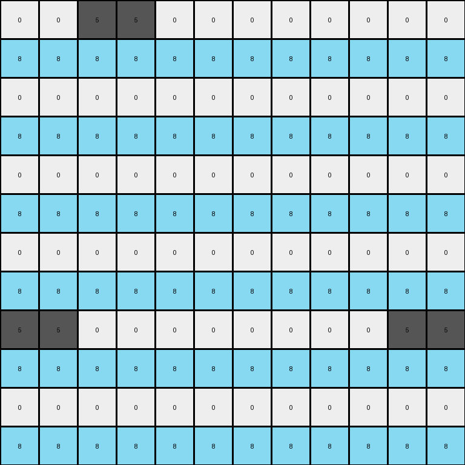

# f5b8619d • 015 • refine_dreamer

---


Previous Code:
```python
"""
Expands the input grid to double its size, creating 2x2 blocks in the output
grid based on each input cell. White cells are expanded to a block with
alternating white and azure pixels, while other colored cells are expanded to
a block where the top-left cell remains the same, while the cells below and
diagonally from it are azure.
"""

import numpy as np

def transform(input_grid):
    input_height, input_width = input_grid.shape
    output_height = input_height * 2
    output_width = input_width * 2
    output_grid = np.zeros((output_height, output_width), dtype=int)

    for i in range(input_height):
        for j in range(input_width):
            # Get the original cell value
            original_value = input_grid[i, j]

            # Calculate the top-left corner of the 2x2 block in the output grid
            output_row = i * 2
            output_col = j * 2

            # Assign values to the 2x2 block
            output_grid[output_row, output_col] = original_value  # Top-left

            if original_value == 0:  # White
                 output_grid[output_row + 1, output_col] = 8      # Bottom-left
                 output_grid[output_row, output_col + 1] = 0      # Top-right
                 output_grid[output_row + 1, output_col + 1] = 8  # Bottom-right
            else:
                output_grid[output_row + 1, output_col] = 8      # Bottom-left
                output_grid[output_row, output_col + 1] = original_value     # Top-right
                output_grid[output_row + 1, output_col + 1] = 8  # Bottom-right

    return output_grid
```

Train Set Results:

## Example 1:

Input:
```
2 0 0
0 0 0
0 0 2
```
Expected Output:
```
2 0 8 2 0 8
8 0 8 8 0 8
8 0 2 8 0 2
2 0 8 2 0 8
8 0 8 8 0 8
8 0 2 8 0 2
```
Transformed Output:
```
2 2 0 0 0 0
8 8 8 8 8 8
0 0 0 0 0 0
8 8 8 8 8 8
0 0 0 0 2 2
8 8 8 8 8 8
```

match: False
pixels_off: 23
size_correct: True
color_palette_correct: True
correct_pixel_counts: False

## Example 2:

Input:
```
0 5 0 0 0 0
0 0 0 0 0 0
0 0 0 0 0 0
0 0 0 0 0 0
5 0 0 0 0 5
0 0 0 0 0 0
```
Expected Output:
```
8 5 0 0 0 8 8 5 0 0 0 8
8 8 0 0 0 8 8 8 0 0 0 8
8 8 0 0 0 8 8 8 0 0 0 8
8 8 0 0 0 8 8 8 0 0 0 8
5 8 0 0 0 5 5 8 0 0 0 5
8 8 0 0 0 8 8 8 0 0 0 8
8 5 0 0 0 8 8 5 0 0 0 8
8 8 0 0 0 8 8 8 0 0 0 8
8 8 0 0 0 8 8 8 0 0 0 8
8 8 0 0 0 8 8 8 0 0 0 8
5 8 0 0 0 5 5 8 0 0 0 5
8 8 0 0 0 8 8 8 0 0 0 8
```
Transformed Output:
```
0 0 5 5 0 0 0 0 0 0 0 0
8 8 8 8 8 8 8 8 8 8 8 8
0 0 0 0 0 0 0 0 0 0 0 0
8 8 8 8 8 8 8 8 8 8 8 8
0 0 0 0 0 0 0 0 0 0 0 0
8 8 8 8 8 8 8 8 8 8 8 8
0 0 0 0 0 0 0 0 0 0 0 0
8 8 8 8 8 8 8 8 8 8 8 8
5 5 0 0 0 0 0 0 0 0 5 5
8 8 8 8 8 8 8 8 8 8 8 8
0 0 0 0 0 0 0 0 0 0 0 0
8 8 8 8 8 8 8 8 8 8 8 8
```

match: False
pixels_off: 75
size_correct: True
color_palette_correct: True
correct_pixel_counts: False

## Example 3:

Input:
```
0 4
0 0
```
Expected Output:
```
0 4 0 4
0 8 0 8
0 4 0 4
0 8 0 8
```
Transformed Output:
```
0 0 4 4
8 8 8 8
0 0 0 0
8 8 8 8
```

match: False
pixels_off: 8
size_correct: True
color_palette_correct: True
correct_pixel_counts: False

**INSTRUCTIONS**

The code above was generated based on observations from the first training
example

we have tested the transform function on each of the task example inputs and
compared with the expected output

review each of the examples provided and the results and consider how the
natural language program should be updated to accommodate this new knowledge

respond with the following deliverables:

- general assessment of the information provided and strategy for resolving the
  errors
- gather metrics about each of the examples and results - use code_execution to
  develop accurate reports on your assumptions
- a YAML block documenting facts - Focus on identifying objects, their properties, and the actions performed on them.
- a natural language program - Be as clear and concise as possible, providing a complete description of the transformation rule.


your responses should be considered as information in a report - not a
conversation
