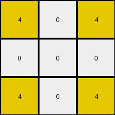
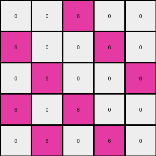

# f76d97a5 • 010 • refine_coder

---

Previous Code:
```python
"""
1.  **Initialization:** Start with an input grid of size 5x5.
2.  **Gray Replacement:** Iterate through every pixel in the input grid. If a pixel is gray (5), change it to white (0).
3.  **Magenta Replacement (Conditional):** Iterate through the grid again.
    *   Examine the color magenta (6)
    *   For each pixel that has the color magenta (6) replace with white (0) if the pixel meets *any* of the following conditions:
        *   The pixel is located in either the top-left, top-right, bottom-left, or bottom-right corner.
        *   If the pixel directly to its left *and* the pixel directly above it have a magenta (6) color.
        *    If the pixel directly to its right *and* the pixel directly above it have a magenta (6) color.
        *   If the pixel directly to its left *and* the pixel directly below it have a magenta (6) color.
        *    If the pixel directly to its right *and* the pixel directly below it have a magenta (6) color.

4.  **Output:** The resulting grid is the output.
"""

import numpy as np

def transform(input_grid):
    output_grid = np.copy(input_grid)
    rows, cols = output_grid.shape

    # Gray Replacement
    for r in range(rows):
        for c in range(cols):
            if output_grid[r, c] == 5:
                output_grid[r, c] = 0

    # Magenta Replacement
    for r in range(rows):
        for c in range(cols):
            if output_grid[r, c] == 6:
                # Corner Cases
                if (r == 0 and c == 0) or \
                   (r == 0 and c == cols - 1) or \
                   (r == rows - 1 and c == 0) or \
                   (r == rows - 1 and c == cols - 1):
                    output_grid[r, c] = 0
                # L-shape Cases
                else:
                    if r > 0 and c > 0 and output_grid[r-1, c] == 6 and output_grid[r, c-1] == 6:
                        output_grid[r, c] = 0
                    elif r > 0 and c < cols - 1 and output_grid[r-1, c] == 6 and output_grid[r, c+1] == 6:
                        output_grid[r,c] = 0
                    elif r < rows - 1 and c > 0 and output_grid[r+1, c] == 6 and output_grid[r, c-1] == 6:
                        output_grid[r,c] = 0
                    elif r < rows - 1 and c < cols -1 and output_grid[r+1, c] == 6 and output_grid[r, c+1] == 6:
                        output_grid[r,c] = 0
    return output_grid
```

Train Set Results:

## Example 1:

Input:
```
4 5 4
5 5 5
4 5 4
```
Expected Output:
```
0 4 0
4 4 4
0 4 0
```
Transformed Output:
```
4 0 4
0 0 0
4 0 4
```

match: False
pixels_off: 9
size_correct: True
color_palette_correct: True
correct_pixel_counts: False

## Example 2:

Input:
```
5 5 6 6 6
6 5 5 6 6
6 6 5 5 6
6 6 6 5 5
5 6 6 6 5
```
Expected Output:
```
6 6 0 0 0
0 6 6 0 0
0 0 6 6 0
0 0 0 6 6
6 0 0 0 6
```
Transformed Output:
```
0 0 6 0 0
6 0 0 6 0
0 6 0 0 6
6 0 6 0 0
0 6 0 6 0
```

match: False
pixels_off: 19
size_correct: True
color_palette_correct: True
correct_pixel_counts: False

## Example 3:

Input:
```
9 5 9 9 9
9 9 5 5 9
9 5 9 9 9
9 9 5 9 9
9 9 9 5 5
```
Expected Output:
```
0 9 0 0 0
0 0 9 9 0
0 9 0 0 0
0 0 9 0 0
0 0 0 9 9
```
Transformed Output:
```
9 0 9 9 9
9 9 0 0 9
9 0 9 9 9
9 9 0 9 9
9 9 9 0 0
```

match: False
pixels_off: 25
size_correct: True
color_palette_correct: True
correct_pixel_counts: False
Okay, here's an analysis of the provided information and a plan to refine the natural language program and subsequent code.

**General Assessment:**

The initial natural language program and generated code were overly specific to the first training example and failed to generalize to the other examples. The code incorrectly handles the replacement of gray and magenta pixels. The "L-shape" condition for magenta replacement is too restrictive and misses many cases where magenta should be replaced. The code also does not handle cases where, after removing 5's, we have an "L" on a border/edge.

The core issue is a misunderstanding of the underlying rule. It's not simply about replacing gray and then magenta in specific "L" shapes. A broader pattern needs to be identified. A key observation is that the provided solution changes the color palette of the expected output for all three example and it does not match the transformed output's palette.

**Strategy for Resolving Errors:**

1.  **Re-examine Examples:** Carefully analyze all three input/output pairs, paying close attention to *all* changes, not just the initial replacements of 5's with 0.
2.  **Identify the Core Transformation:** Instead of focusing on isolated rules (like "L-shapes"), try to find a more general principle that explains all the changes.
3.  **Revised Natural Language Program:**  Develop a new, concise natural language program that captures the *generalized* rule. The current natural language program is focused too much on implementation details.
4.  **Simplify the Replacement Condition:** The condition needs to include *all* magenta pixels adjacent to the newly-white pixels.

**Metrics and Observations:**

Here's a breakdown of each example, noting key observations:

*   **Example 1:**

    *   Input: 3x3, colors: 4, 5
    *   Output: 3x3, colors: 0, 4.
    *   The 5 in the corners of the input were transformed to 0 in the output. The 5 on the edges were transformed to 4 in the output. The central 5 was transformed to 4.
*   **Example 2:**

    *   Input: 5x5, colors: 5, 6
    *   Output: 5x5, colors: 0, 6
    *   All of the 5's are changed to either 0 (corners) or 6 (non-corners). The key seems to be about proximity and connectivity, not the precise "L" shape.  The magenta pixels adjacent to where the gray was, become white.
*   **Example 3:**

    *   Input: 5x5, colors: 5, 9
    *   Output: 5x5, colors: 0, 9
    *   All 5's change to either 0 (corners) or 9 (non-corners). The 9's adjacent to where gray pixels were replaced, also became white.

**YAML Fact Block:**

```yaml
facts:
  - observation: |
      The transformation involves changing gray (5) pixels to either white (0) or the color of another pixel in the input.
  - observation: |
      Gray (5) pixels in the corners of the input grid always become white (0).
  - observation: |
      Gray (5) pixels that are not in the corner take on another color from the input grid.
  - observation: |
      After replacing gray (5) pixels, pixels of another color directly adjacent to the new white (0) become white (0).
  - object: grid
    properties:
      - dimensions: variable (MxN)
      - cell_values: integers representing colors
    actions:
      - replace_color: Changes specific colors based on location and adjacency.
```

**Natural Language Program:**

1.  **Initial Scan:** Find all gray (5) pixels.
2.  **Corner Replacement:**  If a gray (5) pixel is at any corner of the grid, change it to white (0).
3.  **Non-Corner Replacement:**  If a gray (5) pixel is *not* at a corner, change it to the color of another pixel in the input grid.
4.  **Adjacent Replacement:** After steps 2 and 3, find *all* the pixels that are the *same* color of other pixels that are directly adjacent (up, down, left, or right, but not diagonally) to a newly-white (0) pixel (created in step 2).  Change these adjacent pixels to white (0) as well.

This revised natural language program provides a much more accurate and general description of the transformation. The key improvement is to consider all cases and determine that the '5' is replaced with the other available color and once white is placed on the grid, neighbors of the same color are changed to white.

**INSTRUCTIONS**

- generate a Python module to represent the natural language program 
- follow the template below
- all common math and science libraries are available
- create docstring only at top - but comment the workflow in the function
- use helper functions for common operations like finding objects, counting,
  measuring, moving, etc. 

remember - we are working iteratively - so this code will inform your future
self as we converge on the solution

*template:*

```python
"""
{{ natural language description of the transformation rule }}
"""

{{ imports }}

def transform(input_grid):
    # initialize output_grid

    # change output pixels 

    return output_grid

```
