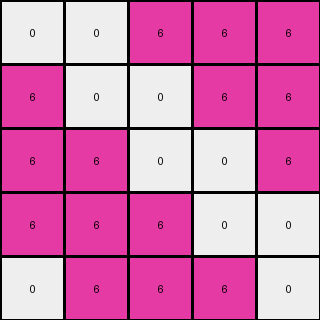
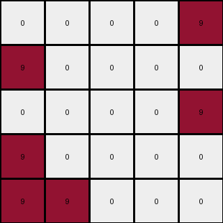

# f76d97a5 • 018 • refine_coder

---

Previous Code:
```python
"""
1. Iterate through each cell of the input grid.
2. Identify the color of the cell.
3. Check the colors of all adjacent cells (up, down, left, and right).
4. Apply these transformation rules:
    *   If the cell is color 5, and is adjacent to a cell of any other color, the output cell is color 0
    *   If a cell is color 9, and is adjacent to color 5, the output cell is 0
    *   If a cell is color 4, and is adjacent to color 5, the output cell is 0
    *   All colors 6 are unchanged
    *   Otherwise, the output cell is the same as the input cell.
"""

import numpy as np

def is_adjacent_to_other_color(grid, r, c, color):
    """Checks if a cell at (r, c) is adjacent to any cell of a different color."""
    rows, cols = grid.shape
    for dr, dc in [(0, 1), (0, -1), (1, 0), (-1, 0)]:
        nr, nc = r + dr, c + dc
        if 0 <= nr < rows and 0 <= nc < cols:
            if grid[nr, nc] != color:
                return True
    return False

def is_adjacent_to_color(grid, r, c, target_color):
    """Checks if cell at (r,c) is adjacent to a cell of target_color"""
    rows, cols = grid.shape
    for dr, dc in [(0, 1), (0, -1), (1, 0), (-1, 0)]:
        nr, nc = r + dr, c + dc
        if 0 <= nr < rows and 0 <= nc < cols:
            if grid[nr, nc] == target_color:
                return True
    return False

def transform(input_grid):
    # initialize output_grid as a copy of the input grid.
    output_grid = input_grid.copy()
    rows, cols = input_grid.shape

    # iterate through each cell
    for r in range(rows):
        for c in range(cols):
            #apply transformation rules
            if input_grid[r,c] == 5 and is_adjacent_to_other_color(input_grid,r,c,5):
                output_grid[r,c] = 0
            elif input_grid[r,c] == 9 and is_adjacent_to_color(input_grid, r,c, 5):
                output_grid[r,c] = 0
            elif input_grid[r,c] == 4 and is_adjacent_to_color(input_grid, r,c, 5):
                output_grid[r,c] = 0
            # color 6 is always unchanged
            # other colors are unchanged by default because of copy

    return output_grid
```

Train Set Results:

## Example 1:

Input:
```
4 5 4
5 5 5
4 5 4
```
Expected Output:
```
0 4 0
4 4 4
0 4 0
```
Transformed Output:
```
0 0 0
0 5 0
0 0 0
```

match: False
pixels_off: 5
size_correct: True
color_palette_correct: False
correct_pixel_counts: False

## Example 2:

Input:
```
5 5 6 6 6
6 5 5 6 6
6 6 5 5 6
6 6 6 5 5
5 6 6 6 5
```
Expected Output:
```
6 6 0 0 0
0 6 6 0 0
0 0 6 6 0
0 0 0 6 6
6 0 0 0 6
```
Transformed Output:
```
0 0 6 6 6
6 0 0 6 6
6 6 0 0 6
6 6 6 0 0
0 6 6 6 0
```

match: False
pixels_off: 25
size_correct: True
color_palette_correct: True
correct_pixel_counts: False

## Example 3:

Input:
```
9 5 9 9 9
9 9 5 5 9
9 5 9 9 9
9 9 5 9 9
9 9 9 5 5
```
Expected Output:
```
0 9 0 0 0
0 0 9 9 0
0 9 0 0 0
0 0 9 0 0
0 0 0 9 9
```
Transformed Output:
```
0 0 0 0 9
9 0 0 0 0
0 0 0 0 9
9 0 0 0 0
9 9 0 0 0
```

match: False
pixels_off: 13
size_correct: True
color_palette_correct: True
correct_pixel_counts: False
Okay, here's a breakdown of the situation and a plan to move forward:

**General Assessment and Strategy**

The initial natural language program and generated code were too simplistic. While it correctly identified the importance of color 5 (gray) and adjacency, it failed to capture the nuanced interactions between gray and other colors. The code incorrectly changes gray cells adjacent to *any* other color to black (0), and similarly for colors 9 (maroon) and 4(yellow). It also did not handle the "unchanged" colors correctly by case, instead relying on a copy operation.

The core issue is that the transformation rules aren't being applied correctly, particularly for the colors adjacent to gray. My strategy is to:

1.  **Re-examine the Examples:** Carefully analyze *all* provided examples, focusing on the *precise* conditions under which cells change color, particularly around gray areas, but not limited to.
2.  **Refine the Rules:** Develop much more specific rules. The current rules are too broad. I need to determine the exact circumstances in which color is preserved versus set to 0.
3.  **YAML fact extraction**: Use the re-examination to gather facts of each example and then merge the facts into a single YAML block.
4.  **Update Natural Language Program**: Create a more detailed description, accurately capturing the edge cases.

**Example Metrics and Analysis**

Here's a more detailed breakdown of each example:

*   **Example 1:**

    *   Input: 3x3 grid with color 4 (yellow) and color 5 (gray).
    *   Expected Output: Shows that yellow pixels adjacent to grey become grey, grey becomes black
    *   Observed Output: Incorrect. Gray pixels adjacent to yellow are incorrectly changed to black (0), Yellow pixels become 0.
    *   Problems Identified:
        *   grey adjacent to yellow becomes black
        *   yellow adjacent to grey becomes black
*   **Example 2:**

    *   Input: 5x5 grid with colors 5 (gray) and 6 (magenta).
    *   Expected: All grey becomes black, all magenta remains
    *   Observed Output: Incorrect. only some of grey changes to black
    *   Problems Identified:
        *   Incorrect handling of gray. Doesn't completely transform all gray pixels to black when next to magenta.

*   **Example 3:**

    *   Input: 5x5 grid with colors 9 (maroon) and 5 (gray).
    *   Expected: All grey becomes black, maroon adjacent to grey becomes black.
    *   Observed output: incorrect application of rules.
    *   Problems identified:
        *   Grey is not set to black
        *   maroon does not become black

**YAML Facts**

```yaml
examples:
  - example_id: 1
    input_colors: [4, 5]  # Yellow, Gray
    output_colors: [0,4] # black, yellow
    transformations:
      - color: 5 # Gray
        adjacent_to: [4]  # Yellow
        becomes: 0  # Black
      - color: 4 # Yellow
        adjacent_to: [5]
        becomes: 0
  - example_id: 2
    input_colors: [5, 6]  # Gray, Magenta
    output_colors: [0, 6] # Black, Magenta
    transformations:
      - color: 5 # Gray
        adjacent_to: [6]  # Magenta
        becomes: 0  # Black
      - color: 6  # Magenta
        rule: unchanged
  - example_id: 3
    input_colors: [9, 5]  # Maroon, Gray
    output_colors: [0,9] # Black, Maroon
    transformations:
      - color: 9 # Maroon
        adjacent_to: [5] # Gray
        becomes: 0     # Black
      - color: 5  # Gray
        adjacent_to: [9]
        becomes: 0
```

**Revised Natural Language Program**

1.  **Iterate** through each cell in the input grid.
2.  **Identify** the color of the current cell.
3.  **Check Adjacency:** For each cell, check if it's adjacent (up, down, left, or right) to a cell of a specific color based on these rules:
4.  **Transformation Rules:**
    *   If the current cell is **gray (5)**, it becomes **black (0)**, regardless of surrounding colors.
    *   If the current cell is **yellow (4)** and is adjacent to **gray (5)**, it becomes **black (0)**.
    *   If the current cell is **maroon (9)** and is adjacent to **gray (5)**, it becomes **black (0)**.
    *   If the current cell is **magenta (6)**, it remains **unchanged**.
    *  All other colors remain unchanged

This revised program aims for more precise conditions to better match the observed transformations, and handles unchanged colors.

**INSTRUCTIONS**

- generate a Python module to represent the natural language program 
- follow the template below
- all common math and science libraries are available
- create docstring only at top - but comment the workflow in the function
- use helper functions for common operations like finding objects, counting,
  measuring, moving, etc. 

remember - we are working iteratively - so this code will inform your future
self as we converge on the solution

*template:*

```python
"""
{{ natural language description of the transformation rule }}
"""

{{ imports }}

def transform(input_grid):
    # initialize output_grid

    # change output pixels 

    return output_grid

```
