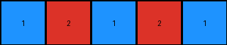
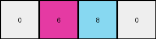
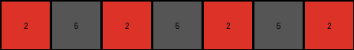

# f9012d9b • 005 • refine_dreamer

---

Previous Code:
```python
"""
1.  **Identify Repeating Color Blocks:** Examine the input grid and identify repeating color blocks. A color block can be a single pixel or a larger contiguous area of the same color. Focus on the smallest repeatable unit.

2.  **Determine Representative Colors:** In example 2, the expected output is a single pixel representing the top-left color of the input. The rule seems to use the first occurrence of the color in the smallest repeatable unit.

3.  **Locate the Color Blocks:** In the input locate all examples of colors identified in step 2.

4. **Reconstruct:** If there are multiple colors, and multiple objects in the input, reconstruct the blocks, but using only colors identified in the repeatable units.

5. **Output**: output should only contain the colors from the smallest repeating pattern.
"""

import numpy as np

def find_smallest_repeating_unit(grid):
    """Finds the smallest repeating unit in the grid."""
    rows, cols = grid.shape
    for unit_height in range(1, rows + 1):
        for unit_width in range(1, cols + 1):
            if rows % unit_height == 0 and cols % unit_width == 0:
                valid_unit = True
                for i in range(0, rows, unit_height):
                    for j in range(0, cols, unit_width):
                        unit = grid[i:i+unit_height, j:j+unit_width]
                        for x in range(i + unit_height, rows, unit_height):
                            for y in range(j + unit_width, cols, unit_width):
                                if not np.array_equal(unit, grid[x:x+unit_height, y:y+unit_width]):
                                     valid_unit=False
                                     break
                            if not valid_unit:
                                break
                    if not valid_unit:
                        break

                if valid_unit:
                    return grid[0:unit_height, 0:unit_width]
    return grid  # If no repeating unit is found, return the whole grid

def get_unique_colors(grid):
    """Returns the unique colors present in a grid."""
    return np.unique(grid)

def transform(input_grid):
    """
    Transforms the input grid based on the smallest repeating unit and its colors.
    """
    # Find the smallest repeating unit
    repeating_unit = find_smallest_repeating_unit(input_grid)

    # Get the unique colors from the repeating unit
    unit_colors = get_unique_colors(repeating_unit)
    
    # Handle the single-color case (like Example 2)
    if len(unit_colors) == 1:
        return np.array([[unit_colors[0]]])

    # Find dimensions of repeating unit
    unit_height, unit_width = repeating_unit.shape

    #If more than one color, use shape of repeating unit, filled by colors
    output_grid = np.zeros((unit_height, unit_width), dtype=int)
    
    color_index = 0
    for i in range(unit_height):
        for j in range(unit_width):
            output_grid[i,j] = unit_colors[color_index % len(unit_colors)]
            color_index+=1

    return output_grid
```

Train Set Results:

## Example 1:

Input:
```
2 1 2 1 2
1 1 1 1 1
2 1 2 1 2
0 0 1 1 1
0 0 2 1 2
```
Expected Output:
```
1 1
2 1
```
Transformed Output:
```
1 2 1 2 1
```

match: False
pixels_off: None
size_correct: False
color_palette_correct: True
correct_pixel_counts: False

## Example 2:

Input:
```
8 6 0 6
6 8 6 8
8 6 8 6
6 8 6 8
```
Expected Output:
```
8
```
Transformed Output:
```
0 6 8 0
```

match: False
pixels_off: None
size_correct: False
color_palette_correct: False
correct_pixel_counts: False

## Example 3:

Input:
```
2 2 5 2 2 5 2
2 2 5 2 2 5 2
5 5 5 5 5 5 5
2 2 5 2 2 5 2
2 2 5 2 2 5 2
5 5 5 5 5 0 0
2 2 5 2 2 0 0
```
Expected Output:
```
5 5
5 2
```
Transformed Output:
```
2 5 2 5 2 5 2
```

match: False
pixels_off: None
size_correct: False
color_palette_correct: True
correct_pixel_counts: False
**INSTRUCTIONS**

The code above was generated based on observations from the first training
example

we have tested the transform function on each of the task example inputs and
compared with the expected output

review each of the examples provided and the results and consider how the
natural language program should be updated to accommodate this new knowledge

respond with the following deliverables:

- general assessment of the information provided and strategy for resolving the
  errors
- gather metrics about each of the examples and results - use code_execution to
  develop accurate reports on your assumptions
- a YAML block documenting facts - Focus on identifying objects, their properties, and the actions performed on them.
- a natural language program - Be as clear and concise as possible, providing a complete description of the transformation rule.


your responses should be considered as information in a report - not a
conversation
