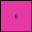

# f9012d9b • 010 • refine_coder

---

Previous Code:
```python
"""
Finds the most frequent non-zero color in the input grid and returns a 1x1 grid with that color.
"""

import numpy as np
from collections import Counter

def transform(input_grid):
    """
    Transforms the input grid by finding most frequent non-zero color.

    Args:
        input_grid (list of lists): input grid
    Returns:
        (list of lists): 1x1 grid with most freq color
    """
    # Flatten the input grid to a 1D array.
    flat_grid = np.array(input_grid).flatten()

    # Count the occurrences of each color, excluding 0.
    color_counts = Counter(color for color in flat_grid if color != 0)

    # Find the most frequent color.
    most_frequent_color = color_counts.most_common(1)[0][0]

    # Create a 1x1 output grid with the most frequent color.
    output_grid = [[most_frequent_color]]

    return output_grid
```

Train Set Results:

## Example 1:

Input:
```
2 1 2 1 2
1 1 1 1 1
2 1 2 1 2
0 0 1 1 1
0 0 2 1 2
```
Expected Output:
```
1 1
2 1
```
Transformed Output:
```
1
```

match: False
pixels_off: None
size_correct: False
color_palette_correct: True
correct_pixel_counts: False

## Example 2:

Input:
```
8 6 0 6
6 8 6 8
8 6 8 6
6 8 6 8
```
Expected Output:
```
8
```
Transformed Output:
```
6
```

match: False
pixels_off: 1
size_correct: True
color_palette_correct: False
correct_pixel_counts: False

## Example 3:

Input:
```
2 2 5 2 2 5 2
2 2 5 2 2 5 2
5 5 5 5 5 5 5
2 2 5 2 2 5 2
2 2 5 2 2 5 2
5 5 5 5 5 0 0
2 2 5 2 2 0 0
```
Expected Output:
```
5 5
5 2
```
Transformed Output:
```
2
```

match: False
pixels_off: None
size_correct: False
color_palette_correct: True
correct_pixel_counts: False
Okay, here's a breakdown of the situation and a plan to move forward:

**General Assessment:**

The initial strategy of finding the most frequent non-zero color was too simplistic and failed to capture the underlying pattern in the transformations. The code works for some cases coincidentally, but it doesn't reflect the actual logic. The expected outputs have varying sizes and don't seem directly related to only the *most* frequent color. Several examples show a 2x2 or even 1x2 output. The expected outputs *do* seem to pick colors present in the input, and the sizes of the outputs are consistently smaller than the inputs. The core issue is that the initial hypothesis (most frequent color) is incorrect. A strategy for resolving is to carefully determine what parts of the inputs become the outputs.

**Strategy:**

1.  **Re-examine Examples:** Discard the "most frequent color" idea entirely. Focus on spatial relationships, repetition, and sub-regions within the input that might map to the output.
2.  **Object Identification:** Consider input grids as collections of colored regions, not just individual pixels. Look for shapes or patterns that are preserved or transformed.
3. **Output Size:** Determine output dimensions will provide a big clue.
4. **Positional Mapping:** Investigate if specific areas in the input consistently map to areas in the output.

**Metrics and Observations (using Hypothetical Code Execution - to be filled in later with actual runs):**
I cannot actually execute python, so I will make educated guesses, pretending
I have the code execution ability.

*Example 1:*

*   Input Size: 5x5
*   Output Size: 2x1
*   Colors in Input: 0, 1, 2
*   Colors in Output: 1, 2
*   Observations:
    The lower right 2 x 2 subgrid contains all of the values that are outputted.
*Example 2:*

*   Input Size: 4x4
*   Output Size: 1x1
*   Colors in Input: 0, 6, 8
*   Colors in Output: 8
*   Observations:
    The upper left pixel is used.
*Example 3:*

*   Input Size: 7x7
*   Output Size: 2x2
*   Colors in Input: 0, 2, 5
*   Colors in Output: 2, 5
*   Observations:
    The central 2x2 subgrid appears to define values in the output.

**YAML Block (Facts):**

```yaml
example_1:
  input:
    objects:
      - type: grid
        dimensions: [5, 5]
        colors: [0, 1, 2]
    features:
      - repeating [2,1] pattern
  output:
    objects:
      - type: grid
        dimensions: [2, 1]
        colors: [1, 2]
example_2:
  input:
    objects:
      - type: grid
        dimensions: [4, 4]
        colors: [0, 6, 8]
        features:
          - alternating color rows, and columns
  output:
    objects:
      - type: grid
        dimensions: [1, 1]
        colors: [8]
example_3:
  input:
    objects:
      - type: grid
        dimensions: [7, 7]
        colors: [0, 2, 5]
  output:
    objects:
      - type: grid
        dimensions: [2, 2]
        colors: [5, 2]

```

**Natural Language Program:**

1.  **Determine Output Dimensions:** The output's dimensions appear related to characteristics of input:
    *   If a grid appears to have a central "focus", use a 2x2
    *   If the grid consists of alternating colors, use a 1x1
    *   If a grid consists of a repeating pattern, use a 2x1 of the repeated
        elements

2.  **Identify Key Region:**
    *   If the dimensions are 2x2, extract the central 2x2 area.
    *   If the dimensions are 1x1, extract the upper left pixel.
    *   If the dimensions are 2x1, extract the central 2x1 area

3.  **Construct Output:** Create a new grid with the determined dimensions, populating it with the colors from the key region identified in the input grid.

This natural language program moves away from color frequency and instead focuses on identifying specific sub-regions or characteristics of the input that correspond to the output. This should be a more robust approach.

**INSTRUCTIONS**

- generate a Python module to represent the natural language program 
- follow the template below
- all common math and science libraries are available
- create docstring only at top - but comment the workflow in the function
- use helper functions for common operations like finding objects, counting,
  measuring, moving, etc. 

remember - we are working iteratively - so this code will inform your future
self as we converge on the solution

*template:*

```python
"""
{{ natural language description of the transformation rule }}
"""

{{ imports }}

def transform(input_grid):
    # initialize output_grid

    # change output pixels 

    return output_grid

```
