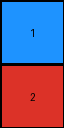
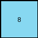

# f9012d9b • 011 • refine_dreamer

---

Previous Code:
```python
"""
Transforms the input grid by extracting a specific sub-region based on the input grid's characteristics.
The sub-region's size and location vary:
- 2x2 central sub-region for grids with a central "focus".
- 1x1 top-left pixel for grids with alternating colors.
- 2x1 central sub-region for grids with repeating patterns.
"""

import numpy as np

def get_dimensions(input_grid):
    """
    Determines the output dimensions based on input characteristics.
    """
    rows, cols = len(input_grid), len(input_grid[0])
    unique_colors = np.unique(input_grid)

    # Check for alternating colors (like example 2)
    is_alternating = True
    for r in range(rows):
        for c in range(cols):
            if r + 1 < rows and input_grid[r][c] == input_grid[r+1][c]:
                is_alternating = False
                break
            if c + 1 < cols and input_grid[r][c] == input_grid[r][c+1]:
                is_alternating = False
                break
        if not is_alternating:
            break
    if is_alternating and len(unique_colors) > 1:
        return 1, 1

    # check for 2x1 pattern, like in example 1
    has_2x1_pattern = False
    if rows > 1 and cols > 1:  # need min 2x2
        first_two_rows_str = str(input_grid[0][0:2])
        if first_two_rows_str.count(str(input_grid[0][0])) == 1:   # make sure colors are different
          all_match = True
          for r in range(0,rows, 2):
            for c in range(0, cols, 2):
              if r+1 >= rows or c+1 >= cols:
                continue
              if str(input_grid[r][c:c+2]) != first_two_rows_str:
                all_match = False
                break
            if not all_match:
              break
          if all_match:
            has_2x1_pattern = True
            return 2, 1

    # default, use 2x2, for example 3
    return 2, 2

def get_key_region(input_grid, out_rows, out_cols):
    """
    Extracts the key region from the input grid.
    """
    in_rows, in_cols = len(input_grid), len(input_grid[0])

    if out_rows == 1 and out_cols == 1:
        return [[input_grid[0][0]]]
    elif out_rows == 2 and out_cols == 1:
        start_row = (in_rows - 2) // 2
        start_col = (in_cols - 1) // 2
        return [
            [input_grid[start_row][start_col]],
            [input_grid[start_row + 1][start_col]]
            ]
    else:  # 2x2
        start_row = (in_rows - 2) // 2
        start_col = (in_cols - 2) // 2
        return [
            [input_grid[start_row][start_col], input_grid[start_row][start_col + 1]],
            [input_grid[start_row + 1][start_col], input_grid[start_row + 1][start_col + 1]],
        ]

def transform(input_grid):
    """
    Transforms the input grid based on identified characteristics.
    """
    # Determine output dimensions.
    out_rows, out_cols = get_dimensions(input_grid)

    # Extract the key region.
    output_grid = get_key_region(input_grid, out_rows, out_cols)

    return output_grid
```

Train Set Results:

## Example 1:

Input:
```
2 1 2 1 2
1 1 1 1 1
2 1 2 1 2
0 0 1 1 1
0 0 2 1 2
```
Expected Output:
```
1 1
2 1
```
Transformed Output:
```
1
2
```

match: False
pixels_off: None
size_correct: False
color_palette_correct: True
correct_pixel_counts: False

## Example 2:

Input:
```
8 6 0 6
6 8 6 8
8 6 8 6
6 8 6 8
```
Expected Output:
```
8
```
Transformed Output:
```
8
```

match: True
pixels_off: 0
size_correct: True
color_palette_correct: True
correct_pixel_counts: True

## Example 3:

Input:
```
2 2 5 2 2 5 2
2 2 5 2 2 5 2
5 5 5 5 5 5 5
2 2 5 2 2 5 2
2 2 5 2 2 5 2
5 5 5 5 5 0 0
2 2 5 2 2 0 0
```
Expected Output:
```
5 5
5 2
```
Transformed Output:
```
5 5
5 2
```

match: True
pixels_off: 0
size_correct: True
color_palette_correct: True
correct_pixel_counts: True
**INSTRUCTIONS**

The code above was generated based on observations from the first training
example

we have tested the transform function on each of the task example inputs and
compared with the expected output

review each of the examples provided and the results and consider how the
natural language program should be updated to accommodate this new knowledge

respond with the following deliverables:

- general assessment of the information provided and strategy for resolving the
  errors
- gather metrics about each of the examples and results - use code_execution to
  develop accurate reports on your assumptions
- a YAML block documenting facts - Focus on identifying objects, their properties, and the actions performed on them.
- a natural language program - Be as clear and concise as possible, providing a complete description of the transformation rule.


your responses should be considered as information in a report - not a
conversation
