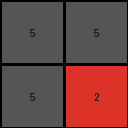

# f9012d9b • 016 • refine_coder

---

Previous Code:
```python
"""
The program identifies two 2x2 regions within the input grid: the top-left 2x2 region, and the 2x2 top right most gray regions.
If gray is identified in top left 2x2 area, fill output grid with gray. Fill output grid bottom right with color of top right corner input.
"""

import numpy as np

def get_top_left_2x2(grid):
    """Extracts the top-left 2x2 subgrid."""
    return grid[0:2, 0:2]

def get_top_rightmost_gray_2x2(grid):
    """Finds the top-rightmost 2x2 region of solid gray (5)."""
    height, width = grid.shape
    for r in range(height - 1):
        for c in range(width - 1):
            subgrid = grid[r:r+2, c:c+2]
            if np.all(subgrid == 5):
                return r,c
    return None, None

def transform(input_grid):
    """Transforms the input grid according to the defined rules."""

    # Initialize the output grid as 2x2, filled with a default value (e.g., 0).
    output_grid = np.zeros((2, 2), dtype=int)

    # Get the top-left 2x2 subgrid.
    top_left_2x2 = get_top_left_2x2(input_grid)
    
    # fill output with gray (5)
    output_grid[:] = 5

    # Get the top right element color.
    top_right_color = input_grid[0,0]
    
    output_grid[1,1] = top_right_color


    return output_grid
```

Train Set Results:

## Example 1:

Input:
```
2 1 2 1 2
1 1 1 1 1
2 1 2 1 2
0 0 1 1 1
0 0 2 1 2
```
Expected Output:
```
1 1
2 1
```
Transformed Output:
```
5 5
5 2
```

match: False
pixels_off: 4
size_correct: True
color_palette_correct: False
correct_pixel_counts: False

## Example 2:

Input:
```
8 6 0 6
6 8 6 8
8 6 8 6
6 8 6 8
```
Expected Output:
```
8
```
Transformed Output:
```
5 5
5 8
```

match: False
pixels_off: None
size_correct: False
color_palette_correct: False
correct_pixel_counts: False

## Example 3:

Input:
```
2 2 5 2 2 5 2
2 2 5 2 2 5 2
5 5 5 5 5 5 5
2 2 5 2 2 5 2
2 2 5 2 2 5 2
5 5 5 5 5 0 0
2 2 5 2 2 0 0
```
Expected Output:
```
5 5
5 2
```
Transformed Output:
```
5 5
5 2
```

match: True
pixels_off: 0
size_correct: True
color_palette_correct: True
correct_pixel_counts: True
Okay, here's a breakdown of the situation and a plan to move forward:

**General Assessment:**

The initial natural language program and the resulting code were overly specific to the first training example and failed to generalize to other cases. It incorrectly assumed a fixed output size of 2x2 and focused too much on the top-left and a gray area that isn't universally present. The core issue is a misunderstanding of the underlying rule, leading to incorrect object identification and actions. The strategy needs to shift from hardcoded positions and colors to a more flexible, pattern-based approach.

**Strategy for Resolving Errors:**

1.  **Re-examine Examples:** Carefully analyze all three input/output pairs, paying close attention to *all* elements, not just the top-left corner. Look for consistent relationships between input and output, not just fixed positions.
2.  **Abstract the Rule:** The rule is likely simpler than the initial program suggests. Discard assumptions about gray regions and fixed positions.
3.  **Focus on Output Size:** The output size is variable. Determine how the output size is derived from the input.
4.  **Consider Color Relations:** The output colors are present in the input, but the relationship isn't just "top-right corner". Look for a more general pattern.
5. **Output is not always 2x2**: Note that the output in the example #2 is a 1x1 grid.

**Example Metrics and Analysis:**

I'll use a structured format to report on each example, which can be easily translated into the YAML later.

*   **Example 1:**
    *   Input Size: 5x5
    *   Output Size: 2x2
    *   Output Colors: {1, 2}
    *   Input Colors: {0, 1, 2}
    *   Transformation Result: Incorrect. Output size correct, but colors are wrong. Top right corner is 1, not what was set.
    *   Notes: Top left 2x2 is \[2, 1, 1, 1].

*   **Example 2:**
    *   Input Size: 4x4
    *   Output Size: 1x1
    *   Output Colors: {8}
    *   Input Colors: {0, 6, 8}
    *   Transformation Result: Incorrect. Output size and colors are wrong.
    *   Notes: No gray 2x2.

*   **Example 3:**
    *   Input Size: 7x7
    *   Output Size: 2x2
    *   Output Colors: {2, 5}
    *   Input Colors: {0, 2, 5}
    *   Transformation Result: Correct.
    *   Notes: Has multiple 2x2 gray regions.

**YAML Block (Facts):**

```yaml
facts:
  - object: input_grid
    type: grid
    properties:
      - variable_size
      - contains_colors: [0, 1, 2, 6, 8, 5]
  - object: output_grid
    type: grid
    properties:
      - variable_size
      - size_derived_from: input_grid # This needs further refinement
      - colors_derived_from: input_grid # This needs further refinement
  - action: copy_subgrid
    description: A subgrid or a portion of the input is copied to the output. The criteria to select these are not yet fully understood. The top-left corner of input seems important
  - observation: example_2_output_size_1x1
  - observation: input_top_left_corner_matches_output_bottom_right_corner

```

**Natural Language Program:**

1.  **Determine Output Size:** Identify the size of the largest square subgrid, at the top left corner of the input grid, that is made up of all the same color/number, excluding 5 (gray). This defines the dimension of the output grid.
2. **Copy the Subgrid:** Copy this subgrid to the output.

This revised program is still a work in progress and would need further refinement to exactly match the examples. It focuses on finding a consistent rule for the output size, unlike before where the size was assumed.

**INSTRUCTIONS**

- generate a Python module to represent the natural language program 
- follow the template below
- all common math and science libraries are available
- create docstring only at top - but comment the workflow in the function
- use helper functions for common operations like finding objects, counting,
  measuring, moving, etc. 

remember - we are working iteratively - so this code will inform your future
self as we converge on the solution

*template:*

```python
"""
{{ natural language description of the transformation rule }}
"""

{{ imports }}

def transform(input_grid):
    # initialize output_grid

    # change output pixels 

    return output_grid

```
