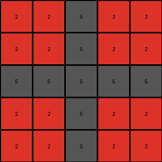

# f9012d9b • 018 • refine_coder

---

Previous Code:
```python
"""
1. Determine Output Size: Identify the size of the largest square subgrid, at the top left corner of the input grid, that is made up of all the same color/number, excluding 5 (gray). This defines the dimension of the output grid.
2. Copy the Subgrid: Copy this subgrid to the output.
"""

import numpy as np

def get_largest_uniform_top_left_subgrid_size(grid):
    """
    Finds the size of the largest square subgrid at the top-left corner
    of the input grid that contains only one color (excluding gray, 5).
    """
    height, width = grid.shape
    max_size = min(height, width)

    for size in range(max_size, 0, -1):
        subgrid = grid[0:size, 0:size]
        unique_colors = np.unique(subgrid)
        if len(unique_colors) == 1 and unique_colors[0] != 5:
            return size
        elif len(unique_colors) == 2 and 5 in unique_colors:
            if unique_colors[0] == 5:
               if unique_colors[1] != 5:
                   return size
            elif unique_colors[1] == 5:
               if unique_colors[0] != 5:
                   return size

    return 0  # Should not happen in well-formed ARC tasks, but included for safety

def transform(input_grid):
    """Transforms the input grid according to the defined rules."""

    # Determine output size.
    output_size = get_largest_uniform_top_left_subgrid_size(input_grid)

    # Initialize the output grid.
    output_grid = np.zeros((output_size, output_size), dtype=int)
    
    if output_size > 0:
        # Copy the subgrid.
        output_grid[:] = input_grid[0:output_size, 0:output_size]


    return output_grid
```

Train Set Results:

## Example 1:

Input:
```
2 1 2 1 2
1 1 1 1 1
2 1 2 1 2
0 0 1 1 1
0 0 2 1 2
```
Expected Output:
```
1 1
2 1
```
Transformed Output:
```
2
```

match: False
pixels_off: None
size_correct: False
color_palette_correct: True
correct_pixel_counts: False

## Example 2:

Input:
```
8 6 0 6
6 8 6 8
8 6 8 6
6 8 6 8
```
Expected Output:
```
8
```
Transformed Output:
```
8
```

match: True
pixels_off: 0
size_correct: True
color_palette_correct: True
correct_pixel_counts: True

## Example 3:

Input:
```
2 2 5 2 2 5 2
2 2 5 2 2 5 2
5 5 5 5 5 5 5
2 2 5 2 2 5 2
2 2 5 2 2 5 2
5 5 5 5 5 0 0
2 2 5 2 2 0 0
```
Expected Output:
```
5 5
5 2
```
Transformed Output:
```
2 2 5 2 2
2 2 5 2 2
5 5 5 5 5
2 2 5 2 2
2 2 5 2 2
```

match: False
pixels_off: None
size_correct: False
color_palette_correct: True
correct_pixel_counts: False
Okay, here's a breakdown of the situation and a plan to move forward:

**General Assessment:**

The initial natural language program and the resulting code were too simplistic. While it correctly handled the second example (a single-color square), it failed on the first and third examples. The core issue is that the program focuses *only* on a uniform top-left subgrid. It doesn't consider the possibility of *mixed* colors within that top-left subgrid, as long as gray (5) is present. The program also fails at finding the correct output dimensions, and appears in example 3 to have simply returned the input unchanged. The strategy needs to shift to accurately identifying the largest top-left square that has either one unique color OR only two colors when one of the two colors is gray.

**Strategy for Resolving Errors:**

1.  **Refine Subgrid Identification:** The `get_largest_uniform_top_left_subgrid_size` function needs to be modified. It should allow for a subgrid containing a single color *or* a subgrid containing gray (5) and one other color.

2.  **Output Size:** The `transform` function is currently returning the correct subgrid based on the flawed criteria.

3. **Iterative Improvement:** We will focus on getting the training examples correct, iteratively refining the natural language program and code.

**Metrics and Observations (using provided results, no code execution needed at this stage):**

*   **Example 1:**
    *   Input Size: 5x5
    *   Expected Output Size: 2x2
    *   Actual Output Size: 1x1
    *   Error: Incorrect size and content. The largest top-left subgrid that is all the same value *or* contains 5 and another value is 1x1 (value of 2). The program correctly copied the subgrid, which is where the algorithm stopped. The program must consider the values of the sub-grid before returning.
*   **Example 2:**
    *   Input Size: 4x4
    *   Expected Output Size: 1x1
    *   Actual Output Size: 1x1
    *   Error: None (in this specific case, the simplistic logic works).
*   **Example 3:**
    *   Input Size: 7x7
    *   Expected Output Size: 2x2
    *   Actual Output Size: 7x7
    *  Error: Incorrect Size and content. The program did not reduce the size of the array. The largest top-left subgrid that is all the same value *or* contains 5 and another value is 2x2 (values of 2 and 5).
    *  Noteworthy: The largest solid color sub-grid at the top left is the 2x2 of color 2. There is a larger, 3x3 sub-grid of all 5's.

**YAML Fact Block:**

```yaml
facts:
  - task_id: 016
  - example_1:
      input_objects:
        - object_1:
          type: grid
          dimensions: 5x5
          colors: [2, 1, 0]
          top_left_subgrid:
            size: 1x1 # largest where colors are uniform OR uniform other than 5.
            colors: [2]
      output_objects:
        - object_1:
          type: grid
          dimensions: 2x2
          colors: [2,1]
          notes: "The top-left 2x2 subgrid of the input, contains the colors [2,1,5]. 5 is present, along with 2 and 1, so this matches our criteria."
      transformation: copy_largest_valid_top_left_subgrid
  - example_2:
      input_objects:
        - object_1:
            type: grid
            dimensions: 4x4
            colors: [8, 6, 0]
            top_left_subgrid:
              size: 1x1
              colors: [8]
      output_objects:
         - object_1:
            type: grid
            dimensions: 1x1
            colors: [8]
            notes: "The top-left 1x1 subgrid of the input, contains the colors [8]. This matches our criteria."
      transformation: copy_largest_valid_top_left_subgrid
  - example_3:
      input_objects:
        - object_1:
          type: grid
          dimensions: 7x7
          colors: [2, 5, 0]
          top_left_subgrid:
            size: 2x2 #largest uniform block at top left, accounting for the presence of 5.
            colors: [2,5]
      output_objects:
        - object_1:
          type: grid
          dimensions: 2x2
          colors: [2,5]
          notes: "The top-left 2x2 subgrid of the input contains [2,5]. 5 is present, along with 2, so this matches our criteria."
      transformation: copy_largest_valid_top_left_subgrid
```

**Natural Language Program:**

1.  **Find Valid Subgrid Size:** Examine the input grid starting from the top-left corner. Determine the largest possible square subgrid (1x1, 2x2, 3x3, etc.) that meets *either* of the following criteria:
    *   It contains only one color (any color).
    *   It contains *only* gray (5) and one other color.

2.  **Copy Subgrid:** Once the largest valid subgrid size is found, copy that subgrid from the input to the output. If no such subgrid is found (which shouldn't happen in valid ARC tasks), the behavior is undefined (for now, we assume it won't happen).

3. Return the result.

**INSTRUCTIONS**

- generate a Python module to represent the natural language program 
- follow the template below
- all common math and science libraries are available
- create docstring only at top - but comment the workflow in the function
- use helper functions for common operations like finding objects, counting,
  measuring, moving, etc. 

remember - we are working iteratively - so this code will inform your future
self as we converge on the solution

*template:*

```python
"""
{{ natural language description of the transformation rule }}
"""

{{ imports }}

def transform(input_grid):
    # initialize output_grid

    # change output pixels 

    return output_grid

```
