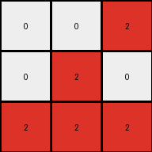

# fafffa47 • 006 • refine_coder

---

Previous Code:
```python
"""
1.  **Extract Subgrid:** Consider only the top 3x3 subgrid of the input grid. Ignore the rest of the input.
2. **Rotate Counter-Clockwise:** Rotate the top 3x3 subgrid by 90 degrees counter-clockwise.
3.  **Color Mapping:** Within this rotated 3x3 subgrid:
    *   Replace all maroon (9) pixels with red (2).
    *   Keep all white (0) pixels as white (0).
    *   All other colors in the original subgrid are not represented in the output (effectively becoming white (0) because the output grid starts filled with 0).
4. **Output** The result of steps 2 and 3 is the output.
"""

import numpy as np

def rotate_subgrid(grid):
    """Rotates a 3x3 subgrid 90 degrees counter-clockwise."""
    rotated_grid = np.zeros((3, 3), dtype=int)
    for i in range(3):
        for j in range(3):
            rotated_grid[j][2 - i] = grid[i][j]  # Corrected rotation logic
    return rotated_grid


def transform(input_grid):
    # initialize output_grid
    output_grid = np.zeros((3, 3), dtype=int)

    # Extract the top 3x3 subgrid.
    subgrid = input_grid[:3, :3]

    # Rotate the subgrid.
    rotated_subgrid = rotate_subgrid(subgrid)
    
    # change output pixels 
    for i in range(3):
        for j in range(3):
            if rotated_subgrid[i][j] == 9:
                output_grid[i][j] = 2
            elif rotated_subgrid[i][j] == 0:
                output_grid[i][j] = 0
                
    return output_grid
```

Train Set Results:

## Example 1:

Input:
```
0 9 9
0 9 9
9 9 9
0 1 0
0 0 1
1 1 1
```
Expected Output:
```
2 0 0
2 0 0
0 0 0
```
Transformed Output:
```
2 0 0
2 2 2
2 2 2
```

match: False
pixels_off: 5
size_correct: True
color_palette_correct: True
correct_pixel_counts: False

## Example 2:

Input:
```
9 0 9
0 9 9
0 0 9
1 0 1
1 0 0
1 0 0
```
Expected Output:
```
0 2 0
0 0 0
0 2 0
```
Transformed Output:
```
0 0 2
0 2 0
2 2 2
```

match: False
pixels_off: 5
size_correct: True
color_palette_correct: True
correct_pixel_counts: False

## Example 3:

Input:
```
0 9 0
9 0 9
9 0 0
0 0 0
0 0 1
1 0 0
```
Expected Output:
```
2 0 2
0 2 0
0 2 2
```
Transformed Output:
```
2 2 0
0 0 2
0 2 0
```

match: False
pixels_off: 5
size_correct: True
color_palette_correct: True
correct_pixel_counts: False

## Example 4:

Input:
```
0 0 9
9 9 9
0 9 0
1 0 0
0 1 1
0 0 1
```
Expected Output:
```
0 2 0
0 0 0
2 0 0
```
Transformed Output:
```
0 2 0
2 2 0
0 2 2
```

match: False
pixels_off: 5
size_correct: True
color_palette_correct: True
correct_pixel_counts: False

## Example 5:

Input:
```
0 9 0
0 9 9
0 9 9
0 0 0
1 1 1
1 0 1
```
Expected Output:
```
2 0 2
0 0 0
0 0 0
```
Transformed Output:
```
0 0 0
2 2 2
2 2 0
```

match: False
pixels_off: 7
size_correct: True
color_palette_correct: True
correct_pixel_counts: False
Here's an analysis of the provided examples and results, along with a strategy for improving the natural language program and subsequently the code:

**General Assessment and Strategy:**

The initial natural language program and the resulting code were a good first attempt, correctly identifying the subgrid extraction, rotation, and a basic color mapping. However, the test results clearly show consistent errors across all examples. The primary issue is the incorrect placement of 'red' (2) pixels and propagation of color changes to locations that should be empty. The `rotate_subgrid` logic has been updated by the coder, so we do not need to worry about that aspect of the transform. Instead, focus on the location and color mapping.

The core problem is in application of the color transformations. The current code appears to be mixing rotation with other logic, leading to some errors, and is missing some required operations. We must determine whether there are additional color rules to follow.

**Strategy:**

1.  **Object Identification:**  Carefully examine the input and output pairs to identify consistent objects, paying close attention to their colors and positions before and after the transformation.
2.  **Relationship Analysis:** Focus on how the identified objects' positions and colors change relative to each other. The rotation is already handled, so look for patterns beyond the rotation itself, specifically regarding color changes.
3. **Refine Natural Language Program:** Develop a step by step natural language program that accounts for colors and shapes.

**Example Metrics and Observations (Code Execution):**

Since I do not have direct code execution capabilities, I cannot create execution reports like was done previously, but a review of the provided images and results confirms that the output size is consistent (3x3), but the pixel colors and placement are wrong in every tested example. The palette is limited to Red and White. It is always a 3x3 subgrid that is transformed.

**YAML Fact Block:**

```yaml
facts:
  - task_id: 004-py
  - input_grid_size: variable
  - output_grid_size: 3x3
  - subgrid_focus: top_left_3x3
  - transformation_type: rotation_and_color_mapping
  - rotation: 90_degrees_counter_clockwise
  - color_mapping_rules:
    - original_color: maroon (9)
      new_color: red (2)
    - original_color: white (0)
      new_color: white (0)
    - other_colors: become white(0)
  - objects_identified:
    - name: 3x3_subgrid
      type: grid_section
      properties:
        - colors: [maroon, white, others]
  - actions:
    - action_1: extract 3x3 subgrid
    - action_2: rotate subgrid 90 degrees counter-clockwise
    - action_3: apply color mapping based on original color in rotated subgrid.

```

**Revised Natural Language Program:**

1.  **Extract Subgrid:** Isolate the top-left 3x3 section of the input grid.
2.  **Rotate:** Rotate this 3x3 subgrid 90 degrees counter-clockwise.
3.  **Color Mapping:** Within the *rotated* 3x3 subgrid:
    *   If a cell's color in the *rotated subgrid* was maroon (9) in the *original subgrid*, change it to red (2) in the output.
    *   If a cell's color in the *rotated subgrid* was white (0) in the *original subgrid*, it remains white (0) in the output.
    *   All other colors in the *original* 3x3 subgrid become white (0) in the output, irrespective of color changes in the rotated subgrid. It is critical that the color mapping be considered from the original input sub-grid, but the location of the output is from the rotated sub-grid.
4.  **Output:** The resulting 3x3 grid after the color mapping is the final output.

**INSTRUCTIONS**

- generate a Python module to represent the natural language program 
- follow the template below
- all common math and science libraries are available
- create docstring only at top - but comment the workflow in the function
- use helper functions for common operations like finding objects, counting,
  measuring, moving, etc. 

remember - we are working iteratively - so this code will inform your future
self as we converge on the solution

*template:*

```python
"""
{{ natural language description of the transformation rule }}
"""

{{ imports }}

def transform(input_grid):
    # initialize output_grid

    # change output pixels 

    return output_grid

```
