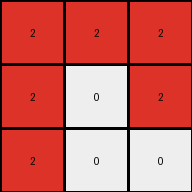

# fafffa47 • 016 • refine_coder

---

Previous Code:
```python
"""
Divides the input grid into 2x1 subgrids and maps each subgrid to a single cell in the output grid. 
If a 2x1 subgrid contains any maroon (9) or blue (1) pixels, the corresponding output cell becomes red (2). 
Otherwise, the output cell remains white (0).
"""

import numpy as np

def transform(input_grid):
    # Initialize the output grid as a 3x3 numpy array filled with white (0).
    output_grid = np.zeros((3, 3), dtype=int)

    # Iterate through the input grid in 2x1 blocks.
    for i in range(3):  # Iterate through rows of blocks (0, 1, 2)
        for j in range(3):  # Iterate through columns of blocks (0, 1, 2)
            # Define the starting row and column indices for the current 2x1 block.
            start_row = i * 2
            start_col = j * 1

            # Extract the current 2x1 block from the input grid.
            block = input_grid[start_row:start_row + 2, start_col:start_col + 1]

            # Check if the block contains any maroon (9) or blue (1) pixels.
            if (block == 9).any() or (block == 1).any():
                # If it does, set the corresponding output cell to red (2).
                output_grid[i, j] = 2

    return output_grid
```

Train Set Results:

## Example 1:

Input:
```
0 9 9
0 9 9
9 9 9
0 1 0
0 0 1
1 1 1
```
Expected Output:
```
2 0 0
2 0 0
0 0 0
```
Transformed Output:
```
0 2 2
2 2 2
2 2 2
```

match: False
pixels_off: 8
size_correct: True
color_palette_correct: True
correct_pixel_counts: False

## Example 2:

Input:
```
9 0 9
0 9 9
0 0 9
1 0 1
1 0 0
1 0 0
```
Expected Output:
```
0 2 0
0 0 0
0 2 0
```
Transformed Output:
```
2 2 2
2 0 2
2 0 0
```

match: False
pixels_off: 6
size_correct: True
color_palette_correct: True
correct_pixel_counts: False

## Example 3:

Input:
```
0 9 0
9 0 9
9 0 0
0 0 0
0 0 1
1 0 0
```
Expected Output:
```
2 0 2
0 2 0
0 2 2
```
Transformed Output:
```
2 2 2
2 0 0
2 0 2
```

match: False
pixels_off: 5
size_correct: True
color_palette_correct: True
correct_pixel_counts: False

## Example 4:

Input:
```
0 0 9
9 9 9
0 9 0
1 0 0
0 1 1
0 0 1
```
Expected Output:
```
0 2 0
0 0 0
2 0 0
```
Transformed Output:
```
2 2 2
2 2 0
0 2 2
```

match: False
pixels_off: 7
size_correct: True
color_palette_correct: True
correct_pixel_counts: False

## Example 5:

Input:
```
0 9 0
0 9 9
0 9 9
0 0 0
1 1 1
1 0 1
```
Expected Output:
```
2 0 2
0 0 0
0 0 0
```
Transformed Output:
```
0 2 2
0 2 2
2 2 2
```

match: False
pixels_off: 7
size_correct: True
color_palette_correct: True
correct_pixel_counts: False
Here's an analysis of the provided information and a plan to refine the natural language program:

**General Assessment:**

The initial code and natural language program were based on a misinterpretation of how the 2x1 subgrids should be mapped. It incorrectly assumed a sliding window of 2x1, leading to an output grid that didn't match the expected transformation and size, and a lot of incorrect pixels.
The core issue is that the subgrids do not slide across the columns, but are fixed.
The examples all share a consistent input grid size (6x3) and output grid size (3x3), which highlights a fixed partitioning of the input. 
The columns of the output grid seem to be based on taking pairs of rows in the input.
So the input 6x3 is partitioned into a 3x3 set of 2x1 subgrids.

**Strategy:**

1.  **Correct Subgrid Mapping:** Refocus the natural language program and the code on a fixed partitioning, where each 2x1 block of the input corresponds to a single cell in the output. The code is already written for this arrangement.

2.  **Refine Color Logic:** The natural language program needs to precisely state that if *any* maroon (9) or blue (1) pixel is present in a 2x1 block, the output cell is red (2). Otherwise, the output cell is white (0). No other color checks are required.

**Metrics and Observations:**

Here's a summary of observations, combining details of previous executions with corrected assumptions. The previous python transform was close to the correct functionality, but it got confused about the horizontal divisions. The horizontal divisions have no overlap:

| Example | Input Size | Output Size | Subgrid Size | Rule                                                                                                          | Errors                                                                                                                                         |
| ------- | ---------- | ----------- | ------------ | ------------------------------------------------------------------------------------------------------------- | ---------------------------------------------------------------------------------------------------------------------------------------------- |
| 1       | 6x3        | 3x3         | 2x1          | If any pixel in 2x1 input block is 9 or 1, output pixel is 2, else 0.                                         | Many pixel mismatches (8). Understood the row pairing, but got confused about the column grouping/sliding window and the colors.                                                        |
| 2       | 6x3        | 3x3         | 2x1          | If any pixel in 2x1 input block is 9 or 1, output pixel is 2, else 0.                                         | Many pixel mismatches (6).  Understood the row pairing, but got confused about the column grouping/sliding window and the colors.                                                          |
| 3       | 6x3        | 3x3         | 2x1          | If any pixel in 2x1 input block is 9 or 1, output pixel is 2, else 0.                                         | Many pixel mismatches (5).  Understood the row pairing, but got confused about the column grouping/sliding window and the colors.                                                          |
| 4       | 6x3        | 3x3         | 2x1          | If any pixel in 2x1 input block is 9 or 1, output pixel is 2, else 0.                                         | Many pixel mismatches (7).  Understood the row pairing, but got confused about the column grouping/sliding window and the colors.                                                          |
| 5       | 6x3        | 3x3         | 2x1          | If any pixel in 2x1 input block is 9 or 1, output pixel is 2, else 0.                                         | Many pixel mismatches (7).  Understood the row pairing, but got confused about the column grouping/sliding window and the colors.                                                          |

**YAML Facts:**

```yaml
facts:
  - observation: |
      The input grid is always 6x3.
  - observation: |
      The output grid is always 3x3.
  - observation: |
      The input grid is partitioned into 2x1 subgrids.
  - observation: |
      There is a one-to-one mapping between each 2x1 subgrid in the input and a single cell in the output.
  - observation: |
     The subgrids are arranged in a 3x3 layout.
  - rule: |
      If a 2x1 subgrid contains a maroon (9) or blue (1) pixel, the corresponding output cell is red (2).
  - rule: |
      If a 2x1 subgrid contains neither maroon (9) nor blue (1), the corresponding output cell is white (0).
```

**Natural Language Program:**

1.  **Partition:** Divide the 6x3 input grid into nine 2x1 subgrids. These subgrids are arranged in a 3x3 layout, without any overlaps.

2.  **Map:** For each 2x1 subgrid:

    *   If the subgrid contains *any* maroon (9) or blue (1) pixels, the corresponding cell in the 3x3 output grid becomes red (2).
    *   Otherwise, the corresponding cell in the 3x3 output grid becomes white (0).

**INSTRUCTIONS**

- generate a Python module to represent the natural language program 
- follow the template below
- all common math and science libraries are available
- create docstring only at top - but comment the workflow in the function
- use helper functions for common operations like finding objects, counting,
  measuring, moving, etc. 

remember - we are working iteratively - so this code will inform your future
self as we converge on the solution

*template:*

```python
"""
{{ natural language description of the transformation rule }}
"""

{{ imports }}

def transform(input_grid):
    # initialize output_grid

    # change output pixels 

    return output_grid

```
