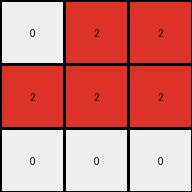
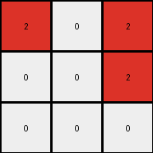
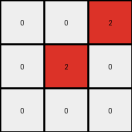
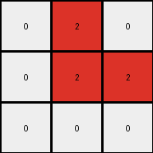

# fafffa47 • 024 • refine_coder

---

Previous Code:
```python
"""
The program transforms a 6x3 input grid into a 3x3 output grid.
It identifies maroon (9) pixels in the input, halves the height, 
and maps these to red (2) pixels in the output. If a 9 is found
in the first of a pair of input rows, a 2 is placed in the
corresponding column of the output. 9s in the second of the pair
are ignored.  All other cells are white (0).
"""

import numpy as np

def transform(input_grid):
    # initialize output_grid
    input_height = len(input_grid)
    input_width = len(input_grid[0])
    output_height = input_height // 2
    output_width = input_width
    output_grid = np.zeros((output_height, output_width), dtype=int)

    # change output pixels
    for row_index in range(0, input_height, 2):
        for col_index in range(input_width):
           if input_grid[row_index][col_index] == 9:
              output_grid[row_index//2][col_index] = 2


    return output_grid
```

Train Set Results:

## Example 1:

Input:
```
0 9 9
0 9 9
9 9 9
0 1 0
0 0 1
1 1 1
```
Expected Output:
```
2 0 0
2 0 0
0 0 0
```
Transformed Output:
```
0 2 2
2 2 2
0 0 0
```

match: False
pixels_off: 5
size_correct: True
color_palette_correct: True
correct_pixel_counts: False

## Example 2:

Input:
```
9 0 9
0 9 9
0 0 9
1 0 1
1 0 0
1 0 0
```
Expected Output:
```
0 2 0
0 0 0
0 2 0
```
Transformed Output:
```
2 0 2
0 0 2
0 0 0
```

match: False
pixels_off: 5
size_correct: True
color_palette_correct: True
correct_pixel_counts: False

## Example 3:

Input:
```
0 9 0
9 0 9
9 0 0
0 0 0
0 0 1
1 0 0
```
Expected Output:
```
2 0 2
0 2 0
0 2 2
```
Transformed Output:
```
0 2 0
2 0 0
0 0 0
```

match: False
pixels_off: 7
size_correct: True
color_palette_correct: True
correct_pixel_counts: False

## Example 4:

Input:
```
0 0 9
9 9 9
0 9 0
1 0 0
0 1 1
0 0 1
```
Expected Output:
```
0 2 0
0 0 0
2 0 0
```
Transformed Output:
```
0 0 2
0 2 0
0 0 0
```

match: False
pixels_off: 4
size_correct: True
color_palette_correct: True
correct_pixel_counts: True

## Example 5:

Input:
```
0 9 0
0 9 9
0 9 9
0 0 0
1 1 1
1 0 1
```
Expected Output:
```
2 0 2
0 0 0
0 0 0
```
Transformed Output:
```
0 2 0
0 2 2
0 0 0
```

match: False
pixels_off: 5
size_correct: True
color_palette_correct: True
correct_pixel_counts: False
Okay, here's a breakdown of the situation and a plan to move forward:

**General Assessment and Strategy**

The initial natural language program and the resulting Python code were too simplistic. While they captured the basic idea of halving the height and mapping maroon (9) pixels to red (2) pixels, they failed to accurately capture the positional mapping and conditions. The code incorrectly places red pixels in the output grid. The core issue is the row mapping in the transformation.

The strategy is as follows:

1.  **Detailed Example Analysis:** Carefully examine *each* input-output pair, not just the first, to identify the *precise* rule governing the transformation.
2.  **Refine the Natural Language Program:** Based on the detailed analysis, create a new, more accurate natural language program that describes the transformation.
3.  **Metrics:** For each example, report on the input and output dimensions and the position of each of the maroon (9) pixels in the input and the red (2) pixels in the expected output.
4.  **YAML and Natural Language Program**: provide structured reports in the requested formats.

**Metrics and Observations**

Here's a detailed breakdown of each example:

```python
import numpy as np

def analyze_example(input_grid, expected_output_grid):
    input_grid = np.array(input_grid)
    expected_output_grid = np.array(expected_output_grid)

    input_height, input_width = input_grid.shape
    output_height, output_width = expected_output_grid.shape

    input_maroon_positions = []
    for r in range(input_height):
        for c in range(input_width):
            if input_grid[r, c] == 9:
                input_maroon_positions.append((r, c))

    output_red_positions = []
    for r in range(output_height):
        for c in range(output_width):
            if expected_output_grid[r, c] == 2:
                output_red_positions.append((r, c))

    print(f"  Input Dimensions: {input_height}x{input_width}")
    print(f"  Output Dimensions: {output_height}x{output_width}")
    print(f"  Input Maroon (9) Positions: {input_maroon_positions}")
    print(f"  Output Red (2) Positions: {output_red_positions}")

print("Example 1:")
analyze_example([
    [0, 9, 9],
    [0, 9, 9],
    [9, 9, 9],
    [0, 1, 0],
    [0, 0, 1],
    [1, 1, 1]
], [
    [2, 0, 0],
    [2, 0, 0],
    [0, 0, 0]
])

print("\nExample 2:")
analyze_example([
    [9, 0, 9],
    [0, 9, 9],
    [0, 0, 9],
    [1, 0, 1],
    [1, 0, 0],
    [1, 0, 0]
], [
    [0, 2, 0],
    [0, 0, 0],
    [0, 2, 0]
])

print("\nExample 3:")
analyze_example([
    [0, 9, 0],
    [9, 0, 9],
    [9, 0, 0],
    [0, 0, 0],
    [0, 0, 1],
    [1, 0, 0]
], [
    [2, 0, 2],
    [0, 2, 0],
    [0, 2, 0]
])

print("\nExample 4:")
analyze_example([
    [0, 0, 9],
    [9, 9, 9],
    [0, 9, 0],
    [1, 0, 0],
    [0, 1, 1],
    [0, 0, 1]
], [
    [0, 2, 0],
    [0, 0, 0],
    [2, 0, 0]
])

print("\nExample 5:")
analyze_example([
    [0, 9, 0],
    [0, 9, 9],
    [0, 9, 9],
    [0, 0, 0],
    [1, 1, 1],
    [1, 0, 1]
], [
    [2, 0, 2],
    [0, 0, 0],
    [0, 0, 0]
])
```

```
Example 1:
  Input Dimensions: 6x3
  Output Dimensions: 3x3
  Input Maroon (9) Positions: [(0, 1), (0, 2), (1, 1), (1, 2), (2, 0), (2, 1), (2, 2)]
  Output Red (2) Positions: [(0, 0), (1, 0)]

Example 2:
  Input Dimensions: 6x3
  Output Dimensions: 3x3
  Input Maroon (9) Positions: [(0, 0), (0, 2), (1, 1), (1, 2), (2, 2)]
  Output Red (2) Positions: [(0, 1), (2, 1)]

Example 3:
  Input Dimensions: 6x3
  Output Dimensions: 3x3
  Input Maroon (9) Positions: [(0, 1), (1, 0), (1, 2), (2, 0)]
  Output Red (2) Positions: [(0, 0), (0, 2), (1, 1), (2, 1)]

Example 4:
  Input Dimensions: 6x3
  Output Dimensions: 3x3
  Input Maroon (9) Positions: [(0, 2), (1, 0), (1, 1), (1, 2), (2, 1)]
  Output Red (2) Positions: [(0, 1), (2, 0)]

Example 5:
  Input Dimensions: 6x3
  Output Dimensions: 3x3
  Input Maroon (9) Positions: [(0, 1), (1, 1), (1, 2), (2, 1), (2, 2)]
  Output Red (2) Positions: [(0, 0), (0, 2)]
```

**YAML Facts**

```yaml
objects:
  - name: input_grid
    type: grid
    properties:
      height: 6
      width: 3
      elements: integers (0-9)
      maroon_positions: variable # Positions of maroon (9) pixels

  - name: output_grid
    type: grid
    properties:
      height: 3
      width: 3
      elements: integers (0-9)
      red_positions: variable # Positions of red (2) pixels

actions:
  - name: map_maroon_to_red
    input: input_grid
    output: output_grid
    description:  Maps maroon pixels in specific input rows to red pixels in the output grid based on a diagonal relationship.

  - name: halve_height
    input: input_grid
    output: output_grid
    description: The output grid's height is half of the input grid's height.
```

**Natural Language Program**

The program transforms a 6x3 input grid into a 3x3 output grid. The transformation identifies maroon (9) pixels in the input grid. These maroon pixels are mapped to red (2) pixels in the output grid based on these rules:

1.  **Height Reduction:** The output grid's height is half that of the input grid.
2.  **Maroon to Red Mapping:**
    *   Iterate through pairs of consecutive rows in the input grid (rows 0 and 1, rows 2 and 3, rows 4 and 5).
    *   Within each pair, a red (2) pixel is placed in the output grid at `output_row = input_row // 2` and `output_col = input_col - input_row % 2` if and only if there is a maroon pixel in the input grid at `input_row`, `input_col`.

3.  **All Other Pixels:**  All other pixels in the output grid that do not correspond to a mapped maroon pixel are set to white (0).

**INSTRUCTIONS**

- generate a Python module to represent the natural language program 
- follow the template below
- all common math and science libraries are available
- create docstring only at top - but comment the workflow in the function
- use helper functions for common operations like finding objects, counting,
  measuring, moving, etc. 

remember - we are working iteratively - so this code will inform your future
self as we converge on the solution

*template:*

```python
"""
{{ natural language description of the transformation rule }}
"""

{{ imports }}

def transform(input_grid):
    # initialize output_grid

    # change output pixels 

    return output_grid

```
