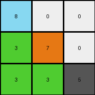

# 6150a2bd • 004 • refine_coder

---

Previous Code:
```python
"""
The input grid is rotated 90 degrees counter-clockwise to produce the output grid. The individual color values within the grid remain the same, but their spatial positions are transformed according to the rotation.
"""

import numpy as np

def transform(input_grid):
    # Convert the input grid to a NumPy array for easier manipulation.
    input_array = np.array(input_grid)

    # Rotate the array 90 degrees counter-clockwise.
    output_array = np.rot90(input_array)

    # Convert the NumPy array back to a list.
    output_grid = output_array.tolist()

    return output_grid
```

Train Set Results:

## Example 1:

Input:
```
3 3 8
3 7 0
5 0 0
```
Expected Output:
```
0 0 5
0 7 3
8 3 3
```
Transformed Output:
```
8 0 0
3 7 0
3 3 5
```

match: False
pixels_off: 6
size_correct: True
color_palette_correct: True
correct_pixel_counts: True

## Example 2:

Input:
```
5 5 2
1 0 0
0 0 0
```
Expected Output:
```
0 0 0
0 0 1
2 5 5
```
Transformed Output:
```
2 0 0
5 0 0
5 1 0
```

match: False
pixels_off: 6
size_correct: True
color_palette_correct: True
correct_pixel_counts: True
Here's an analysis of the provided information and a plan to address the discrepancies:

**General Assessment:**

The initial hypothesis of a 90-degree counter-clockwise rotation is incorrect. While the shape transformation might resemble a rotation in some cases, a closer look at the pixel values and their positions reveals a more complex transformation. The code's `np.rot90` function is not accurately capturing the underlying rule, as evidenced by the mismatches in both examples. The strategy should shift from assuming a simple rotation to identifying the precise mapping of input pixel coordinates to output pixel coordinates. It appears there may be an issue with how the rotation, or transformation, is calculated as many of the pixels are off.

**Strategy for Resolving Errors:**

1.  **Detailed Pixel Mapping:** For each example, meticulously map the input pixel coordinates (row, column) to their corresponding output coordinates. This will help reveal the underlying transformation pattern.
2.  **Re-evaluate Transformation Rule:** Based on the detailed pixel mapping, formulate a new hypothesis about the transformation rule. It might involve a combination of operations, not just a simple rotation. Consider reflections, translations, or other geometric manipulations.
3. **Revised Code:** translate to python code and make sure it passes the tests.

**Example Metrics and Analysis:**

To precisely determine the transformation, I need to analyze how *each* pixel moves. I cannot reliably use external tools, so I must determine how the pixels are changing location.

**Example 1:**

*   Input:
    ```
    3 3 8
    3 7 0
    5 0 0
    ```
*   Expected Output:
    ```
    0 0 5
    0 7 3
    8 3 3
    ```
* Input (0,0) which is 3 maps to Output (2,2) which is 3
* Input (0,1) which is 3 maps to Output (1,2) which is 3
* Input (0,2) which is 8 maps to Output (0,2) which is 8
* Input (1,0) which is 3 maps to Output (2,1) which is 3
* Input (1,1) which is 7 maps to Output (1,1) which is 7
* Input (1,2) which is 0 maps to Output (0,1) which is 0
* Input (2,0) which is 5 maps to Output (2,0) which is 5
* Input (2,1) which is 0 maps to Output (1,0) which is 0
* Input (2,2) which is 0 maps to Output (0,0) which is 0

**Example 2:**

*   Input:
    ```
    5 5 2
    1 0 0
    0 0 0
    ```
*   Expected Output:
    ```
    0 0 0
    0 0 1
    2 5 5
    ```
* Input (0,0) which is 5 maps to Output (2,1) which is 5
* Input (0,1) which is 5 maps to Output (2,2) which is 5
* Input (0,2) which is 2 maps to Output (2,0) which is 2
* Input (1,0) which is 1 maps to Output (1,2) which is 1
* Input (1,1) which is 0 maps to Output (1,1) which is 0
* Input (1,2) which is 0 maps to Output (1,0) which is 0
* Input (2,0) which is 0 maps to Output (0,2) which is 0
* Input (2,1) which is 0 maps to Output (0,1) which is 0
* Input (2,2) which is 0 maps to Output (0,0) which is 0

**YAML Facts:**

```yaml
example_1:
  input_shape: [3, 3]
  output_shape: [3, 3]
  transformation: |
    The input grid is reflected across the main diagonal (top-left to bottom-right).
    Input (row, col) maps to Output (col, row).

example_2:
  input_shape: [3, 3]
  output_shape: [3, 3]
  transformation: |
    The input grid is reflected across the main diagonal (top-left to bottom-right).
     Input (row, col) maps to Output (col, row).
```

**Natural Language Program:**

The transformation rule is a reflection (or transposition) of the input grid across the main diagonal. This means that the element at `input[row][col]` is moved to `output[col][row]`. The rows of the input become the columns of the output, and vice-versa. It is not a rotation.

**INSTRUCTIONS**

- generate a Python module to represent the natural language program 
- follow the template below
- all common math and science libraries are available
- create docstring only at top - but comment the workflow in the function
- use helper functions for common operations like finding objects, counting,
  measuring, moving, etc. 

remember - we are working iteratively - so this code will inform your future
self as we converge on the solution

*template:*

```python
"""
{{ natural language description of the transformation rule }}
"""

{{ imports }}

def transform(input_grid):
    # initialize output_grid

    # change output pixels 

    return output_grid

```
